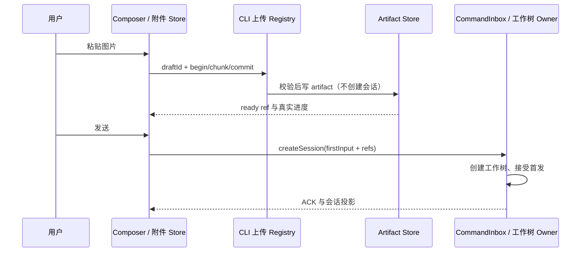

# 工作树草稿附件与新任务

## 产品规则与所有者

- 选择独立工作树后，输入、粘贴图片、添加附件、选择基线均不得创建工作树或会话。首次发送才提交 createSession(firstInput)，正文、模型、ready 附件随同一个命令接受；已导入共享上下文需要实际会话 provenance 时保留既有 create + send 路径；CommandInbox、owner/lease 与未知 ACK 的对账边界不变。
- ComposerAttachmentUploadStore 是附件唯一 owner；hook 负责并发、取消、进度与恢复。协议的上传目标 sessionId / draftId 必须且只能选一个。draftId 仅允许有界字母、数字、下划线、短横线，是随机草稿上传标识，不是 runtime/session 身份。workspaceIdentity 继续隔离目标 Host，原目录只用于 cwd。
- CLI AttachmentUploadRegistry 继续拥有 connection + target + uploadId 的分块事务、校验和、字节配额和幂等 commit。草稿上传写同一配置下的 artifact store，使用 project retention，已提交 ref 可在实际会话中直接读取。草稿上传不 cold-resume、不创建 app、不执行环境准备。事务失效依照已有 TTL 清理；artifact 生命周期由既有存储策略管理。
- 桌面连续传输和手机 replayable 会话恢复仍由同一 Host owner 提供；附件只走既有 begin/chunk/commit/abort，不把完整 base64 放入生产 RPC。不允许向远端提交本机路径；跨机本地文件继续通过 transfer service 暂存。
- 显式新建任务（含 Ctrl/Cmd+N）清空未发送正文和附件并重新聚焦，重置草稿展示意图；已接受的工作树请求不能因新建任务被自动重发或丢弃。普通会话切换仍保留各会话草稿。

## 验收

1. 工作树草稿粘贴图片：有上传进度并 ready，createSession 调用数为 0，无准备卡；首次发送才出现一张准备卡，正文和附件只接受一次。
2. draft 与同名 session 上传互不干扰；commit 重试返回同一 ref；未授权连接、超限、checksum 错误仍拒绝。
3. 粘贴后不发送，点新建任务或快捷键：正文与附件清空，可以重新输入；旧上传、debounce 与卸载写回的迟到结果不得写回新草稿。
4. Windows/macOS/Linux 桌面、本机 Web、手机远控、远端 workspace 分别覆盖内联图片和本地路径，未发送阶段不执行工作树准备。
5. 草稿请求已接受后，仍由既有 pending registry 对账，不因新任务重复执行。构建与浏览器交互验收由用户执行，本次只执行静态检查。
