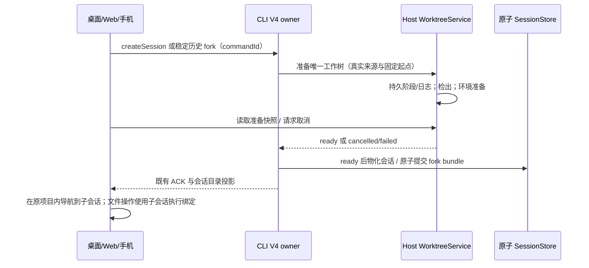

# 工作树准备过程与侧栏会话分叉

## 产品规则

- 首次提交工作树会话时，显示准备工作空间、检出文件、环境准备和就绪的真实阶段；完成后保留可折叠详情。创建就绪不等于任务测试或合并验证通过。
- 无需填写准备命令。优先使用已有显式项目配置；无配置时根据受支持的项目清单与锁文件选择依赖准备，无法确定时明确跳过，后续由任务 Agent 按项目规则处理。不得猜测任意脚本、复制整个 node_modules 或忽略目录。
- 准备结果、阶段和有界日志由目标 Host WorktreeService 持久化。桌面、Web、手机使用同一事实；UI 查询快照，不以本地计时器生成成功或百分比。重连读取最新记录；日志保留上限且显示截断。
- 取消请求在 Host 登记，正在执行的步骤收尾后结算为取消，不执行 firstInput。改用本地目录仅在后端确认取消后解除原请求冻结，保留输入，用户再次发送；已就绪/已接受的会话不得改 cwd 或补发输入。
- 已取消准备请求不能因工作树归档后恢复而重新执行；恢复仅用于取回文件，原 commandId 继续保持取消事实。
- 侧栏普通、置顶、时间线与分组会话右键及手机更多菜单提供分叉。工作树会话显示“在同一工作树中创建会话分叉”和“在新工作树中创建会话分叉”；本地会话显示“在同一本地目录中创建会话分叉”和新工作树选项。
- 同目录分叉复用现有稳定历史复制和真实父绑定引用，共享文件，写入仍受 checkout 许可保护；不把分叉称为文件隔离。
- 新工作树分叉从来源会话实际 checkout 的 HEAD 与非忽略工作文件生成独立快照，保留 staged/unstaged/untracked 区别，不修改来源 index、HEAD 或分支。来源写入中、冲突中、归档/目录缺失时拒绝复制；非 Git 项目禁用新工作树。
- 侧栏分叉以最近一个可用稳定 assistant 边界复制对话；不复制正在运行的工具、队列和后台任务，不停止父会话，也不自动调用模型。历史中的消息分叉维持原行为。
- 分叉采用既有 V4 命令 admission、稳定目标解析、原子 fork bundle 与导航路径；commandId 幂等，冷会话先由 Host 恢复。工作树准备失败不提交 child bundle，post-commit 注册失败遵循已有可恢复收据。
- 所有 scope 使用 workspaceIdentity?.trim() || workspacePath；remoteSessionId、原项目归属与实际执行位置贯穿服务和导航。切换会话或 Host 后旧异步结果不能显示或操作新 scope。

## 所有者与接口

WorktreeService 拥有绑定、准备阶段/日志、取消记录、文件快照和许可；CLI 拥有会话/历史及原子分叉结果；项目设置拥有显式准备配置；UI 只拥有展开状态、未接受草稿和待确认的操作意图。协议 schema 与服务 contract 同步更新，不新增 Renderer 接受队列或另起手机 Agent。

## 验收场景

1. 真实 Git 创建阶段、日志、重试幂等与重启读取；准备失败不执行输入，取消与就绪竞争不会转为两次执行。
2. 默认环境识别只使用受支持的清单/锁文件；显式配置优先；未知项目明确跳过，准备与验证结果不混同。
3. 新工作树分叉包含修改/删除/新增文件和 index 状态，原 checkout 完全不变；来源 busy/冲突拒绝；绑定恢复与父子归属正确。
4. 稳定历史分叉不复制 active work/queue；相同 commandId 不生成第二个 child，旧消息分叉兼容。
5. 实际右键/更多菜单、两种模式说明、成功导航、错误可见、中英文、桌面/390px、键盘、长路径与日志上限。
6. 桌面 continuous 与手机 replayable 均读取 Host 同一持久准备记录；不同远程 identity 同路径不能串状态。

## 验证记录

2026-10-03，在实际检出的 `L-GO` 工作区验证，保留此前的项目管理和终端改动。以下结果属于本次准备过程及侧栏分叉增强；早期方案的验收记录不替代本表。

| 检查                                         | 实际结果                                                                                                                                                                                                            |
| -------------------------------------------- | ------------------------------------------------------------------------------------------------------------------------------------------------------------------------------------------------------------------- |
| `node scripts/check-workspace-freshness.mjs` | exit 0；相对 `origin/main` ahead 56 / behind 0；没有上游跟踪分支，未核实实时远端 `L-GO`                                                                                                                             |
| 根 `pnpm typecheck`                          | exit 0；shared/services/UI/Web/Desktop Host 等项目通过                                                                                                                                                              |
| CLI core/bootstrap/adapters `typecheck`      | exit 0；以 `pnpm --dir apps/lcode-cli --filter @lcode/core --filter @lcode/bootstrap --filter @lcode/adapters typecheck` 执行                                                                                       |
| 根 `pnpm lint`                               | exit 0；0 warnings、0 errors；格式化后将浏览器测试文件控制在现有行数边界内                                                                                                                                          |
| `pnpm architecture:check --changed`          | exit 0；0 violations、0 baseline、0 new                                                                                                                                                                             |
| 定向真实 Git、协议、事务与策略测试           | 34/34；准备持久化与取消、取消后归档恢复、锁文件识别、来源 HEAD/index/工作文件、busy 拒绝、失败重试、候选检查、日志上限、稳定历史与原子 fork bundle、旧设置兼容                                                      |
| 工作树服务与 CLI 既有回归                    | 54/54；创建/设置/多根/别名、跨进程许可、冲突隔离、精确候选审核、过期目标、发布响应恢复、归档恢复、执行路径/MCP、原子绑定与冷恢复                                                                                    |
| UI 命令恢复测试                              | 1/1；`pnpm exec tsx --tsconfig packages/ui/tsconfig.json --test packages/ui/src/v4/taskForkRecovery.test.ts`；响应丢失后按原 scope 查询，不重放创建                                                                 |
| 工作树浏览器回归                             | 25/25（含顶级测试）；`pnpm --dir packages/web exec node --test test/worktree-ui.test.mjs`；实际组件和 hook，Host 使用服务桩。覆盖准备/取消/重试、各侧栏菜单、键盘、非 Git、重复点击、切项目迟到结果、中英文和 390px |
| 提交审核浏览器回归                           | 40/40（含顶级测试）；`pnpm --dir packages/web exec node --test test/git-commit-dialog.test.mjs`；首轮有一个导航加载超时，完整重跑后全部通过                                                                         |
| 本次涉及文件定向格式                         | 98 个文件通过只读比较；先按当前 oxfmt 输出安全格式化，再比较文件原文与格式化结果                                                                                                                                    |
| 根 `pnpm fmt:check`                          | exit 1；2616 个文件。抽查未改动的 `DESIGN.md`、provider/rpc 入口，与 HEAD 去除 CRLF 后一致，且仅换行与 oxfmt 不符；未批量改写无关文件                                                                               |
| `git diff --check`                           | exit 0；沿仓库当前换行设置执行，关闭 safecrlf 提示，不更改配置                                                                                                                                                      |

实测为 Windows、Node 24.14.1、pnpm 10.33.2；mise 要求 Node 24.14.0，未切换工具链。浏览器使用本机 Chrome，无模型调用或用户仓库提交。macOS/Linux、真实手机及 SSH/WSL/Docker 连接未作端到端实测；远程身份与重连通过边界测试验证。以上为提交前验证记录，后续提交状态以 Git 历史为准。
