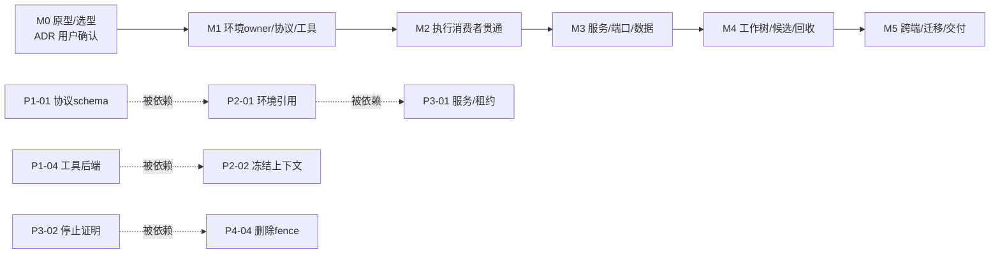
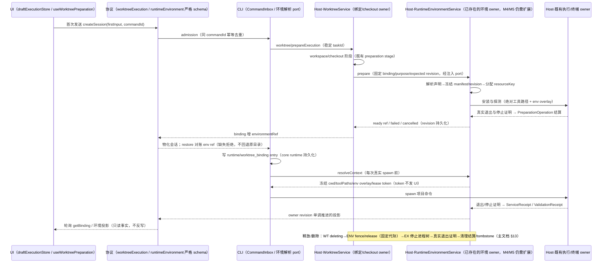

# 工作树运行环境开发计划

状态：M0/M1/M2/M3 已收口；P4-01～P4-07、P5-01～P5-05 已完成 Windows/模拟远端门禁与定向/集成证据；P5-06 文档回填已完成。macOS/Linux 原生门禁、实体手机和完整 Electron 整包构建仍未执行，不把 Windows/fixture 结果写成跨平台完成。
更新日期：2026-10-06。
代码基线：L-GO 分支 `9c6327985e02fa5ea8ab7b583bfbda1e18330734`；本轮 `node scripts/check-workspace-freshness.mjs` 输出 `[freshness] 基线新鲜：L-GO（与 origin/L-GO 同步），相对 origin/main：ahead 111 / behind 0（阈值 50）`。

## 1. 背景与基准

- 本文是 [worktree-runtime-environments.md](worktree-runtime-environments.md)（下称"主文档"）的实施细化：只规定实施顺序、任务拆分、涉及文件、接口复用与验收对齐，**不改任何产品决策**。产品规则、默认决策、隔离边界、验收矩阵以主文档为唯一依据；本文与主文档冲突时以主文档为准，并先修订主文档再动代码。
- 操作系统沙盒按主文档 §2.2 与 §5.3 明确暂缓，本文不排期、不拆任务；容器与云执行同样不在本计划范围内。后扩展路径见主文档 §19"后续扩展"。
- 主文档调查基线为 34c2728，当前 HEAD 已前进 6 个提交。其中与本领域相关的两个：
  - `8ce6a75`：`GitRefreshResult` 新增 `branchComparisonError`（`packages/shared/src/git.ts`），只动 Git 审核域；
  - `bbfffb2`：新增 `session/worktreeCleanup` 协议方法、`binding.deletion.sessionIds` 字段与同树聊天清理链路（`apps/lcode-cli/packages/bootstrap/src/lcode-protocol/worktree-session-cleanup.ts`、`packages/services/src/worktree/app/ports.ts` 的 `collectDiscardSessions`/`discardSessions`），已触及删除/清理领域。
    因此本计划所有任务以当前 HEAD 源码为准；实施 M4 删除联动前，先按主文档 §1 规则核对主文档 §13 与 `bbfffb2` 后现状是否一致，不一致先修主文档。
- 本文吸收四份只读调研（services 层、会话执行链路、UI 层、共享协议）的结论：facts 已用作任务涉及文件的依据；gaps 全部落到任务；risks 落到 §5 风险表；四份调研 blockers 均为空。调研均为只读、未运行 `pnpm typecheck`/`pnpm lint` 或任何测试，各任务实施时必须按主文档 §16.2 真实执行验证并记录证据（基线 SHA、平台、命令、通过/失败/未执行、对应验收 ID）。
- 任务表通用约定（各表不再重复）：
  - 开工前运行 `node scripts/check-workspace-freshness.mjs`；代码阶段使用 `.agents/skills/architecture-governance/SKILL.md`，先架构检查再读模块上下文。
  - 每任务提交前执行 `pnpm typecheck`、`pnpm lint`，涉及新模块或跨包改动的执行 `pnpm architecture:check --changed`；测试入口以目标包 `package.json` 与实际测试文件为准。
  - "验收"列只写任务专属场景；ENV-xx 编号对齐主文档 §18 验收矩阵。
  - 涉及文件中标"拟新增"的路径在创建前先注册 architecture policy（主文档 §9.4），不得只建空壳。

## 2. 里程碑划分

| 里程碑                        | 对应主文档 | 目标                                                                                                                                                           | 前置条件                              | 完成判据                                                                                                                                                                          |
| ----------------------------- | ---------- | -------------------------------------------------------------------------------------------------------------------------------------------------------------- | ------------------------------------- | --------------------------------------------------------------------------------------------------------------------------------------------------------------------------------- |
| M0 原型与技术选型             | §17 P0     | 固定便携 mise 与 Node/pnpm 原型、验证配置隔离/下载/停止语义、核实本项目端口与数据链路，产出选型 ADR                                                            | 无（可先行，独立于代码开发）          | 主文档 P0-01～P0-06 门禁全部有实测证据；ADR 经用户确认；"不能取得确切工具、隔离配置或可靠停止时不进入默认托管"成立                                                                |
| M1 环境 owner、协议与工具准备 | §17 P1     | 新建 RuntimeEnvironmentService 模块、shared schema 与协议方法族、持久化、声明解析与版本冻结、工具后端缓存、prepare/retry/cancel/reconcile 与 capabilities 纵向 | M0 ADR 已确认；backend 与平台范围已定 | 主文档 P1-01～P1-06 门禁通过；环境状态机（主文档 §10.1）可端到端走到 ready/failed/cancelled 并有收据；此阶段仅代表工具准备完成，不声称终端/Agent/服务已隔离（主文档 §17 P1 备注） |
| M2 执行消费者贯通             | §17 P2     | binding 环境引用、ResolvedProjectExecutionContext、冻结上下文接入 setup/Bash/Hook/终端/MCP，依赖与可写资源隔离，准备卡与输入链路 UI                            | M1 ready 纵向可用                     | 主文档 P2-01～P2-07 门禁通过；每类消费者至少一项真实调用证据（主文档 §17 P2 备注）；ENV-01/02/07/08/09/10/11 有证据                                                               |
| M3 服务、端口与本项目数据     | §17 P3     | ServiceDefinition/收据/资源租约、start/stop/健康、Host 端口组与地址映射、Vite 与本项目适配、独立数据根与 SQLite                                                | M2 执行上下文贯通                     | 主文档 P3-01～P3-06 门禁通过；ENV-12/13/14/15 有证据；"真实监听才 running、停止有证明"成立                                                                                        |
| M4 工作树、候选与回收         | §17 P4     | 同目录共享/新树独立、revision 升级、候选精确验证、删除/归档 fence 与清理、快照恢复重建、空间概览与缓存 GC、诊断草稿转交                                        | M2/M3 对应能力就绪                    | 主文档 P4-01～P4-07 门禁通过；ENV-16～ENV-25 有证据；删除一次操作结算、故障可恢复                                                                                                 |
| M5 迁移、跨端与交付           | §17 P5     | 旧会话升级与能力协商、多窗口/手机 snapshot、三平台原生矩阵、桌面/390px/中英/键盘、全纵向故障回归、文档发布说明                                                 | M4 完成；对应平台门禁前不默认托管     | 主文档 P5-01～P5-06 门禁通过；ENV-26～ENV-30 有证据；该平台新工作树才默认托管（主文档 §17 排期）                                                                                  |

## 3. 里程碑任务分解

### 3.1 M0：原型与技术选型

M0 产出为 P0 验证记录与 ADR 结论，不修改业务代码；涉及文件仅作只读核实对象。结论回填主文档 §5/§11.2 后才进入 M1。

| ID    | 任务与交付                                                                                                                       | 涉及文件（只读核实 / 测试目录）                                                                                                                                                                                                   | 接口与状态所有者                                                                                      | 先更新 spec                   | 测试点                                                 | 验收                                                  |
| ----- | -------------------------------------------------------------------------------------------------------------------------------- | --------------------------------------------------------------------------------------------------------------------------------------------------------------------------------------------------------------------------------- | ----------------------------------------------------------------------------------------------------- | ----------------------------- | ------------------------------------------------------ | ----------------------------------------------------- |
| P0-01 | 消费者与执行 owner 清单：逐条梳理 spawn/PTY/MCP/Hook 的真实调用链与停止 owner，形成表格                                          | `apps/lcode-cli/packages/adapters/src/exec/execution-command.ts`、`node-execution-adapter-process.ts`、`packages/services/src/terminal/terminal.ts`、`apps/lcode-cli/packages/bootstrap/src/lcode-protocol/worktree-mcp-scope.ts` | 复用既有执行/终端 owner 记录，无新接口                                                                | 主文档 §9.3（补调用链证据列） | 清单中每类消费者有源码路径与入口函数                   | 主文档 P0-01 门禁                                     |
| P0-02 | 便携 mise + Node 24.14.0/pnpm 10.33.2 固定版本原型（Windows x64 首测），不依赖全局安装                                           | 测试目录运行，不入仓；对照根 `mise.toml`                                                                                                                                                                                          | 原型级；最终经工具后端 port（M1）接入                                                                 | 主文档 §5.1/§5.2              | 目标平台矩阵实测版本、退出/取消语义                    | 主文档 P0-02 门禁                                     |
| P0-03 | 应用生成受限配置的隔离试验：不加载未冻结 env/task/tools、不读父级/全局配置                                                       | 测试目录；对照 [mise exec 文档](https://mise.jdx.dev/cli/exec.html)                                                                                                                                                               | 原型级                                                                                                | 主文档 §5.1                   | 反例试验：恶意/无关父级配置不生效                      | 主文档 P0-03 门禁                                     |
| P0-04 | 下载、哈希校验、共享锁、离线与取消行为试验                                                                                       | 测试目录                                                                                                                                                                                                                          | 复用跨进程文件锁模式原型（对照 `packages/services/src/worktree/adapters/store.ts` 的 `withFileLock`） | 主文档 §5.3                   | 跨 Host 并发下载只发布一份有效产物；取消只释放自身引用 | 主文档 P0-04 门禁；ENV-04/ENV-05 预研                 |
| P0-05 | 本项目端口/地址/数据清单：确认 dev:web、desktop renderer、HTTP server 的实际启动者与端口（5173/5174/3030），及开发数据目录注入链 | `packages/web/vite.config.ts`、`packages/desktop/vite.config.ts`、`packages/desktop/scripts/dev.mjs`、`packages/server/src/http.ts`、`scripts/dev-desktop-env.mjs`、`scripts/mise-toolchain-env.mjs`、根 `mise.toml`              | 只读核实，无改动                                                                                      | 主文档 §11.2（核实记录）      | 每个入口"实际启动者明确"                               | 主文档 P0-05 门禁                                     |
| P0-06 | 最终 ADR：后端版本与资产、许可/包体策略、平台范围、阻塞结论；列出随包 vs 按需下载决策                                            | 无代码；结论回填主文档 §5.2                                                                                                                                                                                                       | 无                                                                                                    | 主文档 §5.2                   | ADR 覆盖供应链约束（固定摘要、平台清单、许可证声明）   | 主文档 P0-06 门禁；ADR 需用户确认（见 §5 未决问题 1） |

### 3.2 M1：环境 owner、协议与工具准备

| ID    | 任务与交付                                                                                                                                                                                        | 涉及文件                                                                                                                                                                                                                                                                                                                       | 接口与状态所有者                                                                                                                                                                                                                                                                                                                                                                                                  | 先更新 spec                                                                                  | 测试点                                                                                                                                                                   | 验收                                     |
| ----- | ------------------------------------------------------------------------------------------------------------------------------------------------------------------------------------------------- | ------------------------------------------------------------------------------------------------------------------------------------------------------------------------------------------------------------------------------------------------------------------------------------------------------------------------------ | ----------------------------------------------------------------------------------------------------------------------------------------------------------------------------------------------------------------------------------------------------------------------------------------------------------------------------------------------------------------------------------------------------------------- | -------------------------------------------------------------------------------------------- | ------------------------------------------------------------------------------------------------------------------------------------------------------------------------ | ---------------------------------------- |
| P1-01 | 新模块骨架与协议：runtime-environment 模块已有 contract/node/CONTRACT 基础；补 shared schema、协议方法族、capabilities 能力位和结构化错误 schema | 改 `packages/shared/src/lcode-protocol/index.ts`（方法族 + `lcodeRuntimeCapabilitiesSchema`）、`packages/services/src/node.ts`、`packages/services/src/accessor.ts`、`architecture-policy.yaml`；新增能力必须接入现有模块，不创建第二 owner | 环境服务继续是 EnvironmentRecord/操作收据事实 owner；Host 桥接沿 strict parse + requireScope；公共 schema/contract/validatedService 三层同步 | 主文档 §9.1/§9.4/§9.5；`architecture-policy.yaml` | strict schema、旧 Host 显式托管拒绝、三层校验同步 | 主文档 P1-01 门禁；ENV-28 协议部分 |
| P1-02 | 环境持久化：records/operations/manifests 目录与原子写入、跨进程锁、schemaVersion 严格校验                                                                                                         | 拟新增 `packages/services/src/runtime-environment/adapters/store.ts`（复用 worktree store 的 `atomicWritePrivateTextFile` 与 `withFileLock` 模式）；目录按主文档 §8.3 放 HostDataRoot（`getAppConfigDir()`）下 `runtime-environments/`，与 `worktrees/` 同级                                                                   | 持久记录 owner = 环境服务；复用 `packages/services/src/worktree/adapters/store.ts` 原子写/锁模式；不改 `worktreeOptions.dataDir`（`packages/services/src/node.ts` 组合根），不绕过 `assertManagedPath`                                                                                                                                                                                                            | 主文档 §8.2/§8.3/§8.4                                                                        | 跨进程原子写、损坏/未知版本记录明确失败不修成 ready、持锁重读、崩溃后对账                                                                                                | 主文档 P1-02 门禁                        |
| P1-03 | 工具声明解析与版本冻结：mise.toml tools/.node-version/.nvmrc/packageManager/engines/锁文件 → 确切版本 + 冲突诊断；范围解析持久化                                                                  | 拟新增 `packages/services/src/runtime-environment/domain/`（解析器与 manifest 冻结）；不改动现有 `packages/services/src/worktree/adapters/environment.ts` 的 `detectWorktreeSetup`（其"多锁歧义返回空命令"行为仅保留给非托管准备路径）                                                                                         | manifest/revision owner = 环境服务；复用 shared schema（P1-01）持久化 FrozenManifest                                                                                                                                                                                                                                                                                                                              | 主文档 §6.1/§6.2                                                                             | ENV-03：冲突/未知语法/无锁分别报错或明确非冻结策略；重启后同一声明解析出同一版本；无声明显示"应用默认"来源                                                               | 主文档 P1-03 门禁；ENV-03                |
| P1-04 | 工具后端 port 与缓存：便携 mise 调用 port、tool-store 分区存储、下载校验、同 key 跨进程互斥、离线明确失败                                                                                         | 拟新增 `packages/services/src/runtime-environment/adapters/`（后端 port 实现）；`tool-backends/`、`tool-store/`、`package-store/` 目录按主文档 §8.3                                                                                                                                                                            | 工具存储与下载互斥 owner = 环境服务（资源协调层）；互斥复用跨进程文件锁模式；不复制 mise 源码进业务模块                                                                                                                                                                                                                                                                                                           | 主文档 §5.1/§5.3                                                                             | 完整性校验失败隔离不发布；并行/离线/取消（ENV-04/ENV-05）；不改系统默认工具与 Shell profile                                                                              | 主文档 P1-04 门禁；ENV-04/ENV-05         |
| P1-05 | prepare/retry/cancel/reconcile：环境状态机（主文档 §10.1）、PreparationOperation 幂等记录、同 requestId 复用操作与环境；WorktreeService 注入环境生命周期 port                                     | 改 `packages/services/src/worktree/contract.ts`、`packages/services/src/worktree/app/ports.ts`、`nodeTypes.ts`（注入 port，复用 `WorktreeServiceOptions` 既有 validate 注入先例）、`app/lifecycle.ts`（environment 阶段接环境 port）、`app/preparation.ts`/`app/setup.ts`（分步收据骨架复用）；拟新增环境服务 app 用例         | 环境生命周期 owner = 环境服务；WorktreeService 仅经注入 port 调用，保持绑定/checkout 所有权不变（主文档 §7）；准备短锁复用 preparation-claim 模式（`app/lifecycle.ts`）                                                                                                                                                                                                                                           | 主文档 §10.1/§10.2/§10.3；`packages/services/src/worktree/CONTRACT.md`（新增注入 port 说明） | 同 commandId/taskId 重试复用原操作与已完成步骤，不新建环境（ENV-11 服务侧）；取消结算持久化、不复活；reconcile 读原 operation 不重放                                     | 主文档 P1-05 门禁；ENV-11 服务侧         |
| P1-06 | capabilities 与投影：平台/后端/工具类别与缺失原因；UI 投影 schema（不含 token/lease）                                                                                                             | 改 `packages/shared/src/runtimeEnvironment.ts`（投影 schema）；环境服务 capabilities 用例                                                                                                                                                                                                                                      | 投影事实 owner = 环境服务；UI 只读投影；resourceLeaseToken 仅内部不进投影（主文档 §9.2）                                                                                                                                                                                                                                                                                                                          | 主文档 §9.1/§2.2                                                                             | 缺能力的 Host 返回 `capability-unavailable` 并给出缺失原因，不伪造托管成功；"部分托管"不显示为完整独立环境                                                               | 主文档 P1-06 门禁；ENV-28 能力上报部分   |

M1 完成记录（2026-10-05，基线 f586cfb，Windows 11 x64 实测）：

- 已落地：`packages/services/src/runtime-environment/` managed 模块（contract / contract.example / module / node / CONTRACT.md；domain 状态机+声明解析+工具选择+engines 比较；app 服务+ports+validatedService；adapters store+declarationsReader+toolBackend）；`packages/shared/src/runtimeEnvironment.ts` 严格 schema 与协议方法族 `runtimeEnvironment/capabilities|prepare|get|list|release` 注册；组合根 `node.ts` 注册 `IRuntimeEnvironmentService`（数据目录 `<HostDataRoot>/runtime-environments/`，与 worktrees 同级）；accessor 增可选 `runtimeEnvironmentService`；`architecture-policy.yaml` 注册 managed 模块。
- 关键语义（均有单测锁定）：同 requestId 幂等复用操作与环境；cancel 结算持久化不复活；声明冲突/未知语法/engines 违约 → 结构化 failed 不猜测；manifest 冻结 + 声明指纹；resolveContext 非消费态抛错、lease token 不进投影；release stale-revision 防护返回 releaseBlocked；reconcile 只读原操作不重放；capabilities 缺能力给 missingReason 不伪造托管。
- 验证（真实执行）：`pnpm typecheck` 通过；`pnpm lint` 0 警告 0 错误；`pnpm architecture:check --changed` 0 违规；oxfmt 通过；`npx tsx --test`（packages/services）48/48 通过（schema 5、声明解析 17、状态机 9、服务纵向与 store 17）。
- M1 边界（主文档 §17 P1 备注）：仅代表环境 owner 与工具准备基础完成。Host 桥接 strict parse、binding environmentRef、依赖安装（preparingDependencies 当前直通 ready）、PATH overlay 按 P2-01/02/06 在 M2 接线。工具后端按 ADR 固定 mise v2026.10.2 + 全平台 8 资产 sha256，全部调用带 `--no-config` 阻断配置注入（P0-03 实测）。

M2 进度记录（2026-10-05，P2-01～P2-07 已完成；提交 ea3f393、4573ee4、6bd4461、ba9edac、88401f7、181db9e、bdb64f7、7924758）：

- P2-01 已完成：`worktreeExecutionBindingSchema` 增 optional `environmentRef`（environmentId+revision，strict）；`lcodeWorkspaceRefSchema` 增 optional `environmentRef`（CLI 持久化引用）；lifecycle 在环境阶段经注入 port `prepareRuntimeEnvironment` 准备环境并把引用写入 binding（port 未注入 = 旧语义不变）；组合根接线 RuntimeEnvironmentService；CLI `restoreProtocolExecution` 对账持久化引用与 Host binding（缺失/revision 不一致拒绝恢复，不回退原目录；旧会话无引用走原路径）；`@lcode/contracts` 新增 `ProjectExecutionContext` 与 `ProjectEnvironmentResolverPort`。测试：CLI worktree-execution 9/9（含 3 个新对账用例）。
- P2-02 已完成：`resolveContext.envOverlay.set` 组合冻结工具目录 PATH 前缀（Windows `Path`/其余 `PATH`，base=inherit 不改宿主环境）；`prepareRuntimeEnvironment` port 返回展平 `env`；lifecycle 首次准备与重试/恢复均解析冻结覆盖并透传 `prepareWorktreeEnvironment` → `runSetup(..., env)` 与 `runWorktreeValidation(..., env)`（spawn 覆盖键值叠加）。测试：runtime-environment 48/48（含 PATH 组合断言）、worktree 集成回归 30/30。
- P2-03 已完成（ba9edac）：服务层 `resolveContextForCwd`（环境 scope 即 checkout 路径，最长前缀 + 分隔符边界匹配，非消费态跳过；frozenContext.ts，含 5 单测）；协议新增 `runtimeEnvironment/resolveContext`（wire 投影不含 resourceLeaseToken）；Host 桥接 `runtimeEnvironmentRequests.ts`（strict parse，chat lane，缺服务明确报错）；CLI 侧 `createProjectScopedExecutionPort` 装饰器（每次 run/start 前按 cwd 解析并合并，合并规则=请求 set 覆盖冻结 set、unset 并集、base 请求优先；解析失败 fail-open 不阻塞 spawn；5 单测）；resolver 经 requestClient 调 Host（5s TTL 缓存、3s 超时、旧 Host method-not-found 归非托管）；注入点 `createWorkspaceLCodeApp`（全部 session app 生效）+ app-adapters 回填 `options.executionPort`（堵 workflow child 裸 adapter 旁路）；shell-init 快照缓存键并入 PATH（防跨环境复用快照覆盖冻结 PATH）。Hook/后台 Bash 与前台共用同一端口，无需单独接线。验证：typecheck/lint 0/架构 0、runtime-environment 53/53、CLI 14/14、oxfmt 通过。
- P2-04 已完成：`ITerminalService.create` 增 optional `envOverlay`，`resolveTerminalEnv` 结果上最后叠加冻结覆盖键值；缺省 = 非托管终端保持现状。验证：typecheck/lint/架构全绿。
- P2-05 已完成（88401f7）：`McpConnectOptions` 增 optional `environmentRef`；`connectionKey` 把它并入 scope（revision 变化不复用旧连接，非托管 key 与托管 key 不碰撞，4 单测）；runtime MCP 启动经 `workspaceBinding.environmentRef`（P2-01 已持久化的 LCodeWorkspaceRef 字段）自动带上，缺省 = 非托管旧行为。验证：typecheck/lint 0/架构 0、connectionKey 4/4、oxfmt 通过。
- P2-06 已完成（181db9e）：`preparingDependencies` 阶段落实（此前直通 ready）。domain `dependencies.ts`：安装计划（pnpm/npm/yarn/bun 锁 → frozen 命令；多锁歧义/无锁不猜测不伪造）、pnpm `clone-or-copy` 强制（不靠硬链接 auto）、收据新鲜度（声明指纹+锁摘要+Node 版本+平台 ABI，不匹配重装）。编排抽到 app `dependencyStage.ts`（service 保持有界）：冻结工具 PATH 前缀 + 环境私有 TEMP（`resources/<id>/temp`）+ clone-or-copy env 经 DependencyInstallPort 注入，进程属既有执行 owner；收据持久化 `receipts/`（strict schema），失败 `dependency-install-failed` 可重试。共享 `DependencyReceipt` schema。测试：dependencies 7/7（计划/歧义/收据失效），全套 60/60；typecheck/lint 0/架构 0/oxfmt 通过。
- P2-07a 已完成（bdb64f7）：准备卡五阶段与工具来源标注。spec 先行（`worktree-preparation-and-sidebar-fork.md` 增五阶段与来源词表规则）；`worktreePreparationSchema` 增 optional `runtimeStage`（resolvingTools/installingTools/preparingDependencies）与 `toolSource`（project-declaration/app-default/user-override/partial-host）；lifecycle 在进入托管准备时标记 `installingTools`、setup 首条命令前标记 `preparingDependencies`（setup.ts）；组合根从环境投影推导 toolSource（全声明/全默认/混合→partial-host）；`WorktreePreparationCard` 托管时展开五步（空间→检出→工具→依赖→就绪），非托管保持原三步不伪造托管阶段；i18n 双语文案。验证：worktree 集成回归 17/17、web worktree-ui E2E 34/34、typecheck/lint 0/架构 0/oxfmt 通过。
- P2-07 已完成（7924758）：E2E 断言扩展。fixture 增 `beginManagedPreparation`/`advanceToDependencies`（托管环境投影：environmentRef + runtimeStage + toolSource 可切换）；两个新用例：五阶段卡（工具步 running、空间/检出 done、依赖步存在、来源标注可见、推进依赖后工具步 done）与来源标注切换（project-declaration/app-default/partial-host 三种文案）。注意：卡片隐藏必须走既有取消链路（先点"改用本地目录"登记 intent，Host 结算后草稿重置），直接调 finishCancel 不卸载卡——首版用例即因此失败。验证：preparation-fork E2E 10/10。
- 已实现分项：M0～M3 的历史记录保留为分项证据；P4-01 已实现并局部验证。
- 未开始：P4-02～P4-07 的生产闭环，以及 P5-01～P5-06；macOS/Linux 原生门禁需对应平台环境。

### 3.3 M2：执行消费者贯通

| ID     | 任务与交付                                                                                                                                                                          | 涉及文件                                                                                                                                                                                                                                                                                                                                                                                                                                                                                   | 接口与状态所有者                                                                                                                                                                                                                                                       | 先更新 spec                                                                             | 测试点                                                                                                                                            | 验收                                                   |
| ------ | ----------------------------------------------------------------------------------------------------------------------------------------------------------------------------------- | ------------------------------------------------------------------------------------------------------------------------------------------------------------------------------------------------------------------------------------------------------------------------------------------------------------------------------------------------------------------------------------------------------------------------------------------------------------------------------------------ | ---------------------------------------------------------------------------------------------------------------------------------------------------------------------------------------------------------------------------------------------------------------------- | --------------------------------------------------------------------------------------- | ------------------------------------------------------------------------------------------------------------------------------------------------- | ------------------------------------------------------ |
| P2-01  | binding 环境引用与 CLI resolver：worktreeExecution schema 增 optional `environmentRef`/`revision`；binding 持久化写入；CLI prepare/restore 对账环境引用；环境解析 port 进 contracts | 改 `packages/shared/src/worktreeExecution.ts`（`worktreeExecutionBindingSchema`/`executionIntentSchema`/`worktreePrepareExecutionParamsSchema`）、`packages/services/src/worktree/adapters/store.ts`、`app/lifecycle.ts`；改 `apps/lcode-cli/packages/bootstrap/src/lcode-protocol/worktree-execution.ts`（`prepareProtocolExecution`/`restoreProtocolExecution` 对账）、`apps/lcode-cli/packages/contracts/src/interfaces/execution.port.ts`（新增环境解析 port，经公共出口不引服务实现） | 环境引用持久化 owner = WorktreeService（binding 字段）；引用对账 owner = CLI restore 链路；复用现有 binding entry 写入（core runtime `runtime/worktree_binding`）与 fork child 复制语义（`bindingOwnerTaskId`）；CommandInbox 指纹复核 `worktree-preparation-retry.ts` | 主文档 §7/§8.1；`specs/worktree-session-execution.md`（环境引用增补）                   | 首次执行前持久化；旧会话（无 env ref）restore 走原路径不报错；有 env ref 而 binding 缺失拒绝（复用现有恢复对账语义）；两版本并发引用各自 revision | 主文档 P2-01 门禁；ENV-26（identity 隔离部分）、ENV-28 |
| P2-02  | setup/validation 冻结上下文：ResolvedProjectExecutionContext 落地；托管路径的准备执行器改用绝对工具路径 + env overlay；停止收据                                                     | 改 `apps/lcode-cli/packages/adapters/src/exec/execution-command.ts`（`buildExecutionEnv` 扩展）、`node-execution-adapter-process.ts`（envOverlay 合并已有通道）；改 `packages/services/src/worktree/adapters/validation.ts`、`packages/services/src/worktree/node.ts`（runSetup/validate 组合根）、`app/setup.ts`（托管路径走冻结上下文，非托管保持现状）；环境服务产出上下文                                                                                                              | 每命令一份不可变上下文 owner = 环境服务 resolveContext；复用 CLI `ExecutionEnvOverlay`（`execution.port.ts`）形状，默认适配器继承应用环境语义保持；不改 Host/Agent process.env                                                                                         | 主文档 §9.2/§3；`packages/services/src/worktree/CONTRACT.md`（准备执行语义变化）        | 实际 spawn 的工具版本与 manifest 一致；步骤幂等重试；超时/取消有真实停止证明；保留键冲突有固定规则                                                | 主文档 P2-02 门禁；ENV-01（准备部分）、ENV-07          |
| P2-03  | Bash/通用执行/Hook/workflow 接线：每次真实 spawn 前按绑定解析；Host env 不污染                                                                                                      | 改 `apps/lcode-cli/packages/adapters/src/exec/execution-command.ts`、`apps/lcode-cli/packages/bootstrap/src/app/app-adapters.ts`（默认继承语义保持）；Hook/workflow 沿现有信任与权限边界注入                                                                                                                                                                                                                                                                                               | 冻结上下文分发 owner = CLI 环境解析 port；环境事实 owner 不变                                                                                                                                                                                                          | 主文档 §9.3                                                                             | 两项目不同 Node 并发（ENV-02）；同 scope 同冻结工具（ENV-08）；子进程不修改应用 env；Shell 自行改 PATH 可诊断                                     | 主文档 P2-03 门禁；ENV-02/ENV-08                       |
| P2-04  | scoped PTY/终端：`ITerminalService.create` 增 scope 与环境引用；PTY 应用 overlay；dispose 结算引用                                                                                  | 改 `packages/services/src/terminal/terminal.ts`、`terminalService.ts`（`resolveTerminalEnv` 接 overlay）；调用方经 hooks 访问                                                                                                                                                                                                                                                                                                                                                              | 终端进程事实 owner = 既有终端 owner；环境通过 port 提供 overlay，环境服务不拥有 PTY                                                                                                                                                                                    | 主文档 §9.3/§3；`specs/worktree-ui.md`（终端入口增补）                                  | 手动终端内工具版本与冻结一致；profile 冲突有诊断；会话关闭后引用释放                                                                              | 主文档 P2-04 门禁；ENV-08（PTY 部分）                  |
| P2-05  | 本地 MCP scope/key/停止：连接 key 含环境/revision/配置摘要；cwd 正确；停止结算                                                                                                      | 改 `apps/lcode-cli/packages/bootstrap/src/lcode-protocol/worktree-mcp-scope.ts`；接线沿当前 MCP 启动 owner                                                                                                                                                                                                                                                                                                                                                                                 | MCP 连接事实 owner = 既有 MCP owner；环境 key 由环境解析 port 提供                                                                                                                                                                                                     | 主文档 §9.3                                                                             | 不共用错环境长期连接；revision 变化后旧连接不冒充新环境（ENV-26）                                                                                 | 主文档 P2-05 门禁；ENV-26（MCP 部分）                  |
| P2-06  | 依赖/临时/缓存/ABI：每 checkout 独立 node_modules、pnpm clone-or-copy/copy、TEMP/TMPDIR overlay、缓存映射、ABI 变化重验                                                             | 改环境服务依赖安装步骤（M1 app 用例内）；资源映射在 manifest（P1-03）；不改用户 `.gitignore`                                                                                                                                                                                                                                                                                                                                                                                               | 可写资源 owner = 环境服务资源协调层；下载内容共享、可写产物不共享（主文档 §4）                                                                                                                                                                                         | 主文档 §11.1/§4                                                                         | ENV-06：修改 A 树依赖与构建结果，原项目/B 树/共享下载不变；ENV-07：Node ABI 或锁变化重验 native addon，在途命令保持旧上下文                       | 主文档 P2-06 门禁；ENV-06/ENV-07                       |
| P2-07a | 准备卡五阶段与工具来源标注：三步改五步（空间→检出→工具→依赖→就绪）；来源标注支持项目声明/应用默认/用户覆盖/部分托管；结构化错误 code + i18n 文案                                    | 改 `packages/ui/src/worktree/WorktreePreparationCard.tsx`、`WorktreeConversationPreparation.tsx`、`DraftWorktreePreparation.tsx`、`packages/ui/src/i18n/locales/zh-CN.ts` 与 `en-US.ts`；投影读 shared schema                                                                                                                                                                                                                                                                              | UI 只读环境服务投影（经 `useWorktreePreparation` 既有 750ms 轮询模式扩展），不复制 ready 卡片；不得复用 `environmentSource` 三态枚举冒充工具来源                                                                                                                       | 主文档 §15.1/§9.5/§10.3；`specs/worktree-preparation-and-sidebar-fork.md`（五阶段增补） | 单卡不重复（taskId 守卫 + 既有挂载点）；准备期间欢迎页关闭语义保持；文案双语、`DESIGN.md` text-ui-\* 字号与语义色                                 | 主文档 P2-07 门禁；ENV-10、ENV-29（卡片部分）          |
| P2-07b | 输入链路回归：粘贴不创建、失败重试不重复创建、取消不执行 firstInput、附件 0% 不复发                                                                                                 | 改动集中在 P2-01/P2-02 的接线回归；UI 回归 `packages/ui/src/store/draftExecutionStore.ts`、`packages/ui/src/v4/composer/useComposerAttachments.ts`、`packages/ui/src/v4/SessionPane.tsx` 现有守卫；测试扩展 `packages/web/test/worktree-ui.test.mjs`                                                                                                                                                                                                                                       | 草稿意图 owner = `draftExecutionStore`；接纳事实 owner = CommandInbox，均不变                                                                                                                                                                                          | 主文档 §10.3（如有顺序修订）                                                            | ENV-09：粘贴但不发送再建任务，无 checkout/env 创建；ENV-11：失败重试不重复创建、ready 取消竞争不执行 firstInput、输入保留                         | 主文档 P2-07 门禁；ENV-09/ENV-10/ENV-11                |

### 3.4 M3：服务、端口与本项目数据

| ID    | 任务与交付                                                                                      | 涉及文件                                                                                                                                                                                                                                              | 接口与状态所有者                                                                                                | 先更新 spec        | 测试点                                                                                                                                         | 验收                                          |
| ----- | ----------------------------------------------------------------------------------------------- | ----------------------------------------------------------------------------------------------------------------------------------------------------------------------------------------------------------------------------------------------------- | --------------------------------------------------------------------------------------------------------------- | ------------------ | ---------------------------------------------------------------------------------------------------------------------------------------------- | --------------------------------------------- |
| P3-01 | ServiceDefinition/服务收据/资源租约：稳定 service ID、generation、并发 start 同收据、依赖组 DAG | 拟新增 `packages/services/src/runtime-environment/app/`（服务用例）与 domain（ResourceLease/ServiceRecord）；租约复用 `packages/services/src/worktree/adapters/coordinator.ts` 的跨进程 lease 模式（canonical path 键、不按墙钟过期）                 | 服务收据与租约 owner = 环境服务资源协调层；进程 owner = 既有执行 owner；同机跨窗口经持久锁协调（主文档 §7）     | 主文档 §12.1/§12.4 | 同环境同服务并发 start 返回同一收据；generation 隔离；依赖组 DAG 部分失败不标全组 ready；资源租约与 checkout writer 许可分开；固定锁顺序无死锁 | 主文档 P3-01 门禁；ENV-14（收据部分）、ENV-15 |
| P3-02 | start/stop/健康/日志：真实监听才 running、停止有进程 owner 证明、有界日志                       | 环境服务 app/adapters；经既有执行/PTY port 启停                                                                                                                                                                                                       | running/停止证明 owner = 进程 owner，环境服务只保存收据（主文档 §7）；PID 仅诊断不授权停止                      | 主文档 §12.1/§12.4 | 服务停止后地址失效；恢复走 reconcile 不信旧 running；停止失败/Windows 文件占用明确阻塞（ENV-20）                                               | 主文档 P3-02 门禁；ENV-19/ENV-20              |
| P3-03 | Host 端口组/地址映射：预留→探测→真实 bind 确认→EADDRINUSE 重分配→地址图同步                     | 环境服务资源协调层；resourceKey 按 主文档 §8.1                                                                                                                                                                                                        | 端口租约 owner = 环境 Host 资源协调层；手机与 Main 不分配远端端口                                               | 主文档 §12.2       | ENV-13：外部抢占按真实 bind 重分配或报错；PORT 不是通用接口，未适配框架不显示自动隔离                                                          | 主文档 P3-03 门禁；ENV-13                     |
| P3-04 | Vite 与本项目适配：两树并行各连自身后端                                                         | 改 `packages/web/vite.config.ts`、`packages/desktop/vite.config.ts`、`packages/desktop/scripts/dev.mjs`、`packages/server/src/http.ts`、`scripts/dev-desktop-env.mjs`、`scripts/mise-toolchain-env.mjs`、根 `mise.toml`（开发数据目录按环境 ID 覆盖） | 每环境独立数据根 owner = 环境服务资源协调层；dev 入口注入由组合根下发；`LCODE_ENV` 是产品环境不是 environmentId | 主文档 §11.2       | ENV-12：两树启动 server/web 不同端口不同数据，各连自己后端；`mise-toolchain-env.mjs` 区分内部 Helper 与项目 Node                               | 主文档 P3-04 门禁；ENV-12                     |
| P3-05 | 独立数据根/SQLite/产品身份：环境 ID + 产品环境目录，不复制真实生产数据                          | 环境服务资源映射；对照 P0-05 清单逐层注入                                                                                                                                                                                                             | 开发数据 owner = 环境服务；外部数据库/Redis 不凭前缀推断隔离（主文档 §4）                                       | 主文档 §11.2/§4    | SQLite 与配置按环境分离；不覆盖另一环境或真实生产数据                                                                                          | 主文档 P3-05 门禁；ENV-12（数据部分）         |
| P3-06 | 预览与手机可达：复用平台 browser/proxy 通路，不开公网、不自动绑 0.0.0.0                         | 环境服务地址投影；手机经既有平台通路（对照 P5-02）                                                                                                                                                                                                    | 预览可达 owner = 平台能力（`IPlatformService` 路径），环境服务只提供地址事实                                    | 主文档 §12.3       | 手机预览经既有 proxy 可达；远端 localhost 不直发手机                                                                                           | 主文档 P3-06 门禁                             |

### 3.5 M4：工作树、候选与回收

| ID    | 任务与交付                                                                                                                                 | 涉及文件                                                                                                                                                                                                                                                                                                                                                             | 接口与状态所有者                                                                                                                                                                          | 先更新 spec                                                                                       | 测试点                                                                                                                                                         | 验收                                    |
| ----- | ------------------------------------------------------------------------------------------------------------------------------------------ | -------------------------------------------------------------------------------------------------------------------------------------------------------------------------------------------------------------------------------------------------------------------------------------------------------------------------------------------------------------------- | ----------------------------------------------------------------------------------------------------------------------------------------------------------------------------------------- | ------------------------------------------------------------------------------------------------- | -------------------------------------------------------------------------------------------------------------------------------------------------------------- | --------------------------------------- |
| P4-01 | 同目录共享/新树独立与 ConsumerReference：分叉引用父环境、新树准备新环境                                                                    | 改 `packages/services/src/worktree/app/sessionAliases.ts`、`packages/shared/src/worktreeExecution.ts`（fork 请求约束保持）、CLI fork 复制链路；环境服务 ConsumerReference 记录                                                                                                                                                                                       | ConsumerReference owner = 环境服务；绑定 alias 语义 owner = WorktreeService 不变（同目录分叉不新建绑定）                                                                                  | 主文档 §13/§8.1；`specs/worktree-preparation-and-sidebar-fork.md`（环境引用增补）                 | ENV-16：同目录分叉共享根环境且不重复启动服务；新树分叉按快照后声明独立准备；父子删除/恢复不串环境                                                              | 主文档 P4-01 门禁；ENV-16               |
| P4-02 | revision 升级与明确服务重启：配置变化标 needsUpdate，执行边界重新准备；在途命令与服务保持旧 revision                                       | 环境服务（needsUpdate/升级 fence）；消费侧经 P2-01 resolver 自然取得新 revision                                                                                                                                                                                                                                                                                      | revision 代际 owner = 环境服务；升级需等真实写入者结算或明确停止，不超时强替（主文档 §6.2）                                                                                               | 主文档 §6.2/§12.1                                                                                 | ENV-18：服务活跃时改配置，在途不变、明确重启后新 revision；换模型不改变绑定也不等服务退出                                                                      | 主文档 P4-02 门禁；ENV-18               |
| P4-03 | 候选环境与精确验证：候选独立 purpose 环境、ValidationReceipt 关联 candidate HEAD/tree/manifest digest/revision；改锁/manifest 后旧收据失效 | 改 `packages/services/src/worktree/app/validation.ts`、`contract.ts`（integrate/continueIntegration/publishIntegration 参数与结果扩展，`approvedCandidateHead` 单字段契约兼容）、`packages/shared/src/worktreeExecution.ts`（收据 schema）；UI ready 判定同步（`packages/ui` 集成验证组件）                                                                          | 候选环境 owner = 环境服务（purpose=integration-candidate）；Git 事务 owner = 既有 Git owner/WorktreeService 不变（环境不动 refs、不 stash）                                               | 主文档 §14                                                                                        | ENV-23：候选不同声明、修复改锁后旧验证失效不发布；ENV-24：合并目标 A 改 B 旧候选失效；下载/安装失败是验证前置失败                                              | 主文档 P4-03 门禁；ENV-23/ENV-24/ENV-25 |
| P4-04 | 删除/归档 fence 与清理：fence→停绑定服务→保存代码→移除目录与可重建资源→tombstone；releaseBlocked 保留原因可重试；与同树聊天清理顺序对账    | 改 `packages/services/src/worktree/app/discard.ts`、`app/ports.ts`（环境 release port 注入）、`contract.ts`；`apps/lcode-cli/packages/bootstrap/src/lcode-protocol/worktree-session-cleanup.ts` 与 CLI 存储 `store-worktree-cleanup` 的调用顺序对齐；UI 弹窗说明扩展 `packages/ui/src/worktree/WorktreeDiscardControl.tsx`；先核对主文档 §13 与 `bbfffb2` 后现状一致 | 删除结算 owner = WorktreeService；环境回收 owner = 环境服务 release；顺序固定：deleting/拒绝新 writer → fence → 停进程树（真实退出证明）→ 清理会话 entry → 目录/refs → 清理结算/tombstone | 主文档 §13；`specs/worktree-discard.md`；`packages/services/src/worktree/CONTRACT.md`（删除联动） | ENV-17：删除子会话不删其他会话资源；ENV-21：多会话工作树一次删除 tombstone/refs/目录/资源一致；清理受阻保留 deleting + 原因，不误报成功；不按进程名/端口批量杀 | 主文档 P4-04 门禁；ENV-17/ENV-21        |
| P4-05 | 快照恢复重建：恢复按平台重新准备环境，可复用工具缓存；不恢复 PID/端口/running                                                              | 改 `packages/services/src/worktree/app/archive.ts`（restore 链路接环境 prepare）；UI `packages/ui/src/worktree/WorktreeManagementActions.tsx` 既有恢复入口保持                                                                                                                                                                                                       | 恢复后环境是新 environmentId/新收据；代码快照与环境数据分开（主文档 §13）                                                                                                                 | 主文档 §13                                                                                        | ENV-22：快照恢复/换平台重建，不假装旧进程数据已恢复；不可重建数据有保存/导出/丢弃选择                                                                          | 主文档 P4-05 门禁；ENV-22               |
| P4-06 | 空间概览与缓存 GC：活引用扫描、数量/时间预算、不删活工具                                                                                   | 环境服务（资源扫描与 GC）；UI `packages/ui/src/worktree/ProjectWorktreeList.tsx`/`ProjectWorktreeManagementDialog.tsx` 增资源概况列                                                                                                                                                                                                                                  | 缓存与工具存储 owner = 环境服务；GC 只针对共享受管理工具与下载                                                                                                                            | 主文档 §4/§8.3                                                                                    | 扫描有界不遍历数万 node_modules 文件；GC 不删除活引用工具（ENV-30 前置）；目录手工丢失显示 missing 并拒绝续写                                                  | 主文档 P4-06 门禁                       |
| P4-07 | 诊断草稿与 Git 联动：环境错误复用"交给 AI 处理"草稿通路，诊断含 revision/工具来源/端口/阻塞 owner                                          | 改 `packages/ui/src/git-action-menu/gitFailureDraft.ts`（`GitFailureContext` 增环境字段，保持脱敏与有界截断）、`GitFailureAction.tsx` 与 `useGitFailureHandoff.ts`（挂载扩展到准备/环境失败路径）、`packages/ui/src/worktree/DraftWorktreePreparation.tsx`（失败卡片增转交入口）；不自动发送、不覆盖已有正文                                                         | 诊断草稿 owner = 既有 UI 草稿通路（`commitReviewNavigationStore` 接收器）；结构化错误事实 owner = 环境服务（P1-01 schema）                                                                | 主文档 §15.3；`specs/git-workflow-linkage-and-ai-recovery.md`（环境失败类别增补）                 | 可编辑、不自动发、不泄露秘密、不覆盖正文；版本冲突列双方声明、端口问题列真实监听、清理问题列阻塞 owner                                                         | 主文档 P4-07 门禁；ENV-25（转交部分）   |

### 3.6 M4/M5 进度记录（2026-10-06，Windows x64）

本轮按当前源码完成并验证以下闭环：

- **P4-02 revision 升级**：声明/锁内容变化标记 `needsUpdate`；升级在原 environmentId 上递增 revision，manifest immutable；服务活跃、消费者或未确认停止会阻塞，明确停止后才允许新 generation。准备操作持久化精确范围计划，取消/重启不重选版本。`preparationRecovery.test.ts`、`production.integration.test.ts` 覆盖重启、取消、同机双 Host 与提交中断恢复。
- **P4-03 候选验证**：候选使用 `purpose=integration-candidate` 独立环境，ValidationReceipt 关联 candidate HEAD/tree、声明/manifest digest、命令及有限输出；skip 必须显式确认并标记 unverified；发布前重查 target/candidate/evidence。真实 Git 候选发布通过，含锁变化、输出截断及 lost reply 对账。
- **P4-04 删除/归档 fence**：先 fence、停止 owner、journal 精确 session IDs、purge、再清理 checkout/refs/可重建资源和 tombstone；archive 保留 session/data，restore 使用新环境并 CAS 重绑。Worktree 真实套件 `93/93` 通过。
- **P4-05 快照恢复**：Git snapshot/index/HEAD 恢复与环境重建分离；新 environmentId 不复用旧 PID/URL/running；SQLite `BEGIN IMMEDIATE` 批量 CAS，resident/identity/digest 失配整批回滚。CLI 精确 Node 24.14.0 定向维护测试 `74/74` 通过。
- **P4-06 资源概览/GC**：扫描预算默认 2,000 entries/200ms、硬上限 20,000/2,000ms；只扫描受管资源，partial/unavailable fail closed；GC 保护活 consumer、旧 revision、active operation、执行租约和安装锁，不删用户 data 或随包 mise。资源定向测试 `33/33` 通过。
- **P4-07 诊断转交**：结构化 runtime error 经过白名单与 URL/Authorization/secret 脱敏后追加既有 composer；保留正文和附件，不自动发送、不创建 session。UI 真实浏览器场景覆盖首发失败及无 session receiver。
- **P5-01 能力协商/迁移**：Host hello 使用实际 capability/action；显式 managed 缺能力拒绝，不 fallback；session/worktreeRebind 走只读 maintenance 通道，SQLite CAS + resident gate + exact identity/digest。定向代理/维护测试 `32/32`，CLI maintenance `74/74`。
- **P5-02 跨端投影**：目标 Host 是唯一 owner；桌面 continuous 与 Web/mobile replayable 均以 stateRevision snapshot/invalidation 恢复，Main/relay 不保存环境队列；远端缺 service 不继承本地 owner。实体手机未执行。
- **P5-03 构建与工具门禁**：Windows x64 官方 mise archive 固定 SHA 校验、构建随包、server/remote component 安装、Node/pnpm/PTY/service 真实 Windows 证据已通过；首次网络工具下载因带宽约 52–87kB/s 超时，已校验缓存离线安装成功。macOS/Linux 原生未执行。
- **P5-04 UI/交互**：runtime environment Web UI `13/13`，旧 worktree workflow `7/7`，纯逻辑 `8/8`；桌面/390px、中英、键盘、candidate skip、start/stop/restart、诊断草稿、断线不 fallback、未托管/手机不可达提示均覆盖。
- **P5-05 故障回归**：环境综合测试 `221` 项通过（官方 Windows fixture 场景含真实 archive），服务 owner `34/34`、终端 `19/19`、跨端代理 `32/32`、远端 mise `21/21`、构建/sign/prebuild `29/29`；全仓 typecheck、lint、architecture 均通过。
- **P5-06 文档回填**：主 spec、RuntimeEnvironment CONTRACT、worktree/session/diagnostic/UI 文档已对齐；自签策略明确不要求商业证书、Developer ID 或公证，无 identity 时 macOS 使用 ad-hoc，Windows 保留既有自签路径。

**未覆盖/不可宣称完成**：macOS/Linux 原生工具、PTY、服务停止与签名实机；实体手机；完整 Electron installer/DMG/ZIP 构建；真实远端 CDN 下载与 Linux/macOS binary；首次网络工具下载在当前带宽下未完成。用户后续自行执行这些平台门禁。

- 同目录 alias 复用父 binding/environmentRef；新树 fork 使用新 binding 的 checkout/声明，不复制父环境引用；`buildWorkspaceRef` 保留 environmentRef。
- ConsumerReference 由 RuntimeEnvironmentConsumerAuthority 作为唯一 owner 管理：环境锁内 acquire/release，owner/代际/lease 精确匹配，released 墓碑防迟到复活；session 删除与 process/app incarnation 释放区分，不能用 transport 断开释放 session。
- Host 授权要求 attached workspace + binding + environmentRef + canonical cwd containment；旧会话无 environmentRef 不发送托管请求，托管请求失败不回退本机环境。
- 现有 release fence 已能发现活消费者和未确认服务并返回 releaseBlocked；它仍只结算逻辑环境引用，不代表目录、refs、私有数据、工具缓存或聊天记录已物理回收。
- 当前源码已执行的较窄检查：`node scripts/check-workspace-freshness.mjs` 通过；`pnpm typecheck` 通过；`pnpm lint` 输出 `Found 0 warnings and 0 errors. Finished in 196ms on 2951 files using 16 threads.`；定向服务/工作树/UI 文件测试 24/24 通过。`frozenContext.test.ts` 定向测试为 4 pass/1 fail（`non-consumable environments are skipped` 与当前 scope-mismatch fence 断言冲突）。这些结果不代表 ENV-18/21/22/23/25 或跨平台门禁通过。

P4-02～P4-07 仍按下表实施，必须先扩展 shared contract 和本合同，再改服务/UI/CLI；本计划不允许创建实现空壳或以 schema 字段替代行为验收：

| ID | 当前已知基础 | 实施最小交付与事件顺序 | 失败/验收边界 |
| --- | --- | --- | --- |
| P4-02 | 已有 ready/needsUpdate 状态、消费者 revision fence、服务 generation/停止证明局部实现；prepare 仍重建 revision=0/1，声明变更检测与生产 start/stop 未闭合 | 环境锁重读声明+锁内容 digest → needsUpdate/upgrading fence → 等真实 writer/服务 owner 结算或明确停止 → 写新 manifest/revision/stateRevision → 下一执行边界重绑定；现有在途命令/服务继续旧 revision | stale/活 writer/未确认停止不得覆盖；ENV-18 必须验证同 HEAD 锁内容变化、在途不变、明确重启新 generation；不以 resolver 单测或 fake process 宣告完成 |
| P4-03 | Git candidate 固定 source/target/candidate HEAD 和 dirty 校验；没有候选环境/精确 ValidationReceipt | candidate checkout 独占许可 → 按 candidate 声明准备 purpose 环境 → 冻结环境引用/digest → 命令执行或明确 skip 收据 → publish 前重查 target/candidate/environment receipt | 改锁/manifest/target/HEAD 使旧收据失效；下载/依赖失败不 ready；旧 `approvedCandidateHead` 只能兼容输入，不能替代新收据；ENV-23/24 |
| P4-04 | Worktree/CLI 已有 deleting journal、目录/ref 删除和 session purge；环境 release 只逻辑结算 | deleting/拒绝 writer → 环境 fence → owner 停服务/进程并取退出证明 → journal 精确 session IDs → purge entry/聊天 → 目录/refs/可重建资源 → environment tombstone/binding.deleted | 顺序不可回退为先释放 session 再等待目录；releaseBlocked/deleting 失败可重试同 operation；不泛杀；ENV-17/20/21，包含 Windows 文件占用 |
| P4-05 | Git snapshot/restore 已覆盖 HEAD/index/非忽略文件；restore 仍保留旧 environmentRef、无 prepare | 恢复 Git 文件/index → environment restore 新 ID/新 revision/新 receipt → binding 与同树 session 全量重绑 → stopped 初始服务事实 | 不复活旧 PID/URL/running；私有不可重建数据需 save/export/discard；ENV-22 不由纯 Git fixture 代替 |
| P4-06 | 路径隔离和工具安装锁存在；没有资源 summary、扫描预算、GC、列表 missing 对账 | owner 提供数量/时间预算扫描 → active consumer/service/download/lock 保护判据 → 只 GC 共享受管理工具/下载 → projection/list/getBinding 一致投影 | partial/unavailable 不等空闲；旧 revision 活引用保护；不能遍历 node_modules 或删除用户数据；预算数值仍需确认，不擅定 |
| P4-07 | Git failure draft 有脱敏/有界 append 通路；环境失败在组合根被压成字符串，首发失败可能无 sessionId | 保留 owner 结构化 error/diagnostic → 白名单脱敏有界转换 → 复用现有 append Composer，不发送/不替换正文附件；无 sessionId 使用准备 scope receiver，不为获得 sessionId 启动任务 | diagnostic 不含 token/lease/envOverlay/凭据；首发失败、同树子会话、远端 identity、富文本/附件、迟到 scope 必测；ENV-25/文档联动 |

### 3.6a M5：迁移、跨端与交付

| ID | 当前已知基础 | 实施最小交付与事件顺序 | 失败/验收边界 |
| --- | --- | --- | --- |
| P5-01 | CLI/Host 已有 optional environmentRef 和局部 fail-closed；没有完整托管 capability/intent 协商 | shared capability/intent → Host hello/runtime capability → 显式 managed admission → CLI prepare/restore/resolver；旧 Host 缺 action 明确拒绝，旧 session 不改行为 | 不可把 method-not-found 当本机 fallback；旧 binding 不隐式升级；ENV-28 |
| P5-02 | 手机 attachment、桌面 continuous/replayable 会话事实链存在；环境服务代理、环境 snapshot/event 和服务 operation 尚未接通 | 目标 Host owner 产生 snapshot/event；desktop-continuous 直连、web-remote-replayable snapshot+resume；按 environment stateRevision 丢弃乱序，手机 start/stop 带 expected generation | Main/relay 不保存环境队列/快照；断线不重放 prepare/start；同 Host/identity 不重复 Agent/服务；ENV-14/27 |
| P5-03 | 工具后端有平台分支，CI 有六种打包构建；没有三平台真实托管工具/PTY/停止证据 | 每个实际 Host 运行 Node/pnpm/PTY/服务启动、真实 bind、停止/并行和故障注入，逐平台记录 SHA/命令/结果 | 当前 Windows 也只有局部/假进程证据；macOS/Linux 未运行，不得写完成；ENV-30 |
| P5-04 | 准备卡、部分双语/390px/键盘回归可复用；完整环境详情、服务动作、删除/恢复/诊断矩阵未接通 | 经共享 hook 读取公开 projection/operation；覆盖桌面/390px、中英、键盘、长中文路径、有界日志、准备失败/重试/取消和输入保留 | UI 不造 running/ready；不以 fixture 假造 owner 事实；ENV-29 |
| P5-05 | 局部 fake backend/process、schema/lease/服务测试存在；没有全链路故障回归 | 真实下载/校验、依赖、进程退出/PID 复用、Windows 文件占用、删除、失联、双窗口/手机恢复纵向回归 | 根 typecheck/lint 不能替代 ENV-01～30；每项记录命令、平台、限制；当前不宣告通过 |
| P5-06 | 主规范、runtime CONTRACT 和计划存在漂移；发布正文来自 tag commit message | 对照实际代码/公开合同逐项回填文档，明确旧会话/平台/部分托管/数据恢复边界，并将正式范围进入发布链 | 不把 CHANGELOG/spec 单改当发布正文；未实现项保留；只有全门禁后平台新树才默认托管 |

### 3.7 M3 进度记录（2026-10-05）

P3-01/P3-02 已完成（提交 13806cf）：

- **P3-01 服务模型与资源租约**：domain `services.ts`（ServiceDefinition：稳定 serviceId/argv/cwd/端口需求/依赖 DAG/是否写源码；`nextGenerationAfter` 代际递增；`reconcileStartIntent` 并发 start 裁决——starting/running 复用同收据，revision 不同返回 needsRestart 不静默替换）。资源租约 `acquireResourceLease` 落 app 层 ports.ts（domain 禁 IO）：跨进程文件锁复用 worktree coordinator 模式，canonical path 键、不按墙钟过期。共享 `ManagedServiceReceipt` schema（generation/state/真实监听 urls/PID 仅诊断/healthCheckedAt/stoppedAt 退出证明）。
- **P3-02 start/stop/健康/停止证明**（app `serviceStage.ts`）：start 流程 starting→真实 TCP connect 探测全部回报 URL→全通过才 running（无虚假 ready，0 验证通过即 failed 并真实停止进程）；stop 需进程 owner 退出确认，无确认不伪造 stopped（收据标 failed + "did not confirm"）；进程意外退出经 `onExit` 回调落盘 stopped 证明，running 收据不死后留存；写源码服务直接拒绝（需 checkout writer，spec §12.4）。收据持久化 `services/`（每环境每服务一份）。
- 测试 6/6（真实监听验证、复用同收据、代际递增、无验证不 running、无确认不 stopped、意外退出结算）；全套 runtime-environment 66/66；typecheck/lint 0/架构 0/oxfmt 通过。spec §12.1 已补实现边界。
- 未开始：P3-03（Host 端口组/地址映射）、P3-05（独立数据根/SQLite）、P3-06（预览与手机可达）。

P3-04 已完成（提交 df14b3a）：端口参数化。`LCODE_WEB_PORT`（缺省 5173）、`LCODE_SERVER_PORT`（缺省 3030，同时作用于 /ws 与 /api 代理目标）、`LCODE_DESKTOP_PORT`（缺省 5174，`packages/desktop/vite.config.ts` 与 `scripts/dev.mjs` 轮询同一变量）。普通启动行为不变（全部带缺省值）。实测证据：`LCODE_WEB_PORT=5373` 启动 vite 后 `curl http://127.0.0.1:5373/` 返回 200。typecheck/lint 0、oxfmt 通过。

P3-05 已完成（提交 c74188f）：环境资源目录映射。`environmentResourceDirs(dataDir, environmentId)`：per-env `resources/<id>/{temp,cache,data,logs}`（spec §8.3），environmentId 强制 32 hex 受管格式拒绝路径穿越；环境间 temp/data 互不重叠（ENV-12 数据隔离基础）；服务收据持久化测试覆盖损坏记录明确失败。测试 4/4；typecheck/lint 0/架构 0/oxfmt 通过。

P3-03 已完成（提交 15863ca）：端口资源租约。`ServiceStageContext.acquireLease`（复用 app 层 `acquireResourceLease`，canonical path 键、不按墙钟过期，与 checkout writer 许可分开）：start 前对 `service-port:<envId>:<serviceId>` 加锁，busy 明确失败（不排队强抢、不触碰收据）；start 失败立即释放；进程退出经 onExit 回调与 stopped 证明一起释放；缺省不注入 = 单窗口场景不加锁。测试 +2（busy 不碰收据、失败/退出双路径释放），服务测试 8/8；typecheck/lint 0/架构 0/oxfmt 通过。

P3-06 已完成（提交 61214fd）：环境投影携带服务地址事实。`runtimeEnvironmentProjectionSchema` 增 optional `services[]`（serviceId/state/urls 只读；PID/诊断字段不出 Host，token 不进投影）；`projectEnvironment` 经每环境服务索引（`services/` 下的 index 记录，serviceId 哈希后不可反查）遍历落盘收据。手机预览沿既有平台 browser/proxy 通路消费该投影（P5-02 接线跨端同步），不在服务侧开公网或绑 0.0.0.0（spec §12.3）。typecheck/lint 0/架构 0。

## 4. 依赖顺序

### 4.1 里程碑依赖

- M0 与代码开发解耦，可最先做；其 ADR 结论（后端、平台范围）是 M1-04 与 M1-01 的输入，未确认不进入默认托管开发。
- M1 内部顺序：P1-01（schema/注册）→ P1-02（持久化）→ P1-03（解析冻结）→ P1-04（工具后端）→ P1-05（prepare 纵向）→ P1-06（capabilities/投影）；P1-05 依赖 P1-02～P1-04。
- M2 内部：P2-01 是其余全部消费者任务的前置（环境引用先持久化）；P2-02 依赖 P1-04；P2-03/04/05 依赖 P2-02 的 ResolvedProjectExecutionContext；P2-06 依赖 P2-02；P2-07 依赖 P2-01/P2-02 的投影与收据。
- M3 依赖 M2 的执行上下文与引用对账；M4 的删除 fence（P4-04）依赖 M3-02 的真实停止证明；P4-03 依赖 P2-02（候选环境按冻结上下文准备）。
- M5 的 P5-01 可在 M2 期间并行准备协议兼容测试，但放行以全链路为准；P5-02～P5-05 依赖 M4。
- M4/M5 的公开 schema、服务 contract 和 Worktree contract 必须先完成；contract 通过不等于行为已接线，完成状态必须引用真实测试和平台证据。- 提交粒度沿主文档 §17：contract/schema 与测试 → prepare 完整纵向 → 逐个执行消费者 → 服务/资源 → 工作树/Git 生命周期 → 跨端/迁移；每提交可独立审查，半接线功能不得默认影响本地会话。

### 4.2 环境生命周期所有者与事件顺序

各层所有者：协议层只做严格校验与投影载体（`packages/shared`）；目标 Host 内环境事实唯一 owner 是已存在的 RuntimeEnvironmentService（M4/M5 仍需补齐闭环），WorktreeService 保持绑定/checkout 所有权并经注入 port 调用环境，进程/PTY 事实 owner 是既有执行与终端 owner，UI 只读投影（`useWorktreePreparation` 轮询或后续 owner 事件）。释放/删除的事件顺序见主文档 §13 与 runtime-environment CONTRACT。

## 5. 风险与未决问题

### 5.1 风险（来自四份调研 risks 与主文档 §19，落到任务）

| #   | 风险                                                                                                                                                                                        | 影响任务             | 缓解措施                                                                                                                                                                                                                                  |
| --- | ------------------------------------------------------------------------------------------------------------------------------------------------------------------------------------------- | -------------------- | ----------------------------------------------------------------------------------------------------------------------------------------------------------------------------------------------------------------------------------------- |
| R1  | 复用与新增边界混淆：把环境能力塞进 WorktreeService，或把现有"服务容器/连接 Environment"改名冒充新 owner                                                                                     | P1-01、P1-05         | 环境 owner 本体、工具后端 port、manifest/revision 体系全部新建于 `runtime-environment` 模块；WorktreeService 仅经注入 port 调用（主文档 §7/§9.4）；`packages/services/src/runtime-tools/` 是应用自身工具定位器，不作为项目环境 owner 复用 |
| R2  | 准备执行语义差异：现有 `detectWorktreeSetup` 多锁歧义"返回空命令交给 Agent 判定"，与托管要求"报错不偷偷回退"冲突；本机 PATH 执行易被误标为托管环境                                          | P1-03、P2-02、P2-07a | 托管路径走新解析器与冻结上下文；`detectWorktreeSetup` 仅保留给非托管准备；UI 来源标注不得复用 `environmentSource` 三态枚举冒充"项目声明/应用默认/用户覆盖/部分托管"                                                                       |
| R3  | 更换 WorktreeService dataDir 会使旧绑定因 `assertManagedPath` 失效（只接受 checkouts 根直接子目录并查 symlink/realpath）                                                                    | P1-02                | 环境资源放 HostDataRoot 下与 `worktrees/` 同级的新目录；不改 `worktreeOptions.dataDir`、不宽松跳过路径校验（主文档 §8.4）                                                                                                                 |
| R4  | 协议 schema 均为 strict zod，旧端拒收未知字段；协议/服务 contract/validatedService 三层校验若不同步会复现"字段整体展开被服务严格 schema 拒绝"的既往事故（`worktreeRequests.ts` 有注释记录） | P1-01、P2-01         | 新字段一律 optional 并配 `lcodeRuntimeCapabilities` 能力协商；任务内写明三层同步清单（shared schema → services contract → validatedService wrapping → Host 桥接 strict parse + requireScope）                                             |
| R5  | prepare 目前在 record 物化前同步执行；若重排会影响 CommandInbox `failedWorktreePreparations` 指纹与重试白名单语义                                                                           | P2-01、P2-07b        | 保持主文档 §10.2 的现有顺序（prepare 在物化前）；指纹任何改动与 `worktree-preparation-retry.ts` 复核绑定在同一任务内完成并有测试                                                                                                          |
| R6  | `bbfffb2` 的同树聊天清理与环境 ConsumerReference 释放顺序未对齐，删除时可能先清会话 entry 再释放环境或反之导致对账缺口                                                                      | P4-04                | 任务内固定顺序：deleting/拒绝新 writer → fence → 停进程树（真实退出证明）→ 清理会话 entry → 目录/refs → tombstone；实施前先核对主文档 §13 与当前源码一致                                                                                  |
| R7  | 就绪/准备卡存在多个合法挂载点（聊天区 `initialUserInputSlot`、Git 操作面板 `LiveWorktreePreparationCard`），新增阶段可能破坏"单份记录"约束                                                  | P2-07a               | 新阶段沿用 `binding.taskId === sessionId` 守卫与既有挂载点；E2E 覆盖 ENV-10；Git 操作面板内 Live 卡（经 `WorktreeTaskActions`/`CommitAndMergeControl` 挂载）为合法第二挂载点，不重复渲染同一记录                                          |
| R8  | `publishIntegration` 的 `approvedCandidateHead` 是单字段契约，验证收据扩展若 UI ready 判定不同步，旧 UI 会忽略新校验照常发布                                                                | P4-03                | 收据字段 optional 扩展 + UI ready 判定同步修改在同一任务；ENV-23 回归覆盖"改锁/manifest 后旧收据失效"                                                                                                                                     |
| R9  | 常驻服务持整树独占锁会阻塞编码/模型切换/合并；锁顺序不当会死锁                                                                                                                              | P3-01                | 资源租约与 checkout writer 许可分开（复用 coordinator 跨进程 lease 模式）；写源码服务需 writer 或拆短时明确写入；P3-01 固定 checkout/环境/工具/端口锁顺序并测死锁（主文档 §12.4）                                                         |
| R10 | 端口探测竞态与 Host 崩溃/PID 复用导致虚假 ready、重复服务或误杀                                                                                                                             | P3-02、P3-03         | 探测不等同监听，以真实 bind 对账；进程代际 + 停止证明；ENV-13/ENV-19/ENV-20 覆盖                                                                                                                                                          |
| R11 | 四份调研均只读，未运行 typecheck/lint/测试；`specs/git-worktree-enhancements.md` 验收记录的 57/57 等结果是旧基线证据                                                                        | 全部                 | 每任务按主文档 §16.2 真实执行 `pnpm typecheck`、`pnpm lint`、适用的 `architecture:check --changed` 与目标包测试；ENV 全部 planned，不得填写推测通过                                                                                       |
| R12 | 旧计划基线/状态与当前源码漂移：P4-01 已实现但 P4-02～P5-06 未收口，旧记录可能把局部 M3/P4 能力当作全量完成 | M4/M5 | 本计划以当前 HEAD 和本轮调研为准；逐任务标注已知基础、未接线和真实证据，未验证平台保留未完成，不用历史绿色数字替代 |

### 5.2 未决问题（需用户或后续确认）

1. **便携后端分发方式**：mise 与工具资产是随应用包分发还是按需下载缓存，以及固定哪个 mise 版本、哪些 OS/架构资产——主文档 §5.2 要求 P0-06 ADR 结论，需用户拍板后才进 M1 默认托管开发。
2. **用户已有系统 mise 的复用入口**：主文档 §5.2 规定"高级用户明确选择后复用"，该选择的 UI 呈现位置与默认值（默认不复用）需要产品确认。
3. **默认托管的放行节奏**：主文档 §17 规定 P4/P5 对应平台门禁通过后该平台新工作树才默认托管；各平台（Windows 首测后的 macOS/Linux）放行顺序与时间由用户确认。
4. **工具覆盖的首期 UI 形态**：主文档 §6.1"项目覆盖：用户显式工具/本机策略"与 §15.1"高级来源详情收起"的收起范围（哪些工具允许用户覆盖、放置在项目设置何处）未细化，M2-07a 实施前需确认。
5. **主文档基线回填**：本轮已将主文档基线更新为 `9c6327985e02fa5ea8ab7b583bfbda1e18330734`；后续以当前源码和真实验证记录为准，不恢复旧完成数字。
6. **缓存 GC 的活引用判定**：主文档 §19 待核实表中“缓存 GC：仅共享受管理工具和下载”的活引用判定规则与扫描预算参数，P4-06 开工前需确认。
