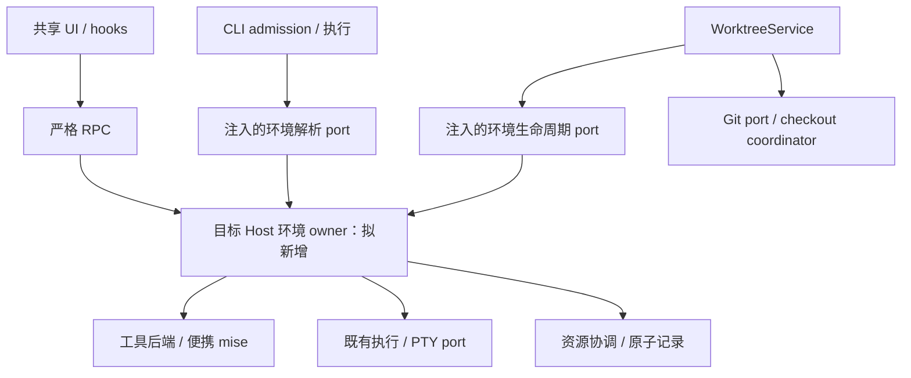
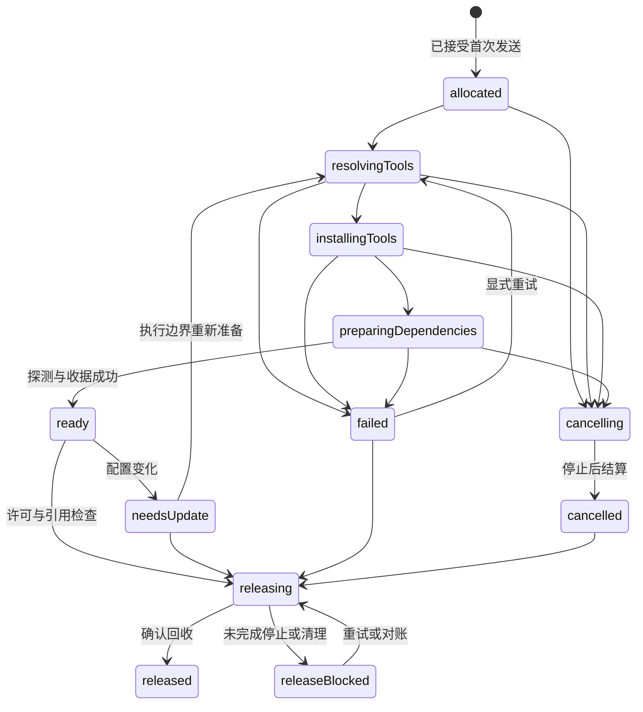
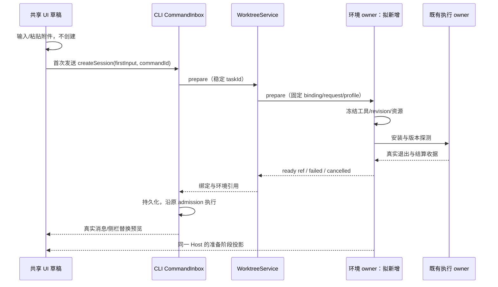
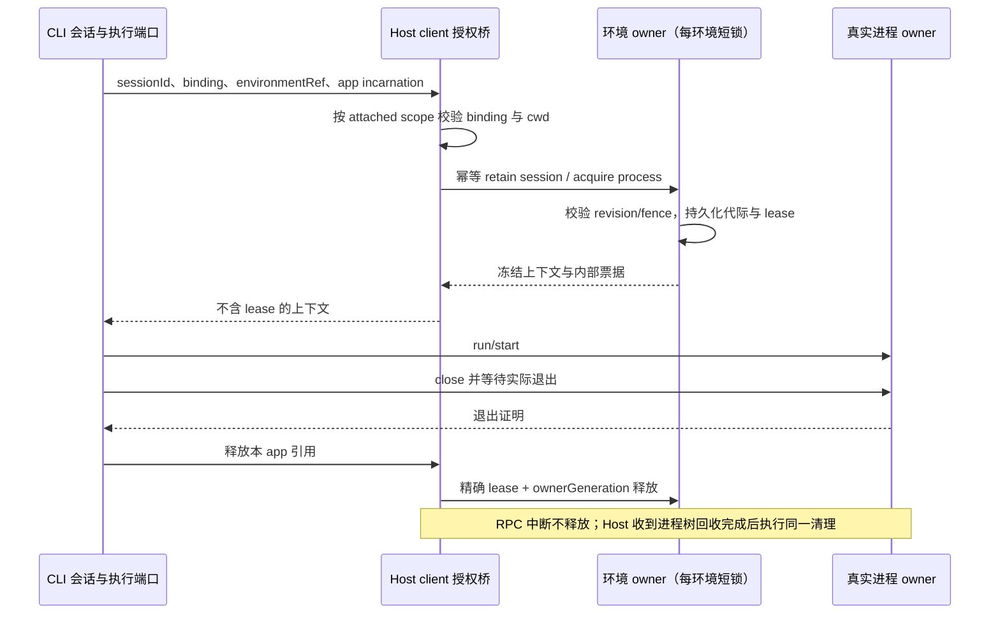
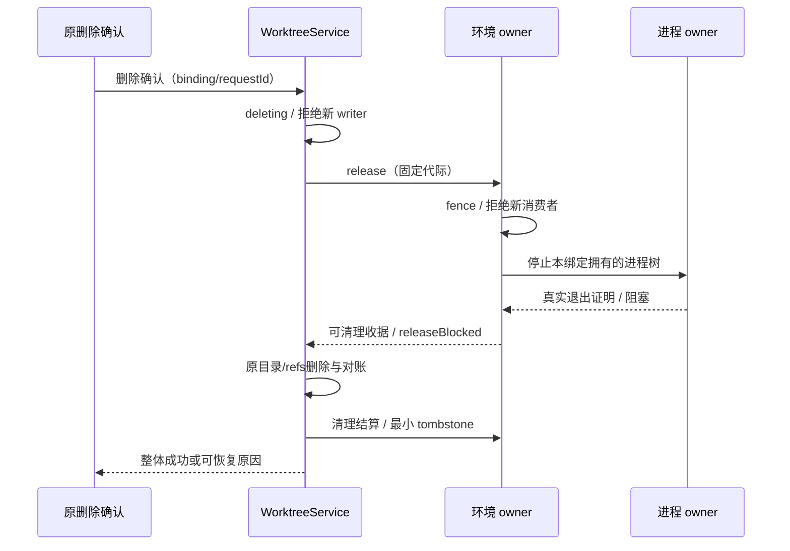
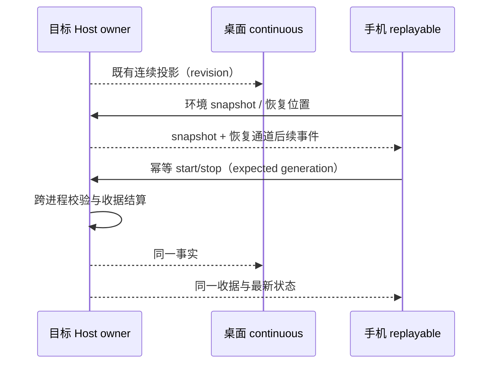

# 工作树与本机独立运行环境：开发规范、技术方案与实施计划

状态：待开发的统一规范；不是功能完成记录。  
更新日期：2026-10-05。调查基线：L-GO / 34c2728。  
本文整合此前运行环境草案，作为此功能产品规则、开发方案、实施顺序及验收的唯一主文档。新增行为先更新本文，再修改合同、代码与测试。

> 已确认目标：各工作树独立工具版本、依赖、构建产物和开发服务，仍在本机运行，尽量无需额外安装。本次编写文档；操作系统沙盒暂缓，不实施业务代码。

## 1. 文档使用规则与现有工作树文档

本文同时面向开发、测试与后续接手的 AI 编码会话。接口、目录和状态草案均是拟新增设计，不表示仓库已经有这些实现。

| 文档 / 合同                                                          | 当前职责                                   | 与本文的关系                              |
| -------------------------------------------------------------------- | ------------------------------------------ | ----------------------------------------- |
| [Git 工作树与提交审核增强方案](git-worktree-enhancements.md)         | 工作树、审核和合并总体方案                 | 本文补充运行环境，不重新设计 Git 发布事务 |
| [工作树服务合同](../packages/services/src/worktree/CONTRACT.md)      | 当前绑定、候选、快照、删除和 checkout 许可 | 当前实现的权威依据；联动时同步维护合同    |
| [会话执行绑定](worktree-session-execution.md)                        | CLI admission、绑定持久化与恢复            | 增加环境引用，不新建用户输入队列          |
| [准备过程与侧栏分叉](worktree-preparation-and-sidebar-fork.md)       | 聊天区进度、侧栏标识和分叉                 | 准备进度来自同一请求，不复制 ready 卡片   |
| [草稿附件与新任务](worktree-draft-attachments.md)                    | 草稿上传、首次发送                         | 环境也只在首次发送后创建                  |
| [工作树界面](worktree-ui.md)                                         | 项目归属、执行位置、审核与跨端联动         | 复用入口、scope 和共享 UI                 |
| [工作树归档与删除](worktree-discard.md)                              | 代码快照、删除与恢复                       | 增加运行资源回收，区别于会话归档          |
| [Git 审核联动与失败转交 AI](git-workflow-linkage-and-ai-recovery.md) | 来源提交、目标发布和诊断转交               | 环境错误复用转交通路，不增加第二套审核    |
| [开发约束](../AGENTS.md)、[UI 规范](../DESIGN.md)                    | 架构、协议、平台、状态与开发要求           | 本文不能免除仓库约束                      |

当前实现与历史 spec 不一致时，先核实源码、合同与运行时证据，再修订文档。新环境能力只有通过对应阶段验收后才可标记为已实现。

## 2. 已确认需求与实施默认值

### 2.1 用户已确认的需求

1. 使用本机执行，每个工作树有独立的工具版本选择、可写依赖、构建结果和开发服务。
2. 普通用户不用填写准备脚本，不用先手工安装 mise 或容器。
3. 创建与准备在聊天区展示，首次输入和附件不丢失、不重复，输入框不会因后台准备永久锁住。
4. 同目录会话分叉共享环境，新工作树分叉拥有新环境。
5. 桌面、Web、手机联动并复用同一目标 Host；手机不安装项目工具、不创建第二个 Agent。
6. 工作树与提交、合并、目标分支发布、删除和恢复贯通。
7. 运行环境与操作系统沙盒分别设计；本阶段只做前者的开发规范。

### 2.2 本方案采用的默认决策

以下是开发默认值，仍属待实现行为。改变时先修订本表，不堆叠冲突开关。

| 项目                       | 默认行为                                               |
| -------------------------- | ------------------------------------------------------ |
| 全局新会话执行方式         | 保持本地目录；项目按需启用工作树                       |
| 功能正式发布后的新工作树   | 默认自动准备托管环境                                   |
| 项目环境策略               | 自动管理运行环境 / 沿用本机环境，默认自动管理          |
| 旧会话、旧工作树           | 保留原行为，显式升级后才绑定新环境                     |
| 本地目录模式               | 首期维持现状；不能声称同目录会话彼此隔离               |
| 首期工具                   | Node、pnpm；npm 使用与所选 Node 配套的版本             |
| 没有工具声明               | 使用应用发布时固定的默认版本，并显示来源               |
| 冲突、安装或下载失败       | 报告真实原因；不偷偷回退系统 PATH                      |
| 降级到本机环境             | 只有用户明确选择后允许，记录降级事实                   |
| 服务启动                   | 准备完成不等于自动启动；用户或被授权任务显式启动       |
| 环境更新                   | 执行边界切换 revision；不替换在途命令与服务            |
| 第三方工具接入             | 优先便携 mise 二进制与适配器；不复制整仓源码到业务模块 |
| 容器、云执行、操作系统沙盒 | 不在本阶段实现，保留独立扩展边界                       |

现有检测支持其他语言/包管理器的准备命令，不代表已经具备其工具隔离。旧项目保持原行为；新建托管环境若缺少必需工具能力，返回 capability-unavailable，用户可明确选择沿用本机环境。计划中允许继承的系统资源从一开始列为未托管，不能把已承诺托管的工具准备失败改成自动继承。部分托管也不显示为完整独立环境。

### 2.3 对外宣布完成的条件

必须同时证明：全部执行消费者使用同一冻结环境；可写资源互不覆盖；同服务跨端启动幂等；重启、停止与删除可对账；候选验证关联精确版本；未托管项可见；相应平台有真实验证证据。

工具准备完成、界面出现环境状态或已有工作树测试通过，都不足以宣布整个功能完成。

## 3. 当前源码核实与缺口

| 范围         | 当前事实                                                         | 待开发内容                            |
| ------------ | ---------------------------------------------------------------- | ------------------------------------- |
| 工作树 owner | WorktreeService 管理绑定、准备、集成、快照与删除                 | 注入环境生命周期 port                 |
| 准备检测     | worktree/adapters/environment.ts 依据锁文件选择命令              | 工具声明、版本冻结、独立依赖策略      |
| 准备执行     | worktree/adapters/validation.ts 在 checkout cwd 启动本机 Shell   | 专属 env/工具上下文与停止收据         |
| CLI          | ExecutionRequest.env 支持 overlay；默认适配器继承应用环境        | 命令边界解析环境引用，防会话污染      |
| 内置终端     | ITerminalService.create 当前接收尺寸与 cwd                       | workspace scope、环境引用与 PTY 接线  |
| 身份与归属   | 原项目 scope 和真实 execution scope 已分离                       | 环境依 binding 对账，不能另造临时项目 |
| 本项目工具   | mise.toml 固定 Node 24.14.0 / pnpm 10.33.2                       | 准备、Agent、终端实际使用同版本       |
| 开发端口     | Web Vite 默认 5173、Desktop renderer 5174、HTTP server 默认 3030 | 托管端口组、实际地址回传、全链路适配  |
| 开发数据     | mise.toml 的开发任务使用固定开发数据目录                         | 每环境独立数据根与 SQLite             |
| 合并候选     | 已有独立候选 checkout、检查与发布事务                            | 候选专属环境、版本关联验证收据        |
| 环境 owner   | 本文提出的新独立运行环境服务尚不存在                             | 新模块、协议、持久化、能力与投影      |

此次核实不代表重新验收全部工作树功能。已有 ExecutionSandboxPolicy 类型也不能作为各平台沙盒已生效的证据。

## 4. 隔离、共享与能力边界

| 资源                      | 管理规则                           | 边界                                             |
| ------------------------- | ---------------------------------- | ------------------------------------------------ |
| 源码与 index              | 每工作树独立 checkout/index        | Git objects、refs、tags 等仍共享                 |
| 工具                      | 每环境固定版本；相同版本复用二进制 | 不切换系统默认工具                               |
| 工具存储                  | 按后端、工具、版本、OS、架构分区   | 项目不能通过适配器覆盖已发布工具                 |
| node_modules / 虚拟 store | 每 checkout 独立                   | 禁止共用原项目或另一工作树的可写依赖             |
| 包下载内容存储            | 同一可信用户可以共享               | 完整性校验；clone-or-copy/copy，不依赖默认硬链接 |
| 构建/测试结果             | 当前 checkout 或环境专属输出目录   | 硬编码外部路径需要适配                           |
| TEMP/TMP/TMPDIR           | 每环境临时目录                     | 仅对子进程 overlay，不修改系统                   |
| 缓存/全局安装前缀         | 按工具映射                         | 不全局替换 HOME、USERPROFILE、APPDATA            |
| 开发服务                  | 环境 + service ID 唯一进程与收据   | 未托管后台命令可能不受服务管理                   |
| 端口                      | 同一真实 Host 协调，监听后确认     | 本机无法两个服务占同地址同端口                   |
| 本项目数据/SQLite         | 环境 ID + 产品环境独立目录         | 不复制真实生产数据                               |
| 外部数据库/Redis/队列     | 显式适配或指定测试实例             | 不自动迁移、清空或猜测生产资源隔离               |
| Git/SSH/认证              | 复用现有授权路径                   | 不将密钥写入 manifest 或日志                     |
| 系统库/驱动/内核          | 继承本机，展示未托管来源           | 不是独立操作系统                                 |
| 沙盒                      | 后续独立执行策略                   | 工具管理成功不等于权限限制生效                   |

环境详情分别展示工具与依赖、服务与数据、未托管资源。任意脚本仍可能硬编码系统路径或自行改 PATH；首期只对经过适配的资源提供管理保证。

## 5. mise 接入与分发方案

### 5.1 接入形态

推荐应用管理的便携 mise 可执行文件，通过工具后端 port 调用。LCode 自己管理环境生命周期、资源、会话、诊断和 Git 联动。

不把 mise 整仓源码复制进 TypeScript 项目，不要求用户安装 Rust。必要补丁编译使用单独受控构建和固定上游 commit，仍以同一 port 接入；维护补丁清单、许可证与升级路径。

官方 mise exec 可以不改变当前 Shell 会话地执行工具命令，但也读取配置。不能直接在任意项目 cwd 执行它，并假定只使用已冻结的版本。[mise exec](https://mise.jdx.dev/cli/exec.html)

首期分工：

1. LCode 受控读取静态声明，生成冻结 manifest。
2. 后端使用应用生成的受限配置，安装和定位确切工具。
3. 项目命令使用绝对工具路径与受控 env overlay 接入既有执行 port。
4. 必须包装时才使用 mise exec；P0 先证明配置隔离、Shell 与停止语义。
5. 每次 spawn 不重新求解 latest、不自动加载新声明、不临时安装。
6. mise task/daemon/bootstrap 不成为第二份环境或服务 owner。

### 5.2 分发与版本控制

| 情形              | 方案                               | 门禁                                     |
| ----------------- | ---------------------------------- | ---------------------------------------- |
| 原型              | 固定官方产物在测试目录运行         | 真实平台、版本、退出/取消、文件校验      |
| 正式交付          | 应用随包提供固定后端，工具按需下载 | 包体、签名/平台要求、代理、离线与许可证  |
| 无法随包的平台    | 应用按需取得同一固定后端并缓存     | 缺网有明确提示，不静默用 PATH 上其他版本 |
| 用户已有系统 mise | 高级用户明确选择后复用             | 版本、能力、路径与来源进入 manifest      |
| 后端升级          | 随应用版本控制                     | 原环境可重现，必要时保留旧后端           |

官方提供手动下载等安装方式；是否适合本项目随包分发必须原型验证。[安装文档](https://mise.jdx.dev/installing-mise.html) 上游使用 MIT 许可证，分发要保留声明；Node、pnpm 等分别处理自身许可证。[源码与许可证](https://github.com/jdx/mise)

“尽量无需额外安装”不意味着首次无需网络，也不意味着编译器、SDK 或驱动已经由应用提供。

### 5.4 P0-06 ADR：便携 mise 后端选型结论（2026-10-05 实测）

- **后端与版本**：固定官方 `mise v2026.10.2`，单文件可执行，不依赖全局安装（`MISE_DATA_DIR`/`MISE_CONFIG_DIR` 指向应用目录即完成隔离）。
- **平台范围**：官方发布资产覆盖全部目标平台——`windows-x64/arm64`（zip 59/61MB）、`macos-x64/arm64`（24/34MB）、`linux-x64/arm64` glibc+musl（28–31MB），共 10 个资产。Windows x64 已本机实测；其余平台按 §17 P5-03 门禁逐平台实测放行，不放行前不默认托管。
- **配置隔离（关键机制）**：项目 cwd 的 `mise.toml` `[env]` 段与父级目录配置会被 walk-up 加载——显式 `exec node@版本` 不能阻止注入（实测 `EVIL=pwned` 泄漏）。缓解已实测：`--no-config`（或 `MISE_NO_CONFIG=1`）阻断全部项目/父级/全局配置加载，同时显式 `node@24.14.0` 仍正常解析到确切版本。托管路径统一用 `--no-config` + 应用生成的受限配置；全局配置注入反例（恶意全局 `config.toml`）同样未加载。
- **下载与安装**：`mise install node@24.14.0 pnpm@10.33.2` 首装 24.8s；重跑幂等 0.1s。并发双进程安装同一新版本（node@22.20.0）双方 exit 0 且产物可用（内置互斥）。离线（不可达代理）exit 1、明确连接错误、不落半成品目录；不存在版本 exit 1。安装中断后重装可恢复。
- **分发策略**：按需下载固定版本 + 固定摘要校验后缓存于 HostDataRoot，不随应用包分发。理由：全平台资产随包将增加数百 MB 压缩包体；按需路径已有明确离线失败语义（不静默用 PATH 兜底，符合 §5.2"无法随包的平台"行）。若后续包体预算允许再评估随包。
- **包体**：mise.exe 解压后 ~188MB/平台（应用侧仅缓存实际使用的平台资产）。
- **阻塞结论**：无阻塞，可进入 P1 托管开发。mise 沙盒标志继续不作安全边界（§5.3）；工具真实版本以 manifest 冻结 + `--no-config` 受限配置保证。

### 5.3 供应链与配置约束

- 固定后端和资产摘要；OS/架构发布清单只列实测资产。
- 临时下载、哈希/可用签名校验、归档路径穿越检查、原子发布。
- 工具 key 包含后端版本、工具版本、OS/架构与安装配置摘要。
- 同 key 跨进程互斥；一个消费者取消只释放自身引用。
- 不自动信任全部仓库配置、动态 env 表达式、插件、task 或系统 bootstrap。
- 项目命令和安装生命周期脚本沿现有授权边界，不把读配置当作执行授权。
- 代理、CA、仓库凭据按现有秘密通路注入，诊断脱敏。
- 不改 Shell profile、全局 PATH 或系统默认版本。
- 已发布工具目录由应用管理；同用户本机模式不承诺能抵御恶意任意进程写入。

2026-10-05 核实的 mise 文档包含部分平台沙盒功能，且明确 Windows 不执行其文件系统和网络限制。本阶段不使用这些标志作安全边界；后续单独验证。[mise 平台沙盒说明](https://mise.jdx.dev/sandboxing.html)

## 6. 工具解析、版本冻结与更新

### 6.1 声明来源

| 来源                        | 首期用途              | 规则                              |
| --------------------------- | --------------------- | --------------------------------- |
| mise.toml 的支持 tools      | 显式版本              | 静态解析，不执行任意表达式        |
| .node-version/.nvmrc        | Node 要求             | 精确版本互相矛盾时报错            |
| package.json packageManager | manager 与版本        | 与 tools 冲突时展示双方           |
| package.json engines        | 兼容范围              | 选中的确切版本必须满足支持的约束  |
| 锁文件                      | 安装策略与依赖指纹    | 多 manager 锁且不能确定时不得猜测 |
| 项目覆盖                    | 用户显式工具/本机策略 | 保留覆盖事实，不掩盖兼容性冲突    |
| 应用默认 manifest           | 无声明时固定版本      | 显示“应用默认”，不冒充项目声明    |

支持的版本语法进入 schema 和测试；未支持语法报告限制。范围解析为确切版本并持久化，重启不得再次取另一版本。

无锁文件不执行伪造 frozen 安装；允许明确的非冻结策略，并显示可复现性限制。产生的新锁文件是普通代码改动，进入原审核。

### 6.2 manifest 与指纹

冻结内容包括：binding/规范化 checkout、实际 Host、用途、profile revision、OS/架构、后端版本、确切工具/路径/来源、声明及锁文件摘要、包管理器配置、安装策略、ABI、适配器版本、资源映射和未托管项。

显示名、中文分支名与会话标题不作为身份 key。凭据只存引用，不持久化展开值，也不发送给 UI。

配置变化将环境标记为需更新；下一次项目执行前重新准备。已有命令和服务继续使用启动时 revision，有真实写入者时升级需等结算或明确停止，不能超时后强行替换。

## 7. 所有者与依赖方向

RuntimeEnvironmentService 是拟新增目标 Host 业务服务，不是现有“服务容器/连接 Environment”的改名。

| 事实                            | 唯一所有者                       | 其他层职责                         |
| ------------------------------- | -------------------------------- | ---------------------------------- |
| 项目归属、checkout、branch      | WorktreeService / 项目索引       | 环境引用真实绑定，不创建临时项目   |
| 输入接纳、turn、恢复            | CLI Core / CommandInbox          | 环境不新增 accepted 输入队列       |
| manifest/revision/准备/资源映射 | 新 RuntimeEnvironmentService     | CLI 存引用，UI 读投影              |
| 子进程、PTY、退出与停止证明     | 既有执行/终端 owner              | 环境通过 port 协调并保存收据       |
| checkout writer                 | 既有 coordinator                 | 安装、验证、清理使用同边界         |
| 端口/环境可写资源租约           | 环境 owner 的 Host 资源协调层    | 同机跨窗口通过持久锁协调           |
| 源提交、候选、目标/远端事务     | 既有 Git owner / WorktreeService | 环境不移动 refs、不自动 stash/提交 |
| 未发送正文/附件                 | 既有草稿与上传 owner             | 不能作为 ready/running 事实        |
| 详情展开和选项草稿              | UI 局部状态                      | 不写业务事实或执行授权             |
| 原生窗口/平台动作               | Main / IPlatformService          | 不承载环境业务数据库               |

多个 window-scoped Host 实例共享同机资源时，逻辑 owner 通过同一数据根、跨进程锁与 fencing 协调，不能各存一份 running。远程 Host 在远程机器分配资源；手机和 Main 不分配远端端口。



组合根注入绑定校验和 checkout 许可 port。环境模块不能深导入 worktree app/adapters，WorktreeService 不依赖 CLI runtime；新模块先注册 contract、公共出口与 architecture policy。

必须保持：

1. 身份使用 workspaceIdentity?.trim() || workspacePath，文件操作使用真实 workspacePath。
2. 原项目 scope 管设置和侧栏，execution scope 管文件和进程。
3. 环境引用在首次执行前持久化；缺失不能回退原目录。
4. 一命令一份不可变上下文，不改 Host/Agent process.env。
5. 换模型不改变绑定，也不等待常驻服务退出才切换。
6. ready、running、任务成功、验证通过和 Git 发布分别结算��
7. 真实停止证明来自进程 owner，UI 消失不证明退出。
8. 升级/删除 fence 拒绝新启动，stale 请求不能复活资源。
9. 未知 ACK 先对账，不重复执行 firstInput 或服务。
10. 缺能力的 Host 明确报告，不伪造托管成功。

## 8. 身份、记录与私有目录

以下名称、字段和目录是拟新增设计。

### 8.1 身份

- environmentId：owner 分配的稳定 ID，不用分支或显示名。
- bindingOwnerTaskId：同目录分叉的根 owner，用于共享环境。
- purpose：worktree / integration-candidate；未来可扩展实际本地 checkout。
- revision：冻结计划代际，活消费者可继续引用旧代。
- resourceKey：实际 Host + environment ID + 类别/service ID。
- 同路径不同 identity 不串授权；实际目录互斥仍按 canonical path。
- 跨端保留 workspaceIdentity 与 remoteSessionId，不手拼 remote identity。
- 同目录共享，新目录独立；分支改名不迁移资源。

### 8.2 持久模型

| 记录                 | 必须字段                                                      | 用途                                  |
| -------------------- | ------------------------------------------------------------- | ------------------------------------- |
| EnvironmentRecord    | ID/scope/binding/purpose/status/current revision/timestamps   | owner 结算的环境事实                  |
| FrozenManifest       | tools/digests/backend/安装策略/resource mappings              | revision 内不可变                     |
| PreparationOperation | operationId/requestId/阶段/step receipts/cancel/error         | 幂等、断点与崩溃对账                  |
| ConsumerReference    | kind/ID/revision/owner generation/lease                       | 区分会话、终端、命令、MCP、服务、候选 |
| ServiceReceipt       | service ID/generation/process token/PID/start time/URLs/state | PID 仅诊断，不独立授权停止            |
| ValidationReceipt    | candidate HEAD/tree/manifest digest/revision/命令与结果       | 精确关联验证，防过期发布              |
| ResourceLease        | resourceKey/owner token/fence generation/用途                 | 活 owner 不按墙钟强行过期             |
| FailureDiagnostic    | stage/code/paths/retryability/脱敏日志引用                    | UI 与转交 AI，内容有界                |

### 8.3 目录建议

本文的 HostDataRoot 明确定义为实际执行 Host 的 getAppConfigDir()，即 {dataBaseDir}/.lcode/v2，不是项目根，也不是项目的 .lcode。默认 dataBaseDir 来自启动时捕获的 HOME/homedir()，也支持 setDataBaseDir、LCODE_DATA_BASE_DIR 及既有旧名兼容。它是应用级数据位置，不能当作项目级工作树位置选项。

当前生产组合根 packages/services/src/node.ts 使用 dataDir: join(resolveAppConfigDir(), "worktrees")；paths.ts 定义其前缀。当前源码没有项目 .lcode / 用户 .lcode 二选一设置。本文不改变这一默认位置，新增环境资源也放在同一实际 Host 的应用数据根，作为 worktrees 的同级目录。

```text
<HostDataRoot>/
  runtime-environments/                 # 拟新增
    records/<environmentId>.json
    operations/<operationId>.json
    manifests/<environmentId>/<revision>.json
    resources/<environmentId>/
      temp/
      cache/
      data/<productEnvironment>/
      logs/
  tool-backends/<backendVersion>/<os-arch>/
  tool-store/<backend>/<tool>/<version>/<os-arch>/
  package-store/<manager>/<compatibility>/
  worktrees/...                        # 复用当前布局
```

记录带 schemaVersion，严格校验、持锁重读、临时文件原子替换。未知版本或损坏记录明确失败，不修成 ready。业务记录不借用 storage management 数据库。

日志有界尾读/分页，资源扫描有数量和时间预算；不用每次刷新遍历数万个 node_modules 文件。私有目录不进入 Git checkout，token 不进入 UI 投影。

### 8.4 工作树存储根、项目配置与迁移边界

| 概念                           | 当前/计划位置                           | 语义                                                                                      |
| ------------------------------ | --------------------------------------- | ----------------------------------------------------------------------------------------- |
| 工作树管理记录、checkout、快照 | 当前 {dataBaseDir}/.lcode/v2/worktrees/ | 应用级管理事实与代码目录；本方案保留                                                      |
| 环境记录、缓存、数据与工具     | 拟新增于 HostDataRoot 下的专属目录      | 不写进项目 .lcode，不复制原项目数据                                                       |
| 项目 .lcode                    | 项目已有配置目录                        | config、commands、skills、hooks、workflows、memory 等实际支持的项目功能；不是工作树存储根 |
| UI“项目工作树”                 | 按原项目归属查询的视图                  | 表示所属项目，不表示物理目录在项目内部                                                    |

现有绑定记录绝对 checkoutPath；store.assertManagedPath 只接受当前 checkouts 根下的直接子目录，并检查 symlink/realpath。直接换 dataDir 而不迁移，可能先因新根没有旧 records 查不到绑定；若旧记录被读入新 store，又会因旧路径不在新受管根而被拒绝。因此不得把新环境功能实现成更换 WorktreeService dataDir，也不得宽松跳过路径校验来兼容旧绑定。

“换根会使全部绑定失效”仅是无迁移换根的风险，不是当前已经发生的事实，也不是合法迁移必然失效。本文未规划改根功能。以后若另行开发存储位置设置，先单独制定记录/aliases/requests/快照/候选/原生 Git 登记与路径映射的迁移、回滚和双根对账规则，停止实际 writer/服务并保留身份校验；不能只改字符串或直接搬目录。

用户级 checkout 在物理位置上不随项目目录移动，但原项目 scope、绝对路径、Git common directory 与任务索引仍需重新绑定/对账，不能承诺项目移动后所有会话无需处理。项目内嵌套 checkout 的配置发现、搜索/监听、Git status/暂存和同步盘 realpath 行为是条件性风险，需按各自真实调用链验证，不能推断为当前已发生的问题，也不能保证所有 OneDrive 项目都会被拒绝。

## 9. 接口草案与命令接线

### 9.1 Host API

以下是拟新增方法族，最终按架构约束收敛：

| 方法族                   | 关键输入                                                                                                                        | 输出                                |
| ------------------------ | ------------------------------------------------------------------------------------------------------------------------------- | ----------------------------------- |
| capabilities             | scope / Host 路由                                                                                                               | 平台、后端、支持类别与缺失原因      |
| prepare                  | requestId/binding/purpose/expected profile revision                                                                             | 可查询 operation、环境引用          |
| get/list                 | 授权 scope、环境/项目引用                                                                                                       | 环境/资源投影与分页                 |
| resolveContext           | scope/binding/env ref/用途/consumer/许可；CLI 执行前解析按 checkout cwd 定位（环境记录 scope 即 checkout 路径，取最长前缀匹配） | 冻结 cwd/工具 argv/env overlay/摘要 |
| startService/stopService | requestId/env ref/service ID/expected generation                                                                                | 唯一服务收据或明确阻塞              |
| reconcile                | 原操作/环境/进程引用                                                                                                            | 实际对账，不创建新任务              |
| release                  | requestId/binding/expected revision/生命周期授权                                                                                | 回收收据或阻塞证据                  |

UI 不可提交任意 env 文件、工具存储路径或 token 作为事实。保留现有通用命令 overlay 契约，但保留键和身份由 owner 校验。

### 9.2 项目命令上下文

拟新增 ResolvedProjectExecutionContext，区别于当前 tracing ExecutionContext：

```typescript
// 设计形状，尚不是现有类型。
type ResolvedProjectExecutionContext = {
  environmentId: string;
  revision: number;
  manifestDigest: string;
  executionScope: { workspacePath: string; workspaceIdentity?: string };
  cwd: string;
  toolPaths: Readonly<Record<string, string>>;
  envOverlay: {
    base?: "inherit" | "empty";
    set?: Record<string, string>;
    unset?: string[];
  };
  resourceLeaseToken: string; // 仅内部，不能发送给 UI
};
```

事件顺序：校验 scope/binding/许可 -> 对账 env ref 与摘要 -> 合成平台必要变量/认证与代理/资源映射/工具路径/命令 overlay -> spawn -> 收据结算。

保留键冲突必须有固定规则，不能任意覆盖环境身份、内部执行载体或托管端口。应用内部 Helper、Agent 自身与项目程序分开：项目 Node 不替换应用运行时。

cwd 越出绑定范围明确标记资源边界，不自动切换另一个环境。Shell 自行重写 PATH、硬编码外部程序的行为需可诊断；本阶段不承诺拦截所有此类行为。

### 9.3 消费者覆盖清单

| 消费者                  | 必须接线                                    |
| ----------------------- | ------------------------------------------- |
| 工作树准备/setup        | 第一条安装前取得冻结上下文                  |
| Agent Bash/通用项目执行 | 每次真实 spawn 前按绑定解析                 |
| Hook/工作流             | 先沿现有信任与权限边界，再注入上下文        |
| 测试/构建               | 相同依赖、输出范围、版本收据                |
| 内置终端                | scoped create 获取环境，PTY 应用 overlay    |
| 本地项目 MCP            | 连接 key 含环境/revision/配置摘要，cwd 正确 |
| 托管服务                | 定义、端口组、数据路径、进程代际一致        |
| 候选/冲突修复           | candidate purpose、候选声明与精确验证       |
| 外部 MCP/HTTP           | 明确外部资源，不能承诺本机隔离              |

只给准备命令追加 PATH 不算完成。绕过 execution port 的插件进程必须接线，或列为未托管项。

CLI 执行前解析（P2-03 起）：执行适配器在每次 spawn 前按请求 cwd 向目标 Host 查询所属托管环境（环境记录 scope 含该 cwd 时命中，取最长匹配）；无命中或旧 Host 不支持时保持现有继承语义（不报错、不改行为）。冻结 overlay 与请求自带 overlay（如 Hook 插件变量）合并规则固定：请求自带 set 覆盖冻结 set，unset 取并集，base 默认继承。解析结果按 cwd 短时缓存（含 revision），缓存失效后下一条命令取新 revision，在途命令不受影响。应用内部 Helper 与 Agent 自身进程不在命中范围（cwd 不在托管 checkout 内）。

### 9.4 源码改动位置与新增模块规划

以下现有路径已核实；拟新增路径实施时先注册架构策略，不能仅创建空壳后宣布接线完成。

| 位置                                                                                              | 开发职责                                                                                                                                                  |
| ------------------------------------------------------------------------------------------------- | --------------------------------------------------------------------------------------------------------------------------------------------------------- |
| packages/services/src/runtime-environment/（拟新增）                                              | managed 模块：module、contract、contract.example、CONTRACT、node 公共组合入口；domain 管 manifest/状态/资源规则，app 管用例，adapters 管后端/记录/资源 IO |
| packages/shared/src/runtimeEnvironment.ts（拟新增）                                               | 环境引用、投影、操作收据、严格 schema；只暴露协议所需字段，不包含本机后端实现或授权 token                                                                 |
| packages/services/src/node.ts、accessor.ts、公开出口                                              | 注册 descriptor、组合后端与执行 port，注入各消费者；沿当前服务注册方式，不放入 Electron Main                                                              |
| packages/shared/src/lcode-protocol/index.ts 与当前实际协议边界                                    | 新环境引用的严格输入/输出校验、能力协商与兼容字段；实施时确认 V4 创建、事件及恢复入口                                                                     |
| packages/services/src/worktree/contract.ts、app/ports.ts、node.ts                                 | 注入生命周期/候选验证 port；保持 WorktreeService 的 Git 与绑定所有权                                                                                      |
| apps/lcode-cli/packages/contracts/src/interfaces/execution.port.ts                                | 复用 env overlay；新增环境解析 port 通过 contracts 公共出口，不引用服务实现                                                                               |
| apps/lcode-cli/packages/bootstrap/src/app/app-adapters.ts 与 lcode-protocol/worktree-execution.ts | 应用执行器组合与 worktree 环境引用接线，内部 Helper 和项目命令分类                                                                                        |
| apps/lcode-cli/packages/adapters/src/exec/                                                        | 在真实进程边界使用上下文、记录实际版本/代际、复用停止机制                                                                                                 |
| packages/services/src/terminal/terminal.ts、terminalService.ts                                    | scoped create、PTY 环境、会话关闭与终端 dispose 的引用结算                                                                                                |
| apps/lcode-cli/packages/bootstrap/src/lcode-protocol/worktree-mcp-scope.ts                        | 本地项目 MCP 的 scope/环境 key；沿当前实际 MCP 启动 owner 接线                                                                                            |
| packages/ui/src/hooks/、worktree/、i18n/locales/                                                  | 共享服务访问、准备投影、详情/动作、双语文案；不直接读环境 JSON                                                                                            |
| architecture-policy.yaml 与 feature graph                                                         | 新模块真实存在后注册层/模块规则和源码种子，检查循环依赖与深导入                                                                                           |
| scripts/third-party-notices.mjs 等现有打包/声明链路                                               | 后端资产、校验、许可证与按平台的发布清单；具体插入点由 P0 核实                                                                                            |

新服务通道通过当前共享服务描述/注册机制接入。不得未经查证手写一个不存在的 ServiceChannels 文件路径，或同时在 Main、Host、CLI 各注册一套环境事实。

### 9.5 错误、操作收据与兼容语义

拟新增结构化错误使用稳定 code 与阶段，显示文案由 UI 国际化；错误不能只返回一段字符串。

| 类别                                             | 建议语义                                    | 重试规则                                       |
| ------------------------------------------------ | ------------------------------------------- | ---------------------------------------------- |
| configuration-conflict / unsupported-declaration | 给出声明来源、字段与冲突                    | 用户修正/明确覆盖后新 revision；不原样无限重试 |
| capability-unavailable / tool-unavailable        | Host 平台、后端或版本不支持                 | 能力改变后重新准备，或用户明确沿用本机         |
| download-failed / integrity-failed               | 网络、校验或半成品                          | 复用操作和有效步骤，坏产物隔离，不发布         |
| dependency-install-failed                        | 实际退出码与脱敏日志                        | 先核实已发生副作用，再显式重试该步骤           |
| stale-reference / scope-mismatch                 | binding/revision/generation/identity 不匹配 | 读取当前事实，旧请求不得覆盖新代               |
| resource-busy / port-bind-failed                 | 活消费者或实际端口失败                      | 适配器允许时重新分配，否则明确停止/重试        |
| process-unknown / release-blocked                | 缺少退出证明或目录未清理                    | reconcile 后继续同一操作，不误报资源已释放     |
| cancelled                                        | 已取消并持久化结算                          | 不复活首次输入，按既有规则手动重发             |

同 requestId 的接受事实和副作用收据持久化；响应丢失读取原 operation。查询不产生执行，状态更新带单调 revision，消费者只接受 owner 已结算事实。协议增加可选字段和 capabilities；无新能力的旧 Host 保持现有执行，但显式托管请求返回不支持，不能忽略字段后假装成功。

## 10. 创建、准备、取消与恢复

### 10.1 生命周期



服务 starting/running/stopping/stopped/failed/unknown 独立于环境状态。恢复是对账动作，不通过旧 running 标记直接认定服务活着。

### 10.2 首次发送顺序



### 10.3 时序与故障规则

- intent 在发送时冻结；之后改设置不影响已接受请求。
- 同 commandId/taskId/binding 重试复用操作、完成步骤和环境。
- 粘贴/选基线/空草稿不启动准备，也不能阻塞“新任务”。
- 失败保留输入；取消结算后不执行 firstInput。已取消请求沿既有规则手动重发。
- ready 与取消共享真实决策边界，不用 UI 隐藏或延时推动成功。
- 共享下载取消只释放当前消费者，项目安装进程由真实 owner 停止。
- 物化后消息替换 preview，准备卡不在页面顶部和消息流重复渲染。
- pending 仅覆盖必要接受阶段；不因长期准备永久禁用编辑草稿或另建任务。
- 长操作有查询收据；丢失响应/重启只对账，不重放输入。
- 无法确认显示“正在核实”及原因，不把未知当完成。

## 11. 依赖、构建产物与本项目适配

### 11.1 首期 Node/pnpm

- 本项目真实验收使用 Node 24.14.0 / pnpm 10.33.2；其他项目按冻结声明。
- 每 checkout 的 node_modules/虚拟 store 独立，monorepo workspace 语义保持。
- pnpm 显式使用 clone-or-copy 或 copy，不依靠可能硬链接的 auto。[pnpm 10 包导入策略](https://pnpm.io/10.x/settings#packageimportmethod)
- 依赖收据覆盖工具/锁/配置/平台 ABI，不能因目录存在跳过安装。
- 更换 Node ABI 重新验证 native addon 和 postinstall，不复用未验证构建。
- 缓存、配置与全局前缀按工具适配，保留原认证。
- 安装脚本保持项目授权，不无条件开启所有生命周期脚本。
- 首期只共享下载内容和受管理工具，不跨树共享可写 native 产物。

构建输出默认当前 checkout 或专属目录。硬编码绝对路径需要适配，否则展示未托管。私有资源不进 checkout；忽略规则需审查，不自动覆盖用户 .gitignore。已经被 Git 跟踪的构建文件仍进入普通审核。

不自动复制原项目 node_modules、真实 .env、数据库或凭据。代码快照与环境数据分别管理。

### 11.2 本项目完整接线清单

| 当前入口                                           | 待开发                                       | 必须证据                      |
| -------------------------------------------------- | -------------------------------------------- | ----------------------------- |
| 根 package.json dev:web                            | server/web 一致端口组与地址                  | 两树并行各连自身后端          |
| packages/web/vite.config.ts                        | 受控端口/endpoint，保留普通启动默认值        | 实际请求/监听                 |
| packages/server/src/http.ts 及实际 entry-http 入口 | server 端口与数据 scope 全链路               | 不只改底层参数，实际 dev 启动 |
| packages/desktop/vite.config.ts                    | renderer 端口参数化，保留 strictPort         | 实际 ready 地址               |
| packages/desktop/scripts/dev.mjs                   | ready 探测/启动器使用实际端口                | 不连接其他实例                |
| scripts/dev-desktop-env.mjs                        | 上下文贯穿 pre-dev、Agent build、dev:runtime | 子进程工具/输出范围           |
| mise.toml 开发数据目录                             | 托管启动按环境 ID 覆盖数据根                 | SQLite 与配置分离             |
| scripts/mise-toolchain-env.mjs                     | 保持项目 Node，区分内部 Helper               | 两类进程分别验证              |

LCODE_ENV 是产品环境，不是 environmentId。不得为目录隔离随意改变 production/test、OAuth、远控 endpoint 或品牌。工作树中启动的开发 LCode 实例也不能接管控制它的 Host/session。

P0-05 核实记录（2026-10-05，HEAD 3c436cc）：web dev 端口 5173 硬编码于 `packages/web/vite.config.ts:57`（`/ws`、`/api` 代理硬编码 3030）；desktop renderer 5174 strictPort 于 `packages/desktop/vite.config.ts:189`；desktop dev 启动链 = 根 dev:desktop:test → `scripts/dev-desktop-env.mjs`（注入 LCODE*ENV）→ `desktop/scripts/dev.mjs:89` 轮询 5174 后 spawn Electron（`ELECTRON_RENDERER_URL`）；HTTP server 默认 3030 于 `packages/server/src/http.ts:303-306`，`PORT`/`LCODE_SERVER_HOST`/`HOST` 可覆盖（`packages/server/src/entry-http.ts:16-17`）。数据根唯一来源 `LCODE_DATA_BASE_DIR`（兼容旧 ZCODE* 名，`packages/services/src/paths.ts:12-13,36-42`），config root = `{base}/.lcode/v2`；desktop 经 setting.json `dataBaseDir` → `setDataBaseDir` 注入并由 host 回注子进程（`desktopRuntimeEnv.ts:559`）；`LCODE_HOME` 仅 CUA Helper 路径回退，不是数据根。已天然参数化：server 端口/host、数据根、LCODE_ENV；需改造：web 5173 与代理目标、desktop 5174 与 dev.mjs 轮询地址（M3-04）。`paths.ts` 模块加载期捕获 env，进程内切换须走 `setDataBaseDir`。

本次不构建桌面包。后续实现者仍应进行源码、CLI、服务、浏览器和必要的原生进程验证；用户执行最终桌面构建，不把未构建记作打包通过。

## 12. 服务、端口、数据与许可

### 12.1 服务模型

拟定 ServiceDefinition：稳定 service ID、用途、argv/批准的 Shell、cwd、环境 revision、端口/地址需求、服务依赖、输出/数据目录、健康证据、停止策略、日志、是否写源码。

同环境同服务并发 start 返回同一收据。配置/revision 不同需明确 restart；旧进程停止后分配新 generation。依赖组是 DAG，部分失败不能把全组标为 ready。

实现边界（P3-01/P3-02，2026-10-05）：ServiceDefinition/ServiceReceipt/资源租约落在本 runtime-environment 模块 domain（复用 worktree coordinator 的跨进程文件锁模式，canonical path 键，不按墙钟过期）；进程启停经既有执行 port（环境服务保存收据，PID 仅诊断不授权停止）；真实监听健康检查用 TCP connect 探测实际 bind，探测成功才标 running，停止以进程 owner 退出为准。

### 12.2 端口竞态

1. 在实际 Host 上预留资源记录。
2. 探测候选端口，不等同于真实监听。
3. 启动进程，收集实际 bind/URL。
4. 外部 EADDRINUSE 按适配能力重新分配或失败。
5. 重新分配后同步 backend/frontend/HMR/websocket 地址图。
6. 满足真实健康条件才标 running。
7. 服务停止后失效旧地址；关闭浏览器标签不停止服务。

PORT 不是通用接口；框架固定参数、renderer/debug/websocket 都需适配。没有适配不能显示自动端口隔离。

### 12.3 数据与手机预览

每环境独立开发数据，必要组件同环境共享。默认空数据，测试 seed 是明确动作。外部数据库不凭环境名前缀推断隔离。

手机预览走已有平台/browser/proxy；不能直接把远程 localhost 发给手机。不开公网、不自动绑定 0.0.0.0 来绕过可达性问题，沿原权限。

### 12.4 写入和锁

- 依赖安装、生成源码、候选验证、清理经过既有 checkout writer。
- 只读源码、写声明缓存/数据的常驻服务持资源许可，不无条件占用整树独占许可。
- 持续写源码服务需 writer 或拆成短时明确写入；否则会阻止继续编码。
- 升级/释放 fence 阻止新消费者，等待已接受者结算。
- P1 固定 checkout/环境/工具/端口锁顺序并测试死锁。
- 短记录锁不覆盖整个下载或长安装。
- UI busy 不能撤销活 writer；外部编辑器仍在应用许可边界之外。

## 13. 分叉、会话删除、工作树归档与恢复

| 动作                     | 环境联动                                                      |
| ------------------------ | ------------------------------------------------------------- |
| 同目录分叉               | 共享根环境，新消费者引用，不重复启动服务                      |
| 新树分叉                 | 由快照后的实际声明准备新环境，不复制进程/数据库/可写依赖      |
| 删除一条会话             | 释放该会话消费者，不能删除其他会话使用的资源                  |
| 会话归档                 | 影响可见性，不等于代码快照、环境回收或停止                    |
| 保存代码快照并移除工作树 | fence、停止绑定服务、保存代码、移除目录与可重建资源           |
| 删除工作树               | 原位置/原确认弹窗说明影响，一次操作结算，不新增“强制删除”入口 |
| 清理受阻                 | 保留 deleting/releaseBlocked 和原因，可重试，不误报成功       |
| 恢复代码                 | 按平台重新准备，可复用工具缓存，不恢复 PID/端口/running       |
| 目录手工丢失             | missing 并拒绝原会话续写，不回退原目录                        |

P4-01 实施合同（2026-10-06）：同目录分叉经 session alias 读取父 binding，环境引用随 workspace ref 保留；新树只使用新 binding 的环境，不复制来源环境引用。环境 owner 显式登记消费者，读取上下文本身不暗中创建无法结算的引用。

- `session` 引用用实际 session/task ID（不是共享的 bindingOwnerTaskId），所有者为 binding；prepare/fork/restore 按相同身份幂等登记。关闭 app、归档和 transport 断开不删除会话引用；只有持久删除获确认或工作树删除事务明确结算对应会话后才释放。
- `process` 引用用每个 app 的唯一 incarnation ID，ownerId 由 Host 的真实 Agent client 代际派生。环境 revision 不充当进程代际；ownerGeneration 由环境 owner 分配，lease 随该代际固定。登记重试返回同一 lease，不覆写另一个 owner。
- 每个环境的引用登记、精确释放、回收 fence 共用同一持久短锁，持锁重读。释放必须同时匹配 environmentId/kind/id/ownerId/ownerGeneration/lease；迟到释放不能删除新代引用。同名消费者在不同环境中互不影响。released 引用保留墓碑，除显式带前一代际的重新登记外不复活。
- Host 先按 attached workspace（identity 优先）和 sessionId 查询真实 worktree binding，再核对 environmentId/revision 及 cwd 的规范化目录边界。禁止仅凭 cwd 最长前缀授权，也不信任客户端自报 owner 或 lease；内部 lease 不出 Host 的 UI 投影。
- 托管执行每次 run/start 都对账，不用 TTL 跳过 fence；Host 不可达、引用过期和回收中均拒绝 spawn。只有没有托管 environmentRef 的旧会话保持原行为。命令自带 overlay 不得覆盖或删除冻结 PATH、临时目录等 owner 字段。
- 执行端口成功关闭后 CLI 发送精确释放；关闭失败保留引用。Host 仅在 `onProcessCleanupCompleted` 确认真实进程树退出后兜底释放该 client 的 process 引用，不释放 session 引用。已开始的登记与退出交错时，等待登记结算后再清理。
- 环境 release 持锁写 fence 后检查活消费者与未证实停止的服务；仍有占用则保留 releaseBlocked 及有界诊断，不误报 released。P4-04 的目录回收和会话删除顺序仍须单独完成验收。



删除不要求关联会话活跃或 persisted。其他会话引用需要明确影响并结算执行，不成为永久不能删除的借口。



不得按 node.exe、Shell 名、端口号或孤立 PID 批量杀进程。删除一树不删除其他环境使用的工具；缓存 GC 根据活引用。

环境私有数据不自动包含在代码快照里。不可重建的数据清理前明确保存/导出或丢弃选择，不冒充恢复时一定存在。

## 14. 提交、候选验证、目标与远端发布

环境资源不进入 Git 提交。Git diff/file scope 继续归原 owner，不能根据空任务摘要推断全部变更应隐藏，也不要求会话活跃才能管理工作树。

本地审核保持本地提交；工作树审核使用现有来源提交 -> 目标候选流程。候选规则：

1. 固定 source HEAD、target branch/HEAD、candidate checkout。
2. 候选有独立 purpose 环境，读取合并后的声明/锁文件，不复制来源 node_modules。
3. 冲突修复改变工具/锁文件即使旧 manifest/验证失效。
4. 验证收据关联 candidate HEAD/tree、env revision/manifest、命令与实际结果。
5. 候选或环境变化重新审核验证，不发布过期收据。
6. 下载/安装失败是验证前置失败，不能标通过。
7. 既有允许跳过检查的流程保留明确确认与未验证记录。
8. 候选取消回收自有资源；已发布事实不可变回 cancelled。

目标不是写死的 L-GO。用户改目标使旧候选/计划失效，重新冻结。示例：

```text
来源工作树提交
 -> 选 L-GO 并固定其 HEAD
 -> 独立候选环境按候选锁文件准备
 -> 冲突处理 / 差异审核 / 精确验证
 -> 确认合并到 L-GO
 -> 从实际 L-GO ref 准备远程与 Tag 发布
```

环境服务不执行 stash、移动 refs、创建 Tag 或替换 Git/SSH 认证。目标检查和远端事务仍由 Git owner 负责。

运行资源不会“合并”到目标；目标下一次运行按目标声明准备。原目标服务继续旧 revision 并提示更新，不在 fast-forward 时偷偷重启。

## 15. UI、跨端联动与错误转交

### 15.1 交互位置

| 入口           | 行为                                               |
| -------------- | -------------------------------------------------- |
| 新会话顶部     | 左侧项目/执行方式/分支基线，右侧项目设置           |
| 项目设置       | 简单环境策略；高级来源详情收起，不让用户填准备命令 |
| 聊天区卡片     | 空间 -> 检出 -> 工具 -> 依赖 -> 就绪，只有一份记录 |
| 已有工作树会话 | 环境状态/版本/来源/服务/数据/未托管详情            |
| 项目工作树管理 | 生命周期与资源概况，删除恢复不依赖活会话           |
| 服务动作       | 运行/停止/重启/预览，pending 对应实际 operation    |
| Git 审核       | 补充候选环境/验证，不创建第二套审核管理            |
| 手机/Web       | 查询控制相同 Host，不安装工具、不启动第二个 Agent  |

文案用“正在准备运行环境”“工具与依赖已就绪”“项目声明/应用默认/用户覆盖”“部分资源沿用本机环境”。不将所有情况都写成完全隔离。

大日志有界详情，文件差异沿既有区域查看，不在弹窗展开上万个依赖文件。共享 UI 同时兼容桌面/390px、中英、键盘与长中文路径。

### 15.2 事实同步



保持 desktop-continuous 和 web-remote-replayable 区别。乱序以 owner revision 对账，pending overlay 不反写 running。Main/relay 不保存环境业务队列或快照。

### 15.3 诊断转交 AI

错误至少包含：阶段/类型、绑定用途、来源/目标/candidate 分支与提交、环境 revision/工具来源、配置字段或准确位置、相关路径、命令摘要/退出码、脱敏 stderr 尾部、日志引用、是否可重试及已发生副作用。

复用“提出后续修改要求”草稿入口，点击“交给 AI 处理”才填入可编辑诊断；不自动发，不泄露秘密，不覆盖已有正文。已有草稿按明确追加/合并规则处理。

版本冲突列双方声明，端口问题列真实服务与监听，清理问题列阻塞路径/owner，合并问题列 source/target/candidate。修复后重新取得有效验证，不能复用旧 ready。

## 16. 开发规范与交付要求

### 16.1 行为和边界

- 开工确认分支与源码，执行 node scripts/check-workspace-freshness.mjs。
- 先 spec/验收后代码，按阶段有限范围实施；完整功能后立即验证。
- 代码阶段使用 architecture-governance，先检查再读实际模块 context。
- 新 managed 模块先 contract/public exports/policy；拟新增 API 不冒充已有 API。
- 状态唯一 owner、严格 schema、公开 port 注入，不深导入其他域实现。
- UI 经 hooks，平台动作经 IPlatformService，服务不引用 CLI runtime。
- 身份与路径分开，scope/owner/lease/remoteSessionId/stale 防护保留。
- 使用异步文件/网络 IO；缓冲、扫描、日志与进度有界。
- argv 优先，批准的 Shell 保留原权限；支持中文、空格、平台方言。
- 不用延时掩盖同步，不新增第二份接受队列，不修改全局 process.env。
- 重试指向原 operation，明确已完成步骤；未知状态先 reconcile。
- 日志按 createServiceLogger/UI logger，chunk 用 debug，生产记录生命周期，秘密脱敏。
- bug 注释用中文说明真实原因与修复证据。
- 保留无关本地改动，不能全量暂存其他任务。

### 16.2 验证规范

必须执行 pnpm typecheck、pnpm lint、适用的 pnpm architecture:check --changed；格式检查真实报告。不能把已有失败记作通过。

测试以目标包 package.json 和实际文件为准；行为有测试、交互有 E2E，真实工具/进程/Git不能全被 mock 替代。平台能力来自实际 Host，不由浏览器 OS 推断。

每阶段记录：基线 SHA、平台、实际命令、通过/失败/未执行、对应验收 ID、限制及证据。用户自行桌面构建；实现者仍须完成可用源码与集成验证。

## 17. 详细实施计划与门禁

所有任务当前为 planned。先完成阶段内纵向功能再验证，不跳过依赖将后续能力标完成。


### P0：原型与技术选型

P0 已完成（2026-10-05，证据见下表与 §5.4/§11.2）。Windows x64 实测平台：Windows 11 x64（10.0.19045），mise v2026.10.2 官方 windows-x64 资产，隔离 `MISE_DATA_DIR`/`MISE_CONFIG_DIR` 测试目录，不依赖全局安装。

| ID    | 任务与交付                        | 完成门禁                                       | 实测证据（2026-10-05）                                                                                                                                                                                                                                                                                                                                                                                                                                                                                                                                                                                                                                                                                                                                                                             |
| ----- | --------------------------------- | ---------------------------------------------- | -------------------------------------------------------------------------------------------------------------------------------------------------------------------------------------------------------------------------------------------------------------------------------------------------------------------------------------------------------------------------------------------------------------------------------------------------------------------------------------------------------------------------------------------------------------------------------------------------------------------------------------------------------------------------------------------------------------------------------------------------------------------------------------------------- |
| P0-01 | spawn/PTY/MCP/Hook入口和owner清单 | 每类有源码调用链                               | 四类消费者调用链与停止 owner 已核实到行级：spawn=`NodeExecutionAdapterRun.run`（`node-execution-adapter-run.ts:27`，spawn :206，停止 owner=请求级 requestStop→terminateProcessTree win32 taskkill/posix 杀组）；PTY=`terminalService.ts:354 create`→`nodePty.spawn` :246/:279，停止 owner=`cleanupTerminal`→pty.kill :347（`resolveTerminalEnv` :199-233 完全无 overlay 入口）；MCP=connectionKey `pool-identity.ts:32-44`，env 源 `buildMcpStdioEnv`（`network.ts:9-20`）仅 sanitize，停止 owner=`disconnectServer`→先杀进程树/Job Object（`adapter-cleanup.ts:52-90`）；Hook=复用 spawn 链（`configured-runner-callback.ts:31` 经 executionPort.run），overlay 仅 set。四类 env 终源全部是宿主 process.env；`ExecutionEnvOverlay`（contracts `execution.port.ts`）是现成注入点，PTY 唯一完全空白 |
| P0-02 | 固定 mise 与 Node/pnpm 便携原型   | Windows x64 首测，目标平台矩阵，不依赖全局安装 | mise v2026.10.2 windows-x64 官方 zip 单目录解压即用；`exec node@24.14.0`/`pnpm@10.33.2` 返回精确版本，绝对路径落 `installs/node/24.14.0`；全平台资产 10 个（win/macos/linux × x64/arm64，见 §5.4），其余平台按 P5-03 逐平台放行                                                                                                                                                                                                                                                                                                                                                                                                                                                                                                                                                                    |
| P0-03 | 生成配置与父级/全局配置隔离试验   | 不加载未冻结 env/task/tools                    | 反例实测：项目 cwd `mise.toml` `[env]` 与父级目录配置会被 walk-up 加载，显式版本 exec 不能阻止注入（EVIL 泄漏）；全局配置注入同样加载。缓解实测：`--no-config`/`MISE_NO_CONFIG=1` 阻断全部项目/父级/全局配置且显式版本仍解析；托管路径用 `--no-config` + 应用受限配置（§5.4）                                                                                                                                                                                                                                                                                                                                                                                                                                                                                                                      |
| P0-04 | 下载、校验、共享锁、离线与取消    | 跨 Host 只发布一份有效产物                     | 首装 24.8s、重跑幂等 0.1s；并发双进程装同一新版本双方 exit 0 产物可用（内置互斥）；离线 exit 1 明确连接错误不落半成品；不存在版本 exit 1；中断后重装可恢复。应用侧跨 Host 互斥按 §8.3 用 withFileLock 模式实现（P1-04）                                                                                                                                                                                                                                                                                                                                                                                                                                                                                                                                                                            |
| P0-05 | 本项目端口/地址/数据清单          | dev:web/desktop/server实际启动者明确           | 全链核实见 §11.2 P0-05 核实记录；LCODE_DATA_BASE_DIR 是现成注入点，web/desktop 端口两处硬编码待 M3-04 参数化                                                                                                                                                                                                                                                                                                                                                                                                                                                                                                                                                                                                                                                                                       |
| P0-06 | 最终 ADR、资产/许可/包体策略      | 后端、平台范围、阻塞有结论                     | ADR 见 §5.4：按需下载固定 v2026.10.2+摘要校验；全平台资产清单；无阻塞。ADR 需用户确认（实施计划 §5.2 未决问题 1）                                                                                                                                                                                                                                                                                                                                                                                                                                                                                                                                                                                                                                                                                  |

不能取得确切工具、隔离配置或可靠停止时不进入默认托管。改后端先改本文，不能增加无声 PATH fallback。

### P1：owner、协议与工具准备

| ID    | 任务与交付                                | 完成门禁                         |
| ----- | ----------------------------------------- | -------------------------------- |
| P1-01 | 新模块/contract/schema/RPC/public exports | 架构和严格输入校验               |
| P1-02 | 环境/manifest/操作/引用持久化             | 跨进程原子、坏记录、迁移         |
| P1-03 | 静态解析、版本冻结与冲突诊断              | 无声明、歧义、失败规则固定       |
| P1-04 | 工具适配与缓存                            | 完整性、离线、并行，不改系统默认 |
| P1-05 | prepare/retry/cancel/reconcile            | 原请求不新建环境，有真实收据     |
| P1-06 | capabilities与投影                        | 缺能力不伪造成功                 |

P1 只代表基础和工具准备完成，不代表终端、Agent或服务已隔离。

### P2：全部执行消费者与依赖

| ID    | 任务与交付                        | 完成门禁                      |
| ----- | --------------------------------- | ----------------------------- |
| P2-01 | binding env ref/CLI resolver/恢复 | 首次执行前持久化，旧会话兼容  |
| P2-02 | setup/validation上下文            | 实际冻结工具与幂等步骤        |
| P2-03 | Bash/通用执行/Hook/workflow       | 两版本并发，Host env不污染    |
| P2-04 | scoped PTY/终端                   | 手动版本一致，profile冲突诊断 |
| P2-05 | 本地MCP scope/key/停止            | 不共用错环境长期连接          |
| P2-06 | 依赖/临时/缓存/ABI                | 可写资源不跨树传播            |
| P2-07 | 准备卡/正文/附件/侧栏             | 粘贴不创建、单份卡、输入正常  |

每类消费者至少一项真实调用证据，覆盖曾出现的首发重复、输入冻结、附件0%与侧栏缺失风险。

### P3：服务、端口与本项目数据

| ID    | 任务与交付                         | 完成门禁                      |
| ----- | ---------------------------------- | ----------------------------- |
| P3-01 | ServiceDefinition/收据/资源租约    | 并发唯一，generation隔离      |
| P3-02 | start/stop/健康/日志               | 真实监听才running，停止有证明 |
| P3-03 | Host端口组/地址映射                | 外部抢占，无虚假ready         |
| P3-04 | Vite与本项目server/web/desktop适配 | 两树并行，前后端不串连        |
| P3-05 | 独立数据根/SQLite/产品身��         | 不覆盖另一环境或真实生产      |
| P3-06 | 预览与手机可达通路                 | 复用平台，不自动公网暴露      |

其他框架逐项适配后宣布支持，不把通用检测当完整服务管理。

### P4：工作树、候选与回收

| ID    | 任务与交付                 | 完成门禁                       |
| ----- | -------------------------- | ------------------------------ |
| P4-01 | 同目录共享、新树独立与引用 | 父子删除/恢复不串环境          |
| P4-02 | revision升级/明确服务重启  | 在途不变，下一条新版本         |
| P4-03 | 候选环境/精确验证          | 改代码/锁/manifest后旧收据失效 |
| P4-04 | 删除/归档fence与清理       | 一次操作结算，故障可恢复       |
| P4-05 | 快照恢复重建               | 不复活PID/端口/遗漏数据        |
| P4-06 | 空间概览/缓存GC            | 不删除活工具，扫描有界         |
| P4-07 | 诊断草稿与Git联动          | 可编辑、不自动发、不覆盖       |

### P5：迁移、跨端与交付

| ID    | 任务与交付                  | 完成门禁                     |
| ----- | --------------------------- | ---------------------------- |
| P5-01 | 旧会话升级/能力协商         | 默认不改旧执行，旧协议安全   |
| P5-02 | 多窗口/手机snapshot与事件   | 同一事实，不重复Agent/服务   |
| P5-03 | Windows/macOS/Linux原生矩阵 | 每平台真实工具/PTY/进程      |
| P5-04 | 桌面/390px/中英/键盘        | 长路径日志、动作、输入可用   |
| P5-05 | 全纵向/故障回归             | 下载、进程、清理、失联可诊断 |
| P5-06 | 开发/用户文档、发布说明     | 范围准确，未实现保留         |

### 排期与提交粒度

P0 结果前不承诺固定日期。各阶段结束记录实际耗时、阻塞和下一阶段条件。

提交顺序：contract/schema与测试 -> prepare完整纵向 -> 逐个执行消费者 -> 服务/资源 -> 工作树/Git生命周期 -> 跨端/迁移。每提交可独立审查，半接线功能不能默认影响本地会话。

P0/P1 进入内部实验；P2 验证工具/依赖，P3 验证并行开发；P4/P5及对应平台全部通过后，该平台新工作树才默认托管。旧模式保持兼容。

## 18. 验收矩阵

全部为 planned；实施时补实际准备、操作、断言、命令和证据，不能填写推测通过。

| ID     | 场景                            | 必须结果                                     | 证据                 |
| ------ | ------------------------------- | -------------------------------------------- | -------------------- |
| ENV-01 | 本项目两树并行准备              | setup/Agent/终端为24.14.0与10.33.2，系统不变 | 实际路径、版本、进程 |
| ENV-02 | 两项目不同Node并发              | 各revision独立，Host/Agent不被替换           | argv/输出            |
| ENV-03 | 冲突/未知语法/无锁              | 固定错误或明确非冻结策略，不偷偷覆盖         | 单测/UI              |
| ENV-04 | 同工具两Host下载，一方取消      | 单份有效工具，另一方仍完成                   | 跨进程记录           |
| ENV-05 | 离线命中/未命中/损坏包          | 命中可用，其他明确失败，不回退               | IO/故障注入          |
| ENV-06 | 修改A依赖与构建结果             | 原项目/B/共享下载不变                        | 哈希/链接属性/Git    |
| ENV-07 | Node ABI或锁变化                | 依赖重验，在途保持旧上下文                   | native/revision      |
| ENV-08 | Bash/Hook/workflow/PTY/MCP      | 同scope、同冻结工具，认证可用                | 各消费者实调用       |
| ENV-09 | 粘贴但不发送，再建任务          | 无checkout/env，新任务与上传可用             | E2E/Host调用数       |
| ENV-10 | 首发准备完成                    | 单卡、预览替换、正文/附件结算、侧栏归属正确  | E2E/绑定             |
| ENV-11 | 失败、原请求重试、ready取消竞争 | 不重复创建，取消不执行firstInput，输入保留   | admission/故障       |
| ENV-12 | 两树启动server/web              | 不同端口数据，各连自己后端                   | 监听/HTTP/SQLite     |
| ENV-13 | 外部抢占端口                    | 按真实bind重分配或报错                       | 外部进程/收据        |
| ENV-14 | 两窗口/手机并发start/stop       | 一个服务generation，重复幂等                 | 锁/进程/UI           |
| ENV-15 | 服务组部分失败                  | 不暴露错ready，子进程按规则结算              | 进程组/日志          |
| ENV-16 | 同目录/新树分叉                 | 前者共享，后者独立                           | Git/引用             |
| ENV-17 | 删除子会话                      | 不删其他会话资源，归属明确的消费者释放       | 引用/进程            |
| ENV-18 | 服务活跃时改配置                | 不替换在途，明确重启后新revision             | 版本/generation      |
| ENV-19 | Host重启且PID复用               | 不误认、不重复、不误杀                       | owner/故障注入       |
| ENV-20 | 停止失败/Windows文件占用        | 明确阻塞可恢复，未完成不报成功               | 原生进程/文件        |
| ENV-21 | 多会话工作树一次删除            | tombstone、refs、目录、资源一致              | Git/生命周期         |
| ENV-22 | 快照恢复/换平台                 | 重建，不假装旧进程数据已恢复                 | snapshot/manifest    |
| ENV-23 | 候选不同声明、修复改锁          | 独立候选环境，旧验证失效                     | Git/工具/收据        |
| ENV-24 | 合并目标A改B                    | 旧候选失效，不写死L-GO                       | ref/UI               |
| ENV-25 | 目标远程/Tag拒绝                | 原授权事务保留，诊断可编辑转交               | 临时远端/E2E         |
| ENV-26 | 同路径不同identity/Host         | 不串授权、MCP、环境、端口数据                | 路由/schema          |
| ENV-27 | 手机断线、桌面continuous        | 同Host snapshot恢复，不重放                  | 两delivery kinds     |
| ENV-28 | 旧Host/旧会话                   | 旧行为兼容，缺能力明确                       | 协议/迁移            |
| ENV-29 | 桌面/390px、中英、中文空格      | 控件可用、输入正常、日志有界                 | E2E                  |
| ENV-30 | 三平台原生工具/PTY/停止/并行    | 逐平台放行，不借单平台结果                   | 原生CI/实测          |

任意外部脚本的系统访问不是本验收能保证的隔离。未适配框架、系统依赖、绝对输出与外部数据库列为未托管，不能忽略后算通过。

## 19. 测试入口、扩展与完成记录

### 风险与放行条件

| 风险                     | 后果                             | 放行要求                                   |
| ------------------------ | -------------------------------- | ------------------------------------------ |
| 只接 setup、漏接终端/MCP | 界面成功，实际版本和 cwd 不一致  | P2 每个消费者实调用证据                    |
| 本机全局配置/环境泄漏    | 两任务互相覆盖或执行未冻结内容   | P0 配置隔离、P2 并发 env 测试              |
| 常驻服务持整树独占锁     | 用户无法继续编码、模型切换或合并 | 明确写入类别，资源许可与 checkout 许可分开 |
| Host 崩溃/PID 复用       | 重复服务、误杀用户程序           | 进程 owner 代际与停止证明                  |
| 托管数据误算为 Git 快照  | 恢复后数据丢失且 UI 声称已恢复   | 独立数据保留/丢弃提示，ENV-22              |
| 候选改锁但复用源依赖     | 验证与发布代码不对应             | 独立候选 manifest，精确收据失效            |
| 端口探测/监听竞态        | 前端连接其他环境后端             | 实际 bind 和地址图对账                     |
| 默认启用过早             | 原本本地任务被半实现阻塞         | P4/P5 对应平台门禁通过后启用               |

### 已核实的当前测试位置

- packages/services/src/worktree/：worktreeSetup.integration.test.ts、worktreePreparation.integration.test.ts、worktreeFork.integration.test.ts、worktreeDiscard.integration.test.ts、worktreePartialRemoval.integration.test.ts、worktreeTargets.integration.test.ts。
- CLI：apps/lcode-cli/packages/bootstrap/src/lcode-protocol/worktree-execution.test.ts、worktree-mcp-scope.test.ts；执行适配器在 apps/lcode-cli/packages/adapters/src/exec/。
- 共享UI：packages/web/test/worktree-ui.test.mjs 与对应 fixtures/cases。
- 根检查：pnpm typecheck、pnpm lint、pnpm architecture:check --changed、pnpm fmt:check。
- Web包test脚本运行本包Node test文件，不代表services/CLI全部覆盖。

新owner建成后补环境状态/记录、工具真实集成、上下文/PTY、跨进程资源、候选/清理、共享UI、协议兼容测试。新测试路径是拟新增，不列为已有能力。实际runner和环境变量以当前package.json和文件为准。

### 后续扩展

```text
会话/工作树绑定
 -> 冻结本机环境
 -> 项目命令上下文
 -> 可选且已验证的沙盒执行策略
 -> 既有进程owner
 -> 真实收据
```

沙盒可能限制下载网络、缓存、端口和数据目录；分别设计准备/运行权限，失败不能静默关策略。工具管理不自动隔离数据库。

Python/uv、Go、Rust、其他JS manager按相同contract逐项扩展，每个组合有平台证据。容器/远程执行需新文件/网络/进程/持久化/Git合同，不能仅换一条docker命令。

对齐Codex限于可观察体验：发送后准备、聊天区进度、少配置、实际工作树执行。不从截图推断其内部架构，也不声称整体优于Codex。

### 实施前待核实事项

| 问题              | 当前建议                         | P0/P1必须结论                           |
| ----------------- | -------------------------------- | --------------------------------------- |
| mise版本与资产    | 固定便携后端                     | 原生OS/架构、工具支持、许可和包体       |
| pnpm安装来源      | 受控后端                         | Node依赖、精确下载、配置隔离            |
| 全局/父级mise配置 | 生成冻结配置                     | 固定版实际控制机制与反例试验            |
| PTY profile       | 沿原Shell选择                    | 启动后有效工具路径及冲突机制            |
| 重启进程证明      | 既有owner port                   | 代际/停止授权/失联对账真实机制          |
| 开发数据与端口    | 逐层注入                         | entry/dev/renderer/backend/子进程全链路 |
| 锁顺序            | 同机资源fencing                  | 无循环等待的固定顺序与跨进程测试        |
| 缓存GC            | 仅共享受管理工具和下载           | 活引用、完整性、native独立              |
| 特性图            | 保留既有worktree/identity/writer | 模块建成后加入真实种子和关系            |

P0 核实结论（2026-10-05）：mise版本与资产——固定 v2026.10.2，10 个全平台资产（§5.4）；pnpm安装来源——受控后端 `mise install pnpm@10.33.2` 实测成功，配置隔离依赖 `--no-config`；全局/父级配置——`--no-config`/`MISE_NO_CONFIG=1` 阻断项目/父级/全局 walk-up 已实测（含反例）；PTY profile——`resolveTerminalEnv` 当前无 overlay 入口，P2-04 增加 scope/env 参数（P0-01 清单）；开发数据与端口——LCODE_DATA_BASE_DIR 全链可注入，web/desktop 端口硬编码待 M3-04（§11.2 核实记录）；其余（重启证明/锁顺序/缓存GC/特性图）在 P1/P3/P4 任务门禁内落实。

新环境owner尚不存在，因此不在feature graph中添加虚构导出。实现时创建模块后再更新图并校验。

### 本次文档变更记录

2026-10-05（P0 完成）：回填 P0 实测证据与 ADR。新增 §5.4（ADR：固定 mise v2026.10.2、全平台 10 资产清单、--no-config 隔离机制、按需下载决策、无阻塞）；§11.2 补 P0-05 端口/数据核实记录；§17 P0 门禁表更新为已完成并附逐项实测证据（Windows x64 实测平台，其余平台按 P5-03 放行）；"实施前待核实事项"表补 P0 结论行。M0 原型试验在仓库外测试目录完成，未修改业务代码。实施计划见 worktree-runtime-environments-plan.md（M1 起按该计划推进）。ADR 中"按需下载 vs 随包分发"结论待用户确认（实施计划 §5.2 未决问题 1）。

2026-10-05：将2026-10-03简版草案扩展为统一规范，更新基线；补充完整执行接线、工作树/Git生命周期、所有者、持久化、平台、实施任务及30项验收。全部环境功能仍待开发；本次没有业务代码实现或桌面构建。

本次文档检查：10个相对链接和9个关键现有源码路径可访问，30项验收ID无重复，代码围栏闭合；主文档定向格式检查通过。当前工作区 pnpm typecheck、pnpm lint 和 pnpm architecture:check --changed 均通过，Lint为0警告/0错误，架构为0违规。这些结果只证明文档引用及当前基线检查，不代表上述ENV场景已执行；环境功能验收仍为planned。
