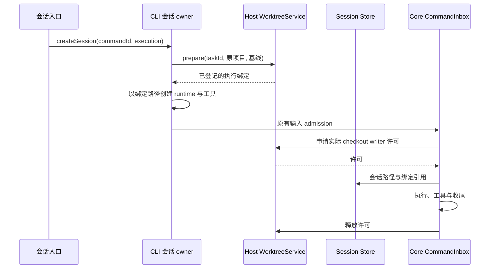

# 工作树会话执行绑定

状态：实现中，2026-10-02；属于 `git-worktree-enhancements.md` 的执行接线。

## 所有者与不变量

- WorktreeService 持有创建请求和绑定事实。CLI 会话只保存绑定引用；`runtime/worktree_binding` session entry 与执行路径必须在首次用户执行前持久化，恢复不能把绑定缺失当作本地会话。
- V4 `createSession` 是唯一用户创建入口。工作树模式禁用自动草稿预热；首次发送或显式添加需要会话的附件才创建工作树。明确的空创建仍固定执行位置，不能稍后切换已有 runtime 的 cwd。
- 首次执行先用 commandId 生成稳定 taskId，等待 prepare 完成，再物化 runtime。相同创建请求重试不能生成第二个任务目录。
- 工作树路径是 Agent、Git、文件、终端、搜索、技能、Hook、checkpoint 和 rewind 的执行根。原路径只承载项目归属、设置及合并目标。
- filesystem MCP 的同仓库允许目录改映射至工作树；不能保留原仓库祖先目录授权。无法安全映射的显式外部目录拒绝工作树创建，不静默扩大权限。
- 整轮 checkout writer 许可由目标 Host 的协调 owner 持有。Core 已接受的输入仍只经过原 CommandInbox；许可等待/失败不会创建第二份用户输入队列。Stop、权限等待和后台收尾沿原 turn 生命周期处理，只有实际执行结束才释放许可。
- 用户确认保留的只读预览与真实写进程不能混同。若无法证明进程不再写入，则目标发布应保持阻塞；草稿生成不受此限制。

## 恢复与失败

恢复先读取 session entry 并向 WorktreeService 对账，校验 bindingId、taskId 和实际执行路径；目录丢失、归档、登记丢失或身份不符时拒绝续写。旧会话没有 entry 时保持原路径和原行为。执行位置不接受 resume 请求覆盖。

准备失败不运行 firstInput。运行期许可申请失败需要报告真实失败，不能让 session reservation 泄漏。许可释放失败保留失败证据，不能把锁超时当成写进程已退出。手机与 Desktop 复用同一 runtime 和绑定，不另建 Host 或输入队列。

Host 将许可绑定到具体 protocol client 代际，不能让重启后的同名 session 复用旧进程许可。协议断连只退休路由，`disposeAndWait` 证明该进程树退出后才释放该 client 的全部许可；退出期间晚到的申请立即释放并拒绝返回。回收失败保留许可，下一次显式回收可重试。

## 冲突修复操作

`resolveWorktreeConflicts` 经原会话 CommandInbox 接受明确的 operationId。Host 核对原会话绑定、集成操作归属与 conflicted 阶段，返回被冻结的集成路径和源/目标 HEAD。CLI 在同一进程创建隐藏 `worktree_repair` child runtime，以独立的 cwd、工具配置、Hook、权限和 MCP 作用域执行修复，原 runtime 不切换目录。

隐藏 child 继承本次冻结的模型和有界对话上下文；只处理集成目录的冲突，完成后生成候选，不发布目标分支。原会话收到 operationId/childId 收据，UI 订阅该 child 的执行状态并回查操作；实际修复 Diff 和候选 HEAD 仍需人审。父会话保存操作请求和结果 entry，相同 requestId 不重新启动模型。失败、取消或重启保留集成目录；新请求可再次显式修复，不从旧 running 状态自动补发模型调用。

UI 用 `waitForRequestId` 等待 CLI owner 的持久结算，child 的结束投影本身不代表候选已生成。只有成功 TurnComplete 才调用 Host 继续集成并保存结果；取消、异常和未完成请求明确失败。隐藏修复会话不能通过普通历史会话恢复入口续跑。

## 验收

1. 创建重试沿同一 commandId/taskId；prepare 失败没有 runtime 和首条执行。
2. 同仓库根与子目录 MCP 映射，原路径不残留；外部和祖先目录拒绝，非 filesystem MCP 不改。
3. 首轮存储绑定引用；冷恢复对账成功且实际路径不变，缺失/归档/路径更改拒绝。
4. writer acquire 在执行前，release 在工具收尾后；失败和取消释放已获许可，未获许可不伪造 release。
5. 队列输入和自动续跑使用相同 Core 边界；已有本地会话和无注入的 CLI 行为兼容。
