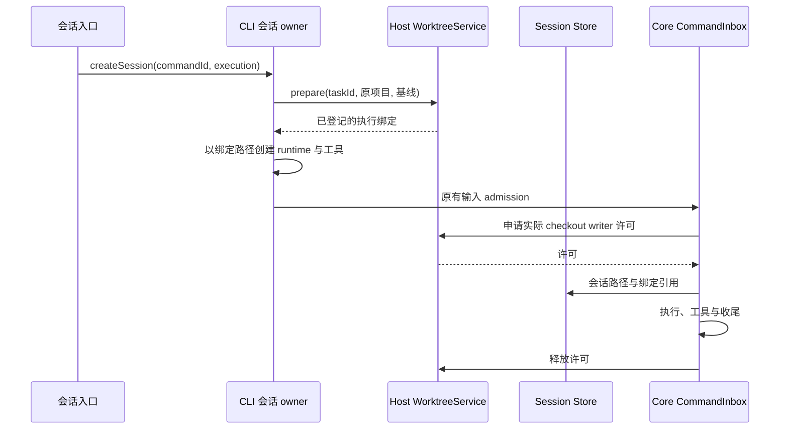
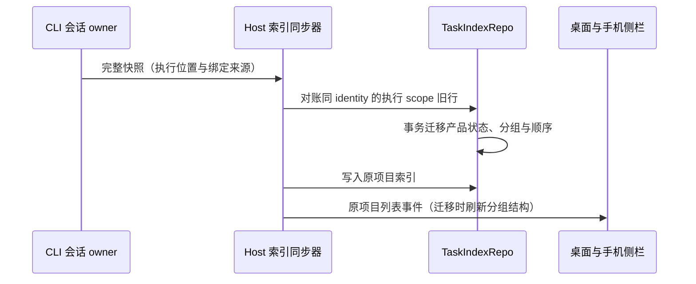
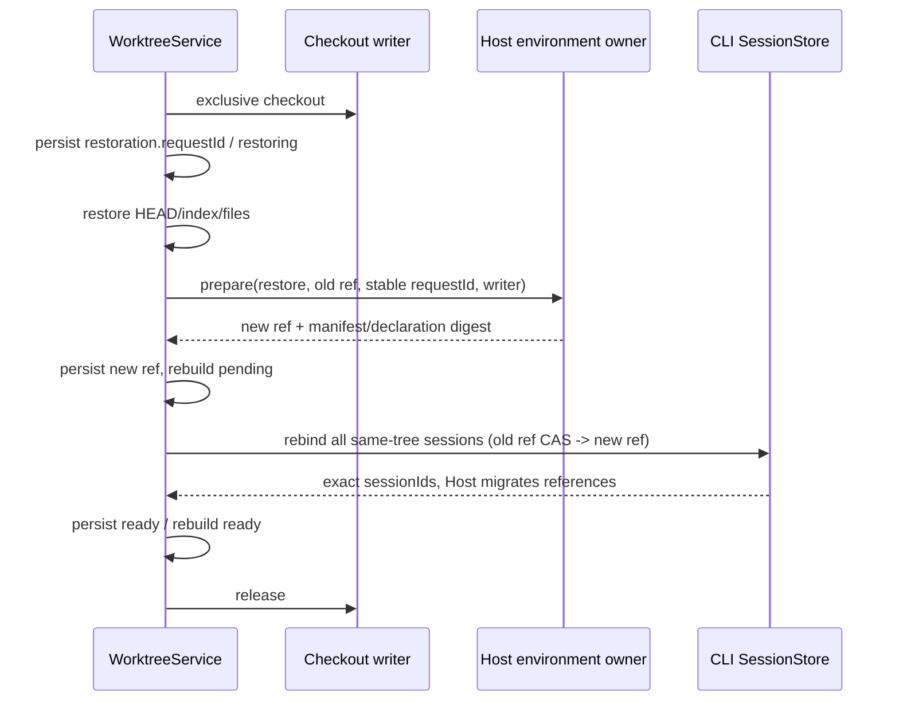

# 工作树会话执行绑定

状态：实现中，2026-10-02；属于 `git-worktree-enhancements.md` 的执行接线。

## 所有者与不变量

- WorktreeService 持有创建请求和绑定事实。CLI 会话只保存绑定引用；`runtime/worktree_binding` session entry 与执行路径必须在首次用户执行前持久化，恢复不能把绑定缺失当作本地会话。
- V4 `createSession` 是唯一用户创建入口。工作树模式禁用自动草稿预热；首次发送才创建工作树；附件在 workspace 草稿范围上传，不创建会话或工作树。明确的空创建仍固定执行位置，不能稍后切换已有 runtime 的 cwd。
- 首次执行先用 commandId 生成稳定 taskId，等待 prepare 完成，再物化 runtime。相同创建请求重试不能生成第二个任务目录。
- 工作树路径是 Agent、Git、文件、终端、搜索、技能、Hook、checkpoint 和 rewind 的执行根。原路径只承载项目归属、设置及合并目标。
- filesystem MCP 的同仓库允许目录改映射至工作树；不能保留原仓库祖先目录授权。无法安全映射的显式外部目录拒绝工作树创建，不静默扩大权限。
- 整轮 checkout writer 许可由目标 Host 的协调 owner 持有。普通会话使用共享执行许可，目录管理与冲突修复使用独占许可；本地项目和同目录工作树 alias 的不同会话可以并行，详细规则见 [多会话执行](checkout-multi-session-concurrency.md)。Core 已接受的输入仍只经过原 CommandInbox；许可等待/失败不会创建第二份用户输入队列。Stop、权限等待和后台收尾沿原 turn 生命周期处理，只有实际执行结束才释放许可。
- 用户确认保留的只读预览与真实写进程不能混同。若无法证明进程不再写入，则目标发布应保持阻塞；草稿生成不受此限制。

## 恢复与失败

Host 的反向许可/修复桥接必须显式投影原 workspace scope，再调用严格 WorktreeService contract。启动 Host client 的首条请求可能是命令查询，携带 `commands`、`clock` 和可信 connection carrier；这些路由字段不能通过对象展开混入 getBinding。原项目 identity 的归属校验及实际 checkout 的 writer 校验保持不变，桌面 continuous 和手机 replayable 的冷恢复复用同一路径。

任务索引和列表广播始终按 snapshot 中经过绑定证明的 originWorkspacePath/originWorkspaceIdentity 归属项目；workspacePath/workspaceIdentity 继续表示真实执行位置。完整快照写入前，TaskIndexRepo 在事务内对账已知执行 scope 的旧错放记录，迁移分组和排序；原项目已有行的产品状态优先，不按裸 taskId 或同路径跨 Host 查找。旧会话在原项目目录首帧可重新显示，打开/收口时完整快照幂等清理错误 scope 的旧行。没有 executionBindingId 或 origin 引用的本地会话沿原路径。

恢复先读取 session entry 并向 WorktreeService 对账，校验 bindingId、taskId 和实际执行路径；目录丢失、归档、登记丢失或身份不符时拒绝续写。旧会话没有 entry 时保持原路径和原行为。执行位置不接受 resume 请求覆盖。

准备失败不运行 firstInput。运行期许可申请失败需要报告真实失败，不能让 session reservation 泄漏。许可释放失败保留失败证据，不能把锁超时当成写进程已退出。手机与 Desktop 复用同一 runtime 和绑定，不另建 Host 或输入队列。

Host 将许可绑定到具体 protocol client 代际，不能让重启后的同名 session 复用旧进程许可。协议断连只退休路由，`disposeAndWait` 证明该进程树退出后才释放该 client 的全部许可；退出期间晚到的申请立即释放并拒绝返回。回收失败保留许可，下一次显式回收可重试。

## 冲突修复操作

`resolveWorktreeConflicts` 经原会话 CommandInbox 接受明确的 operationId。Host 核对原会话绑定、集成操作归属与 conflicted 阶段，返回被冻结的集成路径和源/目标 HEAD。CLI 在同一进程创建隐藏 `worktree_repair` child runtime，以独立的 cwd、工具配置、Hook、权限和 MCP 作用域执行修复，原 runtime 不切换目录。

隐藏 child 继承本次冻结的模型和有界对话上下文；只处理集成目录的冲突，完成后生成候选，不发布目标分支。原会话收到 operationId/childId 收据，UI 订阅该 child 的执行状态并回查操作；实际修复 Diff 和候选 HEAD 仍需人审。父会话保存操作请求和结果 entry，相同 requestId 不重新启动模型。失败、取消或重启保留集成目录；新请求可再次显式修复，不从旧 running 状态自动补发模型调用。

UI 用 `waitForRequestId` 等待 CLI owner 的持久结算，child 的结束投影本身不代表候选已生成。只有成功 TurnComplete 才调用 Host 继续集成并保存结果；取消、异常和未完成请求明确失败。隐藏修复会话不能通过普通历史会话恢复入口续跑。

## 2026-10-06 单写者环境接线合同（P4-03 / P4-05）

- WorktreeService 唯一写入 binding、integration、验证证据与恢复 journal；目标 Host RuntimeEnvironmentService 唯一持有环境、声明新鲜度、消费者及停止证明。组合根注入 `WorktreeRuntimePorts`，内部 checkout lease 与 env overlay 不进入 shared wire、UI 或日志。
- `prepare.environmentPolicy` 可为 `inherit | managed | local`。新请求缺省 / inherit 保留原本机行为；旧 binding 不隐式升级。managed 必须具有准备及解析能力，失败不回退；local 即使注入 port 也不调用它。已存在的策略不可由重试或同树 fork 改写。同树 fork 继承 owner，独立 fork 按其显式策略准备。
- 准备在同一 checkout 独占许可内恢复 fork 文件、准备环境和执行 setup；环境端口复用该可信 writer，不能二次 acquire。环境返回 `dependenciesPrepared: true` 只去掉自动检测的重复依赖安装；用户显式 setup 命令仍全部执行。完成准备不代表候选验证通过。
- `list` 同时接受绑定的原项目及真实执行 scope；identity key 和规范化路径必须共同匹配，错误 identity 或仅猜到相同路径不能读取另一 Host 的绑定。
- 集成 operation 持久化自己的 `environmentRef`、`environmentPolicy`、`candidateEvidence` 和 `validationReceipts`，不借用 task 环境或 binding 上的旧验证投影。managed 候选使用 `purpose: integration-candidate`，根据候选目录当前声明独立准备。准备与重验复用当前独占 writer；实际验证将冻结 env 作为 adapter 第四参数传递。
- 每份证据准确绑定 candidate HEAD/tree、source HEAD、target HEAD/branch、环境引用及 revision、manifest/declaration 摘要、有序 command 列表；每条收据包含精确 command、exitCode、outcome、verifiedAt、有界 output 及 outputTruncated。命令上限统一 8192 字符，输出上限 65536 字符。
- `continueIntegration` / `publishIntegration` 的 `skipValidation?: boolean` 只有显式 true 才可跳过；空命令不视为通过。跳过也须满足环境准备/新鲜度和 Git 前置，持久化 `outcome: skipped, skipAcknowledged: true`，不能投影为已通过验证。验证失败、缺证据、锁文件/声明变化、HEAD/tree/ref/命令变化全部拒绝沿旧 ready 发布；旧 ready 须显式重新 review/validate。
- published 和回复丢失的 publishing 先以真实目标 ref 的 commit ancestry 对账；已包含候选时不重跑验证、不依赖候选目录或已释放环境。尚未发生 Git 发布的 publishing 只能使用仍匹配的原证据，不能自动重放有副作用的验证。
- 恢复以 `restoration.requestId` 固定本次操作。所有 Git 恢复分支统一进入环境重建：旧 environmentRef -> `operation: restore` 新 environmentId/revision/digest -> 持久 binding（仍 restoring）-> 同树全部 session CAS 重绑和 Host consumer migration -> ready。环境/会话失败保留 restoring 与 environmentRebuild.pending/failed；原请求重试不创建第二环境。旧 PID、URL、running 或私有数据不作为恢复成果。

新增验收以真实 Git fixture 覆盖 managed/local/inherit、缺 port fail-closed、writer 复用与依赖去重、同 scope 的 identity 隔离、候选独立环境/冻结 env/有界收据/显式 skip、旧 ready 拒绝发布、声明与锁变化、已发布对账不重验、恢复故障/丢回复后稳定 requestId 与全 session CAS。跨端仍是 desktop-continuous / web-remote-replayable 读取同一 owner，不引入队列或双写投影。

## 验收

1. 创建重试沿同一 commandId/taskId；prepare 失败没有 runtime 和首条执行。
2. 同仓库根与子目录 MCP 映射，原路径不残留；外部和祖先目录拒绝，非 filesystem MCP 不改。
3. 首轮存储绑定引用；冷恢复对账成功且实际路径不变，缺失/归档/路径更改拒绝。
4. writer acquire 在执行前，release 在工具收尾后；失败和取消释放已获许可，未获许可不伪造 release。
5. 队列输入和自动续跑使用相同 Core 边界；已有本地会话和无注入的 CLI 行为兼容。
6. 启动 client 的首条请求包含 commands/clock/可信 connection carrier 时，工作树及修复许可仍通过真实严格服务；跨 identity、外部 checkout 和错误 binding 仍拒绝。
7. 工作树 snapshot 的索引、事件和分组位于原项目；已有错放行经完整快照修复时保留标题覆盖、置顶/归档/未读状态及分组顺序，重试不重复迁移，远程同路径不同 identity 不能串行。
