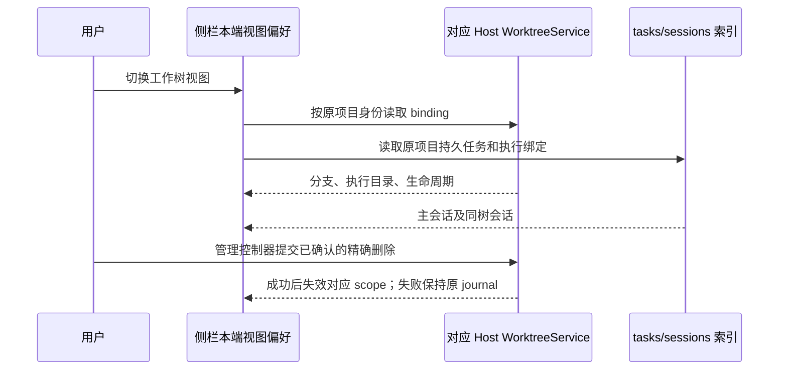

# 工作树侧栏分类（2026-10-10）

## 产品规则与状态所有者

- 侧栏一级视图为「分组 / 项目 / 工作树」，选择保存在现有本端侧栏偏好中。切换视图只改变展示，不迁移项目、任务、分组或 Git 状态。
- WorktreeService 的真实 binding 是工作树、实际执行目录、生命周期和删除范围的唯一所有者；tasks-index 决定持久任务，sessions-index 补充 executionBindingId 与活动。身份沿用 `workspaceIdentity?.trim() || workspacePath`；不按路径片段猜测工作树。
- 有 executionBindingId 的会话、binding 所有者会话及同身份执行目录的任务集中展示在「工作树」。已识别的独立工作树项目从普通项目列表移出；普通原项目仍保留。分组结构与排序不写回修改，隐藏工作树任务的展示不能删除原分组成员。
- 执行绑定必须经每一条侧栏数据通路到达投影，不能只在其中一条通路携带。tasks-index 的 meta_json 与 Controller 的会话覆盖层都不持久化/下发执行绑定：项目/分组视图由 sessions-index join 提供该字段，Controller 视图（时间线、工作树）则必须由覆盖层透传；否则同一会话会在工作树视图被判为普通任务（漏显），又在时间线里被误当成普通行。协议 schema 必须显式声明该字段，zod 默认会静默剥离未声明字段。
- 工作树按原项目和 binding 分类。主会话与同树分支会话归为一项，不因会话数创建新的托管环境。缺失 binding 但已有执行绑定的会话仍可访问，显示待读取事实，不给出未经 owner 校验的删除入口。
- 每项展示分支、生命周期、执行目录与已有会话；管理和删除复用现有工作树管理控制器与确认流程。删除成功只失效对应原项目与工作树投影；其他工作树和普通项目不被关闭或删除。失败保留条目与原 requestId，允许重试。快照归档项仍可管理和恢复。
- 工作树创建不经过管理动作，Host 落盘后没有失效通知，侧栏列表只订阅生命周期失效版本，因此新工作树必须由创建侧主动广播：准备轮询（草稿准备、会话准备）在首次观察到 binding 或 binding 身份/状态迁移时广播，工作树分叉在确认成功后广播。侧栏据此自动重读 binding，准备中的树立即出现，准备完成自动收敛为可用状态，不要求用户点击刷新；刷新按钮只用于强制重读。同一 binding 快照重复读到不得重复广播，避免 750ms 准备轮询被放大成刷新风暴。
- 普通项目移除只移除项目关联，不能借展示分类调用工作树删除。工作树删除继续经过 fence → 停止消费者 → 精确会话清理 → checkout/引用/私有环境清理 → deleted；共享工具和包缓存保留。
- 桌面与手机 Web 共用组件，远端每个 scope 使用其已有 attachment services；断连不回退本机服务。视图切换不创建 Agent 或新的远程 attachment。

## 验收场景

1. 混合普通任务、两个独立工作树、同树多个会话：普通任务只在普通视图；每树独立列出且同树会话聚合，不修改原分组成员。
2. 同路径不同远端 identity：绑定、会话和操作严格按身份区分，断连仅提示该远端不可用。
3. 已删除主会话但 binding 保留：工作树项仍提供管理；缺失 binding 的任务不失踪、不允许推测删除范围。
4. 桌面与 390px 手机视口：三个入口可访问，长分支截断，管理和失败重试流程可用。刷新恢复工作树视图。
5. 删除一树后普通原项目、另一树和其会话保留；快照归档项继续可见。
6. 分类仅使用 owner facts，普通项目包含 `worktrees/checkouts` 字符的路径不会误分类。

## 验证证据

本次侧栏源码范围（不含 locales、spec 和测试）新增 728 行、删除 91 行，净增 637 行。架构检查结果为 violations 0 / baseline 0 / new 0；业务事实继续由已有 WorktreeService、tasks-index 和 sessions-index 所有，本端仅保存视图偏好及派生读取结果。

- `packages/ui/src/lib/worktreeSidebar.test.ts` 覆盖原项目/执行 scope、同路径远端隔离、未知及外部绑定、子目录 checkout 根与分组成员保留。
- `packages/ui/src/lib/sidebarTaskPreferences.test.ts` 覆盖新旧视图偏好的恢复。
- `packages/ui/src/lib/archivedTaskDeletion.test.ts` 覆盖分类后的批量删除不包含隐藏会话。
- `packages/web/test/worktree-sidebar.test.mjs` 使用真实入口、读取 hook、任务聚合与删除控制器，在 1280/390 宽度验证同树会话、重复 scope 去重、删除失败重试、缓存失效及其他树/普通任务保留。Host/Git 副作用由现有 worktree/runtime-environment 回归测试单独覆盖。
