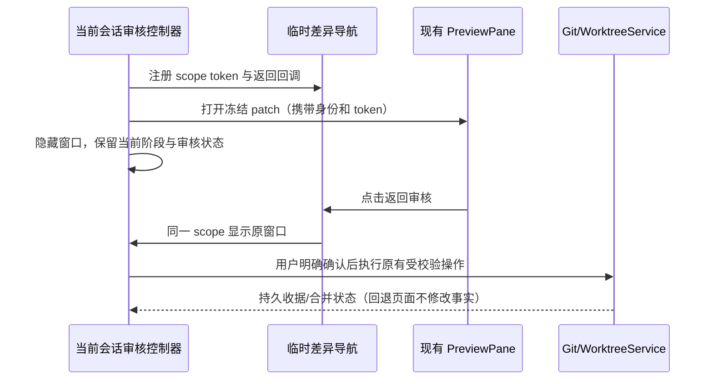
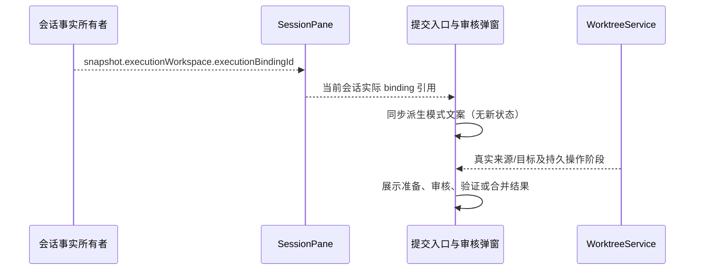
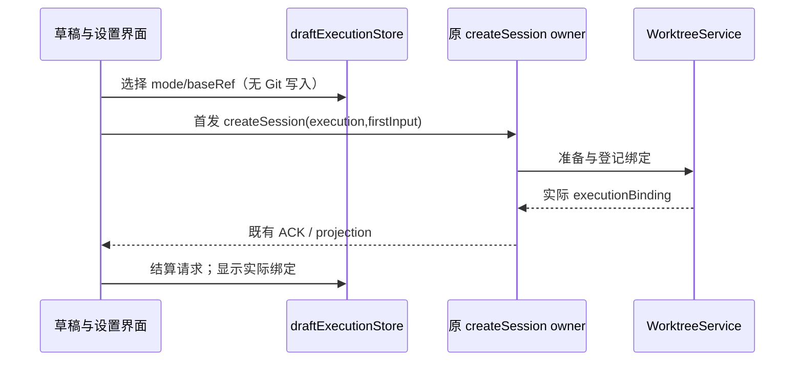

# 工作树界面与执行策略

## 规则与状态所有者

- 会话侧栏的工作树标识来自 sessions-index 的 executionBindingId，live 来自 CLI record，冷启动来自原子会话绑定 entry；不依据项目默认值猜测。工作树原项目归属、fork 层级和任务索引 membership 保持各自 owner。审核区域展示来源/目标/共同基线和归档快照中实际遗漏的忽略文件。

- 设置由 AppSettings 所有，项目覆盖按原 workspaceIdentity 或原 workspacePath 绑定；项目名称只作展示。全局默认本地，项目与本次草稿可覆盖。提交信息生成和自动审核弹窗独立继承。
- Renderer 的 draftExecutionStore 只保存未提交的 mode/baseRef 和 createSession 请求状态，不创建或登记工作树。原 createSession 命令携带 execution 意图，CLI 准备成功后才接受首发。工作树模式禁用自动预热实体；切换会清理原本地草稿预热。
- 显式添加附件可提前通过同一 createSession 命令准备固定工作树；选模式本身不会准备。首次请求冻结 mode/base，首发文本、模型及 commandId 在失败后保留。准备失败显式重试仅增加 retrySetup 授权，不新建命令或改写原输入。
- 项目高级配置保存 setupCommands、copyIgnoredPaths、validationCommands，均按行显式配置。默认不执行安装命令，不复制 .env 等忽略文件；保存失败保留编辑内容。服务按项目 scope 合并本次字段补丁。
- 实际文件搜索、文件拖拽、Git 与终端使用 snapshot.executionWorkspace；会话/技能/命令仍沿原项目 owner 路由，禁止把实际目录当作另一个独立 Host。
- 基线选择仅读取本地分支，不调用 switchBranch。实际位置、归档与集成状态读取 WorktreeService，不能用用户意图冒充执行绑定。
- 所有服务操作经 hooks、当前 Environment 的服务和 identity 路由。错误保留草稿，晚到结果按 scope/request 隔离。
- 项目工作树列表刷新保留同一 scope 的已显示条目与管理弹窗，刷新失败也保留该条目；工作树事实在重新查询成功后替换。归档/恢复不因列表刷新而卸载当前操作入口。
- 自动生成只覆盖原聚焦运行完成入口；后台完成保留手动待处理入口，不因切回自动补发模型。关闭自动弹窗保留已生成草稿，手动打开预填。

## 审核阶段、关闭与差异往返

- 审核窗口的显示状态与业务操作分离。点击遮罩不关闭；X、底部关闭与 Escape 只隐藏窗口。手动入口重开同一会话的草稿、冻结审核、确认项、发布预览及操作结果，不重新生成、不重复提交。切换身份或会话后不得恢复旧窗口；在途结果仍遵循原 scope 与 attempt 防护。
- 提交与合并审核使用同一个窗口，准备来源提交后进入合并审核；支持返回提交审核。工作树管理可回看准备、候选审核、合并确认与完成阶段；远端发布预览可返回编辑，结果可回看已确认的预览。已执行的动作回看只读，返回不撤销提交、候选验证或合并，不提供重复执行入口。
- 差异统一在项目已有 PreviewPane 中查看，不在审核窗口内渲染 patch。使用 GitCommitReview 的冻结文件 patch 或 WorktreeIntegration.diff，不以实时工作目录内容替代审核快照。传递实际 workspacePath、workspaceIdentity 及 remoteSessionId。打开差异临时隐藏审核，查看器显示“返回审核”；返回还原原阶段和输入，不调用模型或写入 Git。
- GitActionMenu 和 WorktreeTaskActions 各自拥有展示阶段与窗口状态；WorktreeService 仍是合并事实唯一所有者。窗口内嵌工作树审核时不叠加第二个模态窗口。reviewDiffNavigationStore 只保存当前窗口的临时查看器入口和带唯一 token 的返回回调，不持久化业务事实；组件卸载、scope 变化或手动返回后清理，旧差异标签不能打开另一个会话的窗口。
- 验收覆盖：遮罩点击、X/Escape 关闭与手动重开；草稿/确认项/预览保留；差异往返无额外模型及 Git 调用；冻结 patch 不变；合并阶段回退不重放提交/验证；在途操作关闭后正常结算；身份切换清理旧返回入口；中文、英文与手机窄屏。
- 大规模变更使用独立文件审核区域，复用现有 PreviewPane 的差异渲染与导航。弹框只保留阶段、提交消息、数量摘要、风险提示和确认动作；文件搜索、分页、逐个/本页排除及恢复在查看区域执行，每页最多 50 项。总数、匹配数与已排除数始终可见；没有“展开全部 patch”动作，选择文件才渲染该文件差异。排除本页仅作用于实际展示范围；非空搜索可批量排除全部匹配文件，按钮明确显示数量。排除使旧审核失效，返回弹框后明确重新生成审核；全排除保持空候选，不能回退到全仓。万级文件不创建万级 DOM，也不拼接全部 patch。冻结审核被服务截断时持续提示，仍遵守既有确认与服务端提交校验。未生成审核时文件区域可管理范围，查看实时差异需显式按文件读取，不把它当作冻结审核。

## 跨端数据联动

冲突路径和归档遗漏路径也不在弹框展开完整清单：弹框显示总数，完整冲突文件沿候选差异入口查看，归档遗漏提供独立路径清单入口。遗漏列表只展示路径，不读取忽略文件内容，归档后也能检查原 snapshot 中的遗漏信息。

桌面、Web、手机共享 Host 的审核编辑状态，范围、草稿和阶段依照 [跨端审核编辑状态](git-review-cross-platform-state.md) 实现。前述控制器拥有本端窗口与确认项，已接受草稿/排除/阶段改由 Host 所有；临时查看器入口不参与跨设备同步。

## 提交与合并文案

- 页面入口、可见弹窗标题、无障碍说明和默认提交按钮统一依据会话 snapshot 的 `executionBindingId`，由 SessionPane 经现有 props 传入，不依据项目默认值或草稿选择推断已有会话模式。缺省保持本地提交审核；切换会话时沿原 scope 生命周期更新文案，不保存第二份模式状态。
- 本地入口和弹窗称为“提交审核”，说明使用共享项目目录，确认后保存提交到当前检出分支；提示同目录写入需要协调，修改归属仍需审核。工作树入口和弹窗称为“提交与合并审核”，分别展示来源工作树分支、实际执行目录和原项目合并目标。默认提交动作仅保存工作树提交。
- “提交并准备合并到 {branch}”只承诺保存来源提交和准备合并结果；候选经过人工审核及配置验证后，“确认合并到 {branch}”才更新目标。准备、验证、目标更新、已合并的状态使用一致词汇，不把提交成功写成合并成功。目标使用真实 binding 或 operation 已冻结值，不写模糊的“当前分支”。
- 原有远端/Tag 发布继续沿既有执行器；统一称为“远端与 Tag 发布”并展示实际发布分支。工作树提交窗口的发布作用于来源任务分支，合并后管理窗口的发布作用于原项目目标分支，分别说明，不能暗示推送会完成本地合并。
- 常规设置改称“任务完成后生成提交草稿”：明确它是项目可覆盖的全局默认，当前查看的编码会话成功完成且有可提交改动时，使用当前模型准备信息和改动审核并消耗额度；本地可审核后提交，工作树还可审核后合并。自动打开审核独立设置，提交、合并、远端发布均需用户确认；后台完成不会自动生成。项目选择“继承全局”时同时展示当前生效值。
- 加载提示只说明正在读取审核内容，操作中只说明正在处理已确认的请求；没有 owner 的等待事实时，不伪造“正在等待目录许可”阶段。已有目录占用错误用统一的中英文说明展示，保留其它原始错误细节，不改协议、许可或重试语义。

## 事件顺序

## 验收

- 合并管理展示来源提交、冻结的目标基线、共同祖先和集成目录；本地可通过平台入口打开集成目录。归档后展示实际省略的忽略文件清单，不能暗示这些文件已保存。

- 本地默认保持原分支组件；工作树模式替换成纯基线选择，并显示准备状态与错误。
- 远端同路径不同 identity 的草稿和覆盖相互独立；请求中不能更改模式和基线。
- 设置继承/启用/关闭独立保存，错误显示并保留上次有效设置。
- 浏览器 fixture 使用真实共享组件验证工作树选择不触发 Git 变更、读取失败与重试、全局/项目继承、自动弹窗开关、窄屏无横向溢出。
- 浏览器验证本地/工作树入口和弹窗文案、实际目录、提交与合并动作区别；已有本地会话不会因项目默认改成工作树而显示合并文案，切换实际绑定后没有上个模式残留。中英文及 390px 布局均覆盖，保留只提交快捷键和显式发布确认回归。

## 2026-10-03 文案统一验证

- `pnpm typecheck`、`pnpm lint`、`pnpm architecture:check --changed` 均通过；本次修改文件的格式检查及 `git diff --check` 通过。
- 使用本机 Chrome 执行 `packages/web/test/git-commit-dialog.test.mjs` 和 `packages/web/test/worktree-ui.test.mjs`，共 43 项通过。覆盖实际绑定决定本地/工作树标题、切换后的实际目录、中英文、390px 布局、占用错误及其它错误保留、设置覆盖生效值、准备/最终合并状态和来源/目标发布分支；原有提交与发布确认回归仍通过。
- `node --test packages/ui/src/v4/ConversationStatusPanel.mount.test.mjs` 的 4 项挂载回归通过。浏览器使用真实共享组件与 hook、确定性 Host 服务桩；本轮未调用真实模型、提交用户仓库或执行真实远端发布。

## 2026-10-03 审核窗口与跨端联动

弹框回退、关闭重开、外部文件区域、万级冲突/归档清单，以及跨端草稿、范围和阶段的最新验证见 [跨端审核编辑状态](git-review-cross-platform-state.md#2026-10-03-实现与验证记录)。前述文案验证为本轮增强之前的记录。
