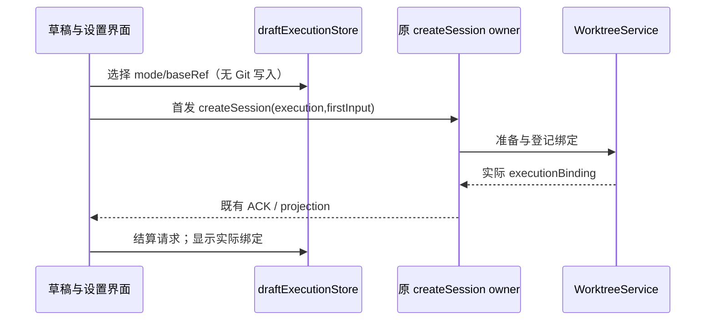

# 工作树界面与执行策略

## 规则与状态所有者

- 会话侧栏的工作树标识来自 sessions-index 的 executionBindingId，live 来自 CLI record，冷启动来自原子会话绑定 entry；不依据项目默认值猜测。工作树原项目归属、fork 层级和任务索引 membership 保持各自 owner。审核区域展示来源/目标/共同基线和归档快照中实际遗漏的忽略文件。

- 设置由 AppSettings 所有，项目覆盖按原 workspaceIdentity 或原 workspacePath 绑定；项目名称只作展示。全局默认本地，项目与本次草稿可覆盖。提交信息生成和自动审核弹窗独立继承。
- Renderer 的 draftExecutionStore 只保存未提交的 mode/baseRef 和 createSession 请求状态，不创建或登记工作树。原 createSession 命令携带 execution 意图，CLI 准备成功后才接受首发。工作树模式禁用自动预热实体；切换会清理原本地草稿预热。
- 显式添加附件可提前通过同一 createSession 命令准备固定工作树；选模式本身不会准备。首次请求冻结 mode/base，首发文本、模型及 commandId 在失败后保留。准备失败显式重试仅增加 retrySetup 授权，不新建命令或改写原输入。
- 项目高级配置保存 setupCommands、copyIgnoredPaths、validationCommands，均按行显式配置。默认不执行安装命令，不复制 .env 等忽略文件；保存失败保留编辑内容。服务按项目 scope 合并本次字段补丁。
- 实际文件搜索、文件拖拽、Git 与终端使用 snapshot.executionWorkspace；会话/技能/命令仍沿原项目 owner 路由，禁止把实际目录当作另一个独立 Host。
- 基线选择仅读取本地分支，不调用 switchBranch。实际位置、归档与集成状态读取 WorktreeService，不能用用户意图冒充执行绑定。
- 所有服务操作经 hooks、当前 Environment 的服务和 identity 路由。错误保留草稿，晚到结果按 scope/request 隔离。
- 项目工作树列表刷新保留同一 scope 的已显示条目与管理弹窗，刷新失败也保留该条目；工作树事实在重新查询成功后替换。归档/恢复不因列表刷新而卸载当前操作入口。
- 自动生成只覆盖原聚焦运行完成入口；后台完成保留手动待处理入口，不因切回自动补发模型。关闭自动弹窗保留已生成草稿，手动打开预填。

## 事件顺序

## 验收

- 合并管理展示来源提交、冻结的目标基线、共同祖先和集成目录；本地可通过平台入口打开集成目录。归档后展示实际省略的忽略文件清单，不能暗示这些文件已保存。

- 本地默认保持原分支组件；工作树模式替换成纯基线选择，并显示准备状态与错误。
- 远端同路径不同 identity 的草稿和覆盖相互独立；请求中不能更改模式和基线。
- 设置继承/启用/关闭独立保存，错误显示并保留上次有效设置。
- 浏览器 fixture 使用真实共享组件验证工作树选择不触发 Git 变更、读取失败与重试、全局/项目继承、自动弹窗开关、窄屏无横向溢出。
