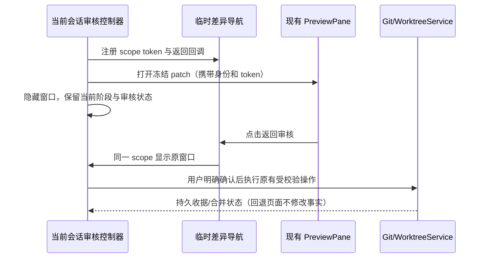
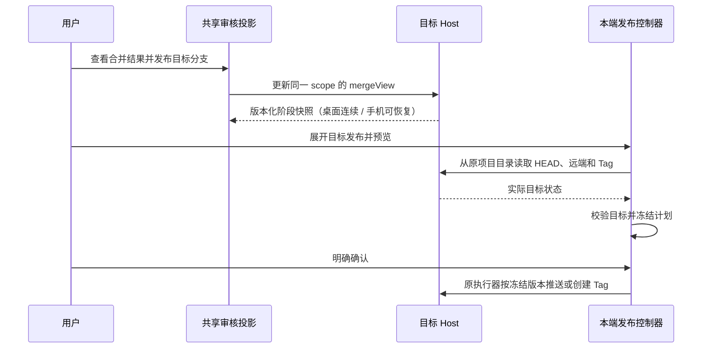
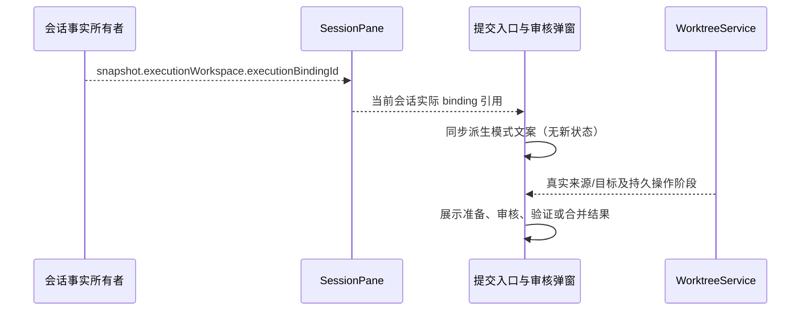
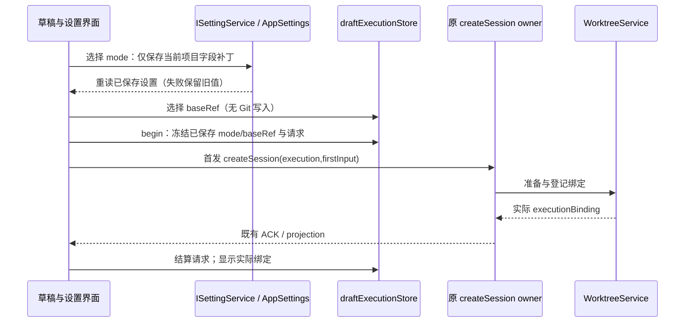
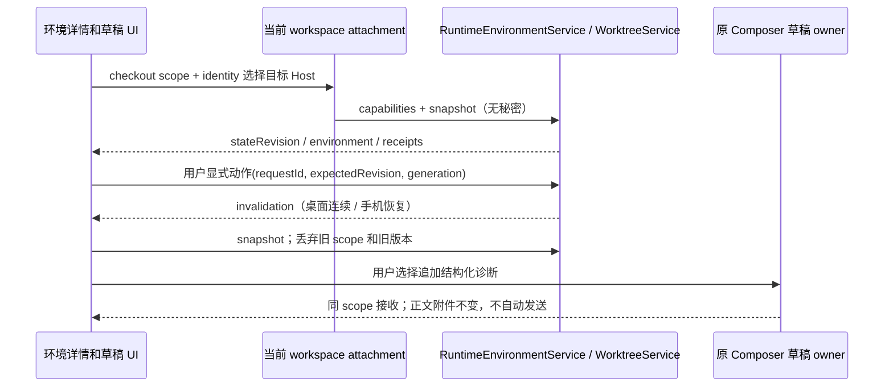

# 工作树界面与执行策略

## 规则与状态所有者

- 会话侧栏的工作树标识来自 sessions-index 的 executionBindingId，live 来自 CLI record，冷启动来自原子会话绑定 entry；不依据项目默认值猜测。工作树原项目归属、fork 层级和任务索引 membership 保持各自 owner。审核区域展示来源/目标/共同基线和归档快照中实际遗漏的忽略文件。
- 侧栏分组、置顶、普通项目列表、时间线及分组拖拽预览在会话标题前复用 WorktreeBadge 图标。图标只依据该会话真实 executionBindingId，与项目当前默认、fork/分屏入口、运行状态和未读标识独立；中文/英文有无障碍名称。本地会话不显示。普通 TaskListItem 的 memo 比较必须包含 executionBindingId，以便首次物化 ACK、恢复绑定及清除绑定时立即更新图标，不能依赖其他字段恰好改变。

- 设置由 AppSettings 所有，项目覆盖按原 workspaceIdentity 或原 workspacePath 绑定；项目名称只作展示。全局默认本地，项目可覆盖。“任务完成后的提交审核”统一为关闭、仅生成草稿、生成并打开审核三档，项目可继承全局；兼容迁移见 [审核设置](git-commit-review-settings.md)。
- 输入框仅有一个执行方式选择器，触发器与选项都只显示“本地目录 / 独立工作树”。选择通过既有 settings hook 保存当前项目 executionMode，当前未提交新会话与后续新会话读取同一已保存值；项目设置不再重复提供执行方式选择。首次选择前仍按已有 inherit/缺失字段跟随全局。下拉说明选择会由项目记住、已有会话不改变，并显示当前来源；不再提供额外的本次覆盖。
- 输入框上方按项目、执行方式、分支/基线的顺序在左侧，只有项目设置按钮在右侧。共享 DraftWorkspaceExecutionControls 分配剩余空间，左侧控件不因占满空间被推到右侧；窄屏可换行、长基线截断并可查看完整名称，区域与弹层不得横向溢出。弹层自动避让边界，兼顾桌面、手机、中英文和主题。
- 选择执行方式只发送当前 scope 的设置字段补丁，不在 draftExecutionStore 再写一份 mode。保存中禁用选择；失败显示错误并保留旧有效值，切换项目后不显示旧项目错误。未冻结草稿中的历史 mode 不参与解析，避免覆盖唯一已保存值。首次 createSession 的 begin 将解析结果冻结到 draftExecutionStore，准备中与失败重试保持冻结的 mode/baseRef；项目或全局更新不能改写已接受的执行意图。基线选择仍仅保存本次 baseRef，不创建或登记工作树。CLI 准备成功后才接受首发。工作树模式禁用自动预热实体；切换会清理原本地草稿预热。
- 添加附件只通过带 draftId 的附件分块事务暂存；选择模式、粘贴或添加附件均不发送 createSession。首次发送通过 createSession(firstInput) 同时携带正文和 ready 附件。首次请求冻结 mode/base，首发文本、模型及 commandId 在失败后保留。准备失败显式重试仅增加 retrySetup 授权，不新建命令或改写原输入。
- 项目设置移除“工作树准备与验证”及准备命令、忽略路径、验证命令输入，不要求普通用户填写技术参数。弹层只提供提交审核设置。新项目无需配置即可创建工作树；Host 按明确锁文件准备依赖，合并候选按自身清单生成检查计划，无法确定时明确显示跳过原因。Agent 继续沿实际目录和项目 AGENTS.md 按需处理任务检查。创建成功不能冒充测试通过；合并仍需审核与确认。旧已保存配置兼容读取，不默默复制忽略文件。创建进度、取消及侧栏两种分叉的具体规则见 [工作树准备与侧栏分叉](worktree-preparation-and-sidebar-fork.md)。
- “项目工作树”移到侧栏项目菜单的固定入口，新会话与已有会话都可访问；普通会话空间及未连接远端不开放管理。入口使用该项目 useWorkspaceServices 返回的服务，并通过 ServiceProvider 注入，携带原 workspacePath、workspaceIdentity 与 remoteSessionId，不使用当前另一个项目的 Host。管理窗口读取原 WorktreeService 列表，含准备后放弃的草稿；点击条目在同一窗口展示既有 WorktreeTaskActions，不叠加管理与审核模态。窗口内返回列表不撤销操作，遮罩不能关闭，X/Escape 可隐藏，重开仍访问同一服务事实；隐藏所选条目时控制器保持挂载，以保留在途动作与差异往返。已有会话自身的工作树管理与提交合并入口保持可用。
- 实际文件搜索、文件拖拽、Git 与终端使用 snapshot.executionWorkspace；会话/技能/命令仍沿原项目 owner 路由，禁止把实际目录当作另一个独立 Host。
- 基线选择仅读取本地分支，不调用 switchBranch。实际位置、归档与集成状态读取 WorktreeService，不能用用户意图冒充执行绑定。
- 基线与本地分支弹层统一使用搜索、分支图标、选中标记、完整名称换行与右侧固定操作区域，Composer 触发器样式一致。基线额外保留 HEAD 和说明，本地分支保留创建/图谱；实际副作用沿各自 hook。占用说明、管理导航及键盘/手机验收见 [分支删除](git-branch-deletion.md)。
- 所有服务操作经 hooks、当前 Environment 的服务和 identity 路由。错误保留草稿，晚到结果按 scope/request 隔离。
- 项目工作树列表刷新保留同一 scope 的已显示条目与管理弹窗，刷新失败也保留该条目；工作树事实在重新查询成功后替换。归档/恢复不因列表刷新而卸载当前操作入口。
- 项目工作树行内提供删除图标，点击后在既有管理区域确认删除目录和任务分支，不新增外部入口，不依赖已删除会话的订阅或提交审核。删除详情、归档大依赖目录及恢复规则见 [工作树归档与删除](worktree-discard.md)。
- 自动生成只覆盖原聚焦运行完成入口；后台完成保留手动待处理入口，不因切回自动补发模型。关闭自动弹窗保留已生成草稿，手动打开预填。

执行方式展示验收：真实共享控件在含项目入口的输入框头部中，项目、执行方式、分支/基线在左，仅设置按钮在右；1280/390px、中英文、浅/深色、长基线均不横向溢出。仅两个模式选项，项目弹层无重复执行方式、技术配置表单与工作树列表；未选时跟随全局，选择后项目记忆且其他项目和旧配置不变；保存失败不冒充成功，重试成功；新草稿 reset 后仍使用已保存项目值。选择不创建工作树或切换分支；首次请求冻结后改默认不影响准备或重试。项目固定入口覆盖列表、单窗口详情、返回、关闭重开、刷新、归档恢复、发布响应丢失、双语与窄屏。既有身份隔离和实际绑定规则保持不变。

## 审核阶段、关闭与差异往返

- 审核窗口的显示状态与业务操作分离。点击遮罩不关闭；X、底部关闭与 Escape 只隐藏窗口。手动入口重开同一会话的草稿、冻结审核、确认项、发布预览及操作结果，不重新生成、不重复提交。切换身份或会话后不得恢复旧窗口；在途结果仍遵循原 scope 与 attempt 防护。
- 提交与合并审核使用同一个窗口，准备来源提交后进入合并审核；支持返回提交审核。工作树管理可回看准备、候选审核、合并确认与完成阶段；远端发布预览可返回编辑，结果可回看已确认的预览。已执行的动作回看只读，返回不撤销提交、候选验证或合并，不提供重复执行入口。
- 差异统一在项目已有 PreviewPane 中查看，不在审核窗口内渲染 patch。使用 GitCommitReview 的冻结文件 patch 或 WorktreeIntegration.diff，不以实时工作目录内容替代审核快照。传递实际 workspacePath、workspaceIdentity 及 remoteSessionId。打开差异临时隐藏审核，查看器显示“返回审核”；返回还原原阶段和输入，不调用模型或写入 Git。
- GitActionMenu 和 WorktreeTaskActions 各自拥有展示阶段与窗口状态；WorktreeService 仍是合并事实唯一所有者。窗口内嵌工作树审核时不叠加第二个模态窗口。reviewDiffNavigationStore 只保存当前窗口的临时查看器入口和带唯一 token 的返回回调，不持久化业务事实；组件卸载、scope 变化或手动返回后清理，旧差异标签不能打开另一个会话的窗口。
- 验收覆盖：遮罩点击、X/Escape 关闭与手动重开；草稿/确认项/预览保留；差异往返无额外模型及 Git 调用；冻结 patch 不变；合并阶段回退不重放提交/验证；在途操作关闭后正常结算；身份切换清理旧返回入口；中文、英文与手机窄屏。
- 大规模变更使用独立文件审核区域，复用现有 PreviewPane 的差异渲染与导航。弹框只保留阶段、提交消息、数量摘要、风险提示和确认动作；文件搜索、分页、逐个/本页排除及恢复在查看区域执行，每页最多 50 项。总数、匹配数与已排除数始终可见；没有“展开全部 patch”动作，选择文件才渲染该文件差异。排除本页仅作用于实际展示范围；非空搜索可批量排除全部匹配文件，按钮明确显示数量。排除使旧审核失效，返回弹框后明确重新生成审核；全排除保持空候选，不能回退到全仓。万级文件不创建万级 DOM，也不拼接全部 patch。冻结审核被服务截断时持续提示，仍遵守既有确认与服务端提交校验。未生成审核时文件区域可管理范围，查看实时差异需显式按文件读取，不把它当作冻结审核。

## 跨端数据联动

冲突路径和归档遗漏路径也不在弹框展开完整清单：弹框显示总数，完整冲突文件沿候选差异入口查看，归档遗漏提供独立路径清单入口。遗漏列表只展示路径，不读取忽略文件内容，归档后也能检查原 snapshot 中的遗漏信息。

桌面、Web、手机共享 Host 的审核编辑状态，范围、草稿和阶段依照 [跨端审核编辑状态](git-review-cross-platform-state.md) 实现。前述控制器拥有本端窗口与确认项，已接受草稿/排除/阶段改由 Host 所有；临时查看器入口不参与跨设备同步。

## 提交与合并文案

- 页面入口、可见弹窗标题、无障碍说明和默认提交按钮统一依据会话 snapshot 的 `executionBindingId`，由 SessionPane 经现有 props 传入，不依据项目默认值或草稿选择推断已有会话模式。缺省保持本地提交审核；切换会话时沿原 scope 生命周期更新文案，不保存第二份模式状态。
- 本地入口和弹窗称为“提交审核”，说明使用共享项目目录，确认后保存提交到当前检出分支；提示同目录写入需要协调，修改归属仍需审核。工作树入口和弹窗称为“提交与合并审核”，分别展示来源工作树分支、实际执行目录和原项目合并目标。默认提交动作仅保存工作树提交。
- “提交并准备合并到 {branch}”只承诺保存来源提交和准备合并结果；候选经过人工审核及配置验证后，“确认合并到 {branch}”才更新目标。准备、验证、目标更新、已合并的状态使用一致词汇，不把提交成功写成合并成功。目标使用真实 binding 或 operation 已冻结值，不写模糊的“当前分支”。
- 原有远端/Tag 发布继续沿既有执行器；统一称为“远端与 Tag 发布”并展示实际发布分支。工作树提交窗口的发布作用于来源任务分支，合并后管理窗口的发布作用于原项目目标分支，分别说明，不能暗示推送会完成本地合并。
- 合并成功后，提交审核顶部必须直接提供“查看合并结果并发布 {targetBranch}”，不得只用“返回当前阶段”表达。目标名取 WorktreeService 的已完成 operation，不取来源分支、当前项目默认或远端目标输入。结果视图显示“合并结果：{targetBranch}”，可返回工作树提交；不重复显示来源目录的分支切换器。新来源改动仍可继续提交，历史合并不锁住来源。
- 合并结果中的发布折叠入口明确称为“发布 {targetBranch}”，预览按钮带目标分支名。入口只改变共享 mergeView 投影，不创建提交、不重新合并、不写远端。发布 hook 从 operation.targetPath 与原项目 identity 重新读取并冻结该目标分支当前最新 HEAD，不要求它仍等于历史 candidateHead；后续新增提交可随本次预览一起发布，摘要必须显示实际 HEAD。实际检出分支变化或没有 HEAD 时拒绝；预览后 HEAD、index 或工作区变化仍使计划失效。修改远端目标分支输入仅修改推送目的地，不能改变读取目录、实际来源分支或 Tag 目标。
- 来源范围的 requiresRegeneration 只阻止来源提交及尚未完成的合并，不禁用已完成合并的目标发布。目标发布仍遵守同一共享状态的同步门禁、本端在途操作/发布计划和阶段只读门禁；两种判断直接从现有 owner 投影，不保存新状态。验收：来源全部排除并需重新审核时，来源提交不可用，但已完成目标发布入口可展开；不会因此提交来源或重放合并。

入口验收：已完成合并、干净来源和有新改动来源均能直接找到带真实目标名的入口；返回来源不重放 Git 动作；预览目标不调用来源提交；目标后续新增提交时重新预览最新 HEAD，检出分支错误或预览后状态变化仍拒绝发布。中文/英文、1280px/390px均可见且无横向溢出。合并目标发布时不显示来源分支切换器，预览和执行携带原项目路径、identity 与目标 HEAD；结果视图 Enter/Ctrl+Enter 不提交隐藏来源表单。

2026-10-04 验证：git-action-menu 与 worktreePublicationPlan 定向测试共 65 项通过，含目标新增提交后的分支/Tag 执行、目标路径与 identity、无额外提交、过期计划零副作用、中英文入口及空范围提示。根 `pnpm typecheck`、`pnpm lint`（0 warnings / 0 errors）、`pnpm architecture:check --changed`（baseline 0 / new 0）通过。更新三个 Web 交互场景文件并通过语法检查；按用户安排未执行浏览器验收、桌面构建或真实远端发布，安装版界面由用户自行构建验证。业务事实及共享阶段仍归原 Host，改动仅涉及 UI 与 Web 夹具，未变更协议或新增队列。

- 常规设置改称“任务完成后生成提交草稿”：明确它是项目可覆盖的全局默认，当前查看的编码会话成功完成且有可提交改动时，使用当前模型准备信息和改动审核并消耗额度；本地可审核后提交，工作树还可审核后合并。自动打开审核独立设置，提交、合并、远端发布均需用户确认；后台完成不会自动生成。项目选择“继承全局”时同时展示当前生效值。
- 加载提示只说明正在读取审核内容，操作中只说明正在处理已确认的请求；没有 owner 的等待事实时，不伪造“正在等待目录许可”阶段。已有目录占用错误用统一的中英文说明展示，保留其它原始错误细节，不改协议、许可或重试语义。

## 事件顺序

## 托管环境详情与显式操作（M4-07 / M5-04）

- 环境事实唯一 owner 为目标 Host 的 `IRuntimeEnvironmentService`。管理详情沿 `useWorkspaceServices` attachment 路由，以 binding 的真实 checkout 路径和 identity 查询；远程 attachment 缺失时不可回退本地。UI 不调用含执行环境或 lease 的 `resolveContext`。
- 详情展示 owner 的状态、冻结版本、工具版本/来源、安装策略、未托管或旧绑定说明、有界资源摘要、服务状态与实际地址。`partial/unavailable` 资源结果不是零占用；缺 capability 显示原因，不假设所有平台支持托管。
- 显式准备/升级/重试/取消均携 requestId，升级冻结 expectedRevision/expectedManifestDigest；旧绑定不自动升级，不因工作树目录独立声称运行环境独立。动作在途只显示 pending，ready 必须来自 owner snapshot。重启服务先以 generation/revision 停止，再读取新 snapshot 后显式启动，不用超时推断停止。
- 事件仅使读取失效；相同 identity 的旧 `stateRevision` 不覆盖新帧。切换 scope 或 attachment 后忽略旧响应，重连只读 snapshot，不重放 prepare/start/stop 等动作。列表查询不把任意环境错配到当前 binding。
- 服务只展示 owner 投影提供的 serviceId，不猜测任意脚本可运行。预览走 `IPlatformService` 已有代理能力；手机/远端无可达通路时解释原因，不能直接打开宿主 localhost。
- 项目设置使用现有 intent 偏好持久化 `environmentPolicy` 的 managed/local/inherit 选择；缺省 inherit 当前解析为 local，旧绑定缺 ref 继续明确显示本机环境。新托管行为仅由用户明确 managed 选择及 Host capability 门禁放行，不能对未验证平台一律放行。设置不改写旧 binding；新请求显式携带解析后的策略。已有绑定的升级经公开 prepare 的 bindingId + operation:upgrade 交给 owner 完成 binding/session 一致迁移。
- 准备/升级失败保留结构化错误与诊断，通过既有 GitFailureDraft 和 composer receiver 追加，不自动发送、不覆盖正文/附件。首发准备从 `binding.preparation.runtimeError` 读取 owner 结构化诊断；尚无 sessionId 的同 scope 草稿可接收，不创建会话；迟到或跨 scope 转交拒绝。失败重试保留原 requestId 与冻结参数，取消使用同 requestId+cancel，永久 cancelled 后只有用户新提交才创建新 requestId。
- 删除/归档前明确托管绑定服务和终端会停止，可重建 temp/cache 可清理；私有 data 默认保留，Git 代码快照不包含数据库。恢复使用新的空 data 目录，原 data 保留供后续单独导出；不新增物理删除 data 按钮。
- 候选验证与发布把用户显式 `skipValidation` 传给 owner。ready/发布展示必须有匹配 candidate/source/target/tree/environment/manifest 的 owner candidateEvidence 和 validationReceipts；跳过收据只称“明确跳过”，不是验证通过。声明/锁变化后需重新验证。

专项验收使用真实共享 hook/组件、确定性 Host fixture，覆盖桌面/390px、中英、键盘、长中文路径、失败重试/取消、同 identity 乱序 snapshot、远端断连/重连无动作重放、无会话草稿与已有正文附件、候选显式 skip 与 owner receipt。fixture 只证明 UI 边界交互，不冒充真实 owner 或生产纵向验收。

## 验收

- 合并管理展示来源提交、冻结的目标基线、共同祖先和集成目录；本地可通过平台入口打开集成目录。归档后展示实际省略的忽略文件清单，不能暗示这些文件已保存。

- 本地默认保持原分支组件；工作树模式替换成纯基线选择，并显示准备状态与错误。
- 工具栏只选择项目、执行方式、分支/基线及审核设置。工作树准备的步骤、日志、取消与重试显示在聊天消息区；本地发送不显示准备卡，首发准备期间的输入预览与物化后的真实消息沿 [准备过程规则](worktree-preparation-and-sidebar-fork.md) 交接。
- 远端同路径不同 identity 的草稿和覆盖相互独立；请求中不能更改模式和基线。
- 侧栏图标验收覆盖普通/置顶/时间线、分组与 drag overlay；只更新 bindingId 也会更新图标。项目默认改变不影响本地/工作树身份；移除绑定后图标消失，fork 元信息不误触发图标；中英文、390px、主题与 hover 后图标均可辨识。
- 设置继承/启用/关闭独立保存，错误显示并保留上次有效设置。
- 浏览器 fixture 使用真实共享组件验证工作树选择不触发 Git 变更、读取失败与重试、全局/项目继承、自动弹窗开关、窄屏无横向溢出。
- 浏览器验证本地/工作树入口和弹窗文案、实际目录、提交与合并动作区别；已有本地会话不会因项目默认改成工作树而显示合并文案，切换实际绑定后没有上个模式残留。中英文及 390px 布局均覆盖，保留只提交快捷键和显式发布确认回归。

## 2026-10-03 文案统一验证

- `pnpm typecheck`、`pnpm lint`、`pnpm architecture:check --changed` 均通过；本次修改文件的格式检查及 `git diff --check` 通过。
- 使用本机 Chrome 执行 `packages/web/test/git-commit-dialog.test.mjs` 和 `packages/web/test/worktree-ui.test.mjs`，共 43 项通过。覆盖实际绑定决定本地/工作树标题、切换后的实际目录、中英文、390px 布局、占用错误及其它错误保留、设置覆盖生效值、准备/最终合并状态和来源/目标发布分支；原有提交与发布确认回归仍通过。
- `node --test packages/ui/src/v4/ConversationStatusPanel.mount.test.mjs` 的 4 项挂载回归通过。浏览器使用真实共享组件与 hook、确定性 Host 服务桩；本轮未调用真实模型、提交用户仓库或执行真实远端发布。

## 2026-10-03 审核窗口与跨端联动

弹框回退、关闭重开、外部文件区域、万级冲突/归档清单，以及跨端草稿、范围和阶段的最新验证见 [跨端审核编辑状态](git-review-cross-platform-state.md#2026-10-03-实现与验证记录)。前述文案验证为本轮增强之前的记录。

## 2026-10-03 执行入口简化与侧栏管理

- 输入框左侧仅有一个“本地目录 / 独立工作树”执行选择，保存为原项目偏好；右侧只保留提交审核设置按钮。项目弹层移除重复执行选择、准备与验证表单以及工作树列表。旧设置继续兼容读取，字段补丁保留其他项目和既有配置。
- 固定侧栏项目菜单提供“项目工作树”，选中条目在同一个管理窗口中审核、归档恢复及发布；从列表进入详情、返回、关闭重开均不叠加第二个模态窗口。隐藏所选详情保留在途控制器，差异返回沿现有导航通路处理。会话顶部的工作树管理入口仍保留。
- 普通/置顶/时间线、分组及拖拽预览在标题前显示真实绑定图标。修复普通列表 memo 漏比较 executionBindingId 的问题；仅更新绑定即可显示或移除图标，项目默认与 fork 标记不改变会话身份。
- `pnpm typecheck`、`pnpm lint` 和 `pnpm architecture:check --changed` 通过，架构基线与新增违规均为 0。初次 Lint 发现两个文件超过 400 行，提取 fixture 页面和绑定读取状态组件后通过；未关闭检查规则。
- 提交审核浏览器回归 40 项通过；最终工作树浏览器回归 18 项通过，含各侧栏真实共享行组件、只更新绑定字段、唯一执行设置、保存失败/迟到响应、冻结请求、管理入口在草稿工具栏消失后仍可访问、单模态列表往返及原有归档/合并/发布流程。桌面/390px、中文/英文、浅深色与长基线无横向溢出。
- 共享策略、实际设置持久化与草稿冻结单元回归 12 项通过。浏览器使用真实共享组件和 hook、确定性服务桩；未调用真实模型、发布真实分支，也未进行物理手机或 macOS/Linux 原生应用验证。任务内依赖准备和检查沿既有 Agent 工具流程，并未增加 Host 自动猜测验证脚本的实现。
